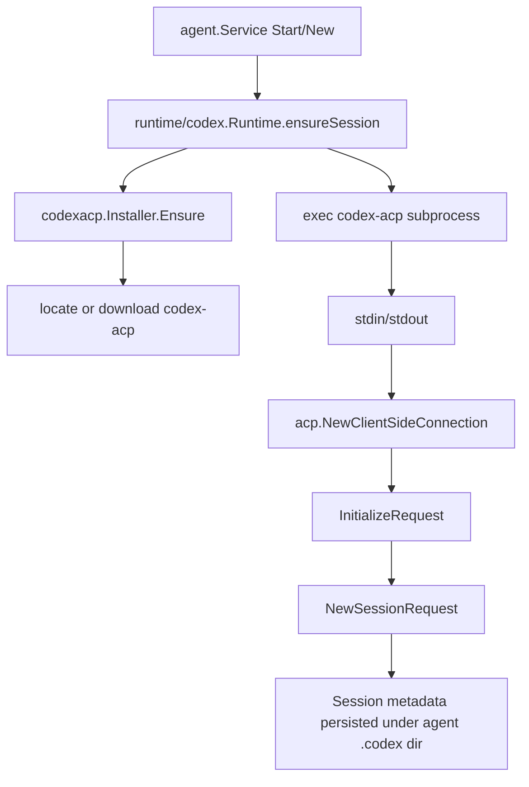
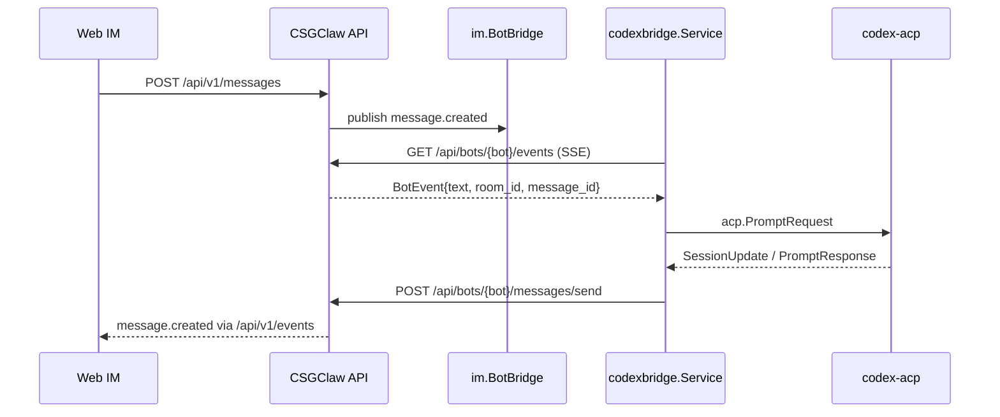
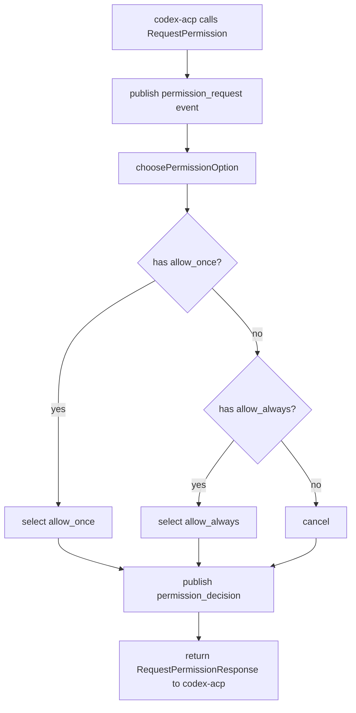
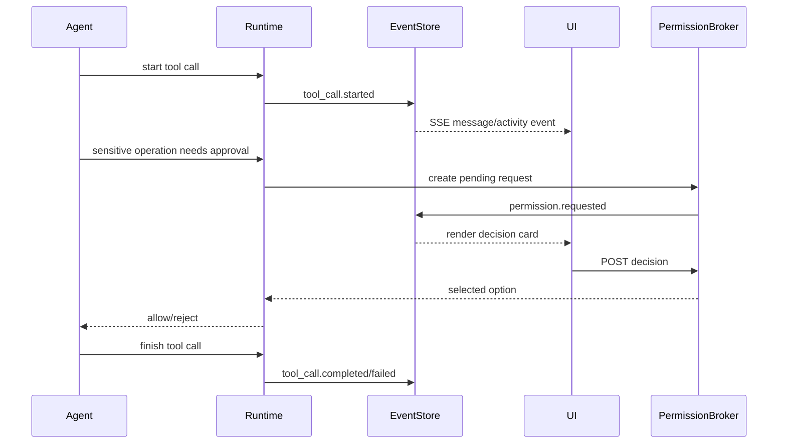
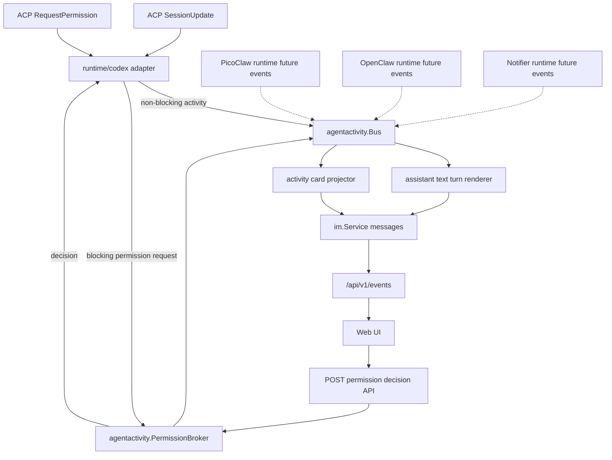
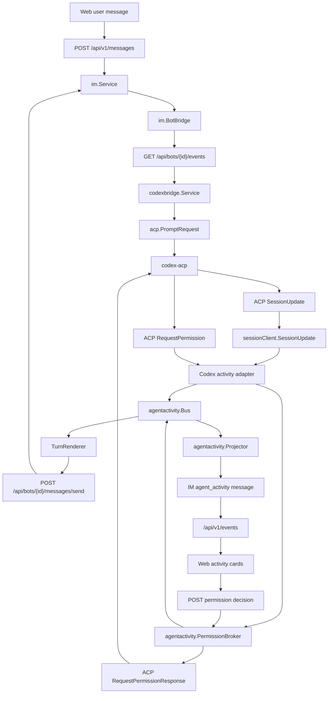
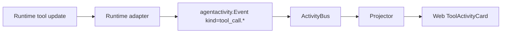
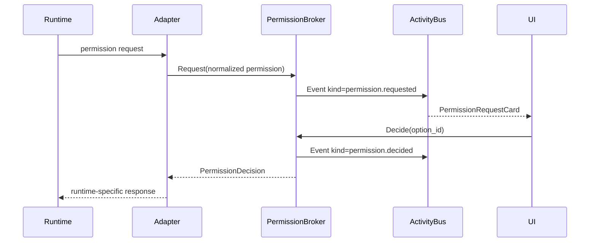
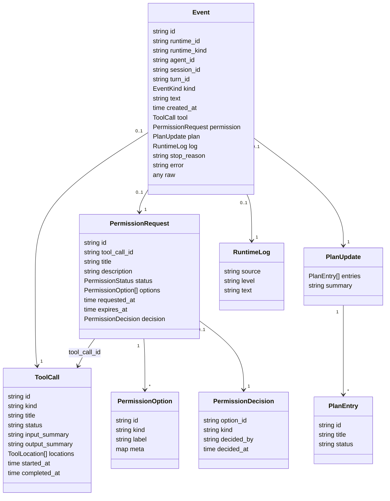
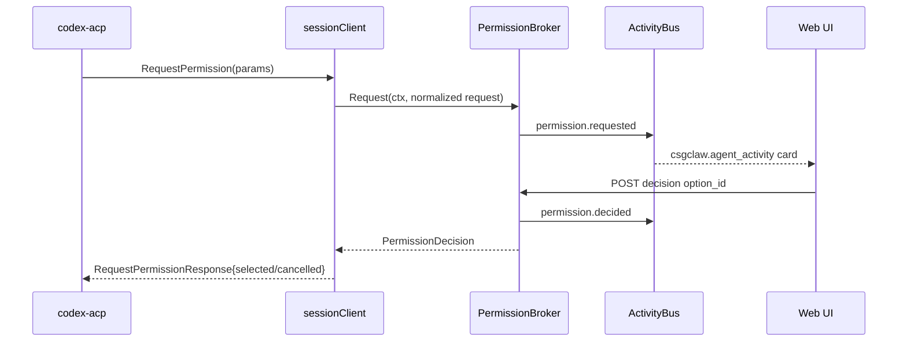

# Codex 工具调用与权限确认前端化方案

## 1. 方案目的

当前 Codex runtime 已经通过 ACP 接入 `codex-acp`，并能收到工具调用、工具状态更新和权限请求。但这些事件目前主要被 `codexbridge` 渲染成普通文本消息，权限请求则在后端自动选择 `allow_once` 或 `allow_always`，前端无法展示可点击确认。

本方案的目标是：

- 将 Codex 工具调用以结构化方式展示在 Web IM 中，支持用户通过现有“显示/隐藏工具调用”按钮关闭展示。
- 将 `permission_request` 渲染成前端可交互的确认卡片，由用户点击允许或拒绝后再返回给 Codex。
- 把 Codex/ACP 的专有事件转换成运行时中立的 agent activity 模型，后续 PicoClaw、OpenClaw、Notifier 或其他 runtime 可以复用同一套前端渲染和 API 交互。
- 保持现有 IM message、bot bridge、SSE、structured card 机制的兼容性，避免把工具调用展示做成 Codex 专用的散落逻辑。

## 2. 现有相关代码的架构交互

### 2.1 Codex ACP 启动与会话链路

Codex runtime 的核心代码位于：

- `internal/runtime/codex/runtime.go`
- `internal/runtime/codex/session_manager.go`
- `internal/runtime/codex/session_events.go`
- `internal/channel/codexbridge/*`
- `internal/codexacp/*`

当前启动流程：



关键点：

- `go.mod` 使用 `github.com/coder/acp-go-sdk v0.12.2`。
- `internal/codexacp/locator.go` 负责查找 `codex-acp`。
- `internal/codexacp/installer.go` 负责下载和解包 `codex-acp`。
- `session_manager.go` 通过 `exec.CommandContext(ctx, spec.BinaryPath)` 启动 `codex-acp`，再用 stdin/stdout 建立 ACP client-side connection。
- 初始化时声明客户端支持 `Fs.ReadTextFile`、`Fs.WriteTextFile` 和 `Terminal`。

### 2.2 消息到 Prompt 的链路

Codex worker 并不直接订阅 Web 前端，而是复用本地 bot 兼容接口：



相关代码：

- `internal/im/bot_bridge.go` 将房间消息转换成 `BotEvent`。
- `internal/api/bot_compat.go` 提供 `/api/bots/{id}/events` 和 `/api/bots/{id}/messages/send`。
- `internal/channel/codexbridge/sse_client.go` 读取 bot SSE。
- `internal/channel/codexbridge/bridge.go` 构造 `acp.PromptRequest`。
- `internal/channel/codexbridge/render.go` 将 Codex runtime 事件渲染为普通文本消息。

### 2.3 当前工具调用字段模型

ACP SDK 中工具调用的主要字段来自 `SessionUpdateToolCall` 和 `SessionToolCallUpdate`：

```go
type SessionUpdateToolCall struct {
    ToolCallId ToolCallId
    Title      string
    Status     ToolCallStatus
    Kind       ToolKind
    Locations  []ToolCallLocation
    RawInput   any
    RawOutput  any
    Content    []ToolCallContent
    Meta       map[string]any
}

type SessionToolCallUpdate struct {
    ToolCallId ToolCallId
    Title      *string
    Status     *ToolCallStatus
    Kind       *ToolKind
    Locations  []ToolCallLocation
    RawInput   any
    RawOutput  any
    Content    []ToolCallContent
    Meta       map[string]any
}
```

CSGClaw 当前将其压缩为 `runtime/codex.SessionEvent`：

```go
type SessionEvent struct {
    RuntimeID            string
    SessionID            string
    Kind                 SessionEventKind
    ReceivedAt           time.Time
    MessageID            string
    Text                 string
    ToolCallID           string
    ToolTitle            string
    ToolStatus           string
    PermissionOptionID   string
    PermissionOptionKind string
    StopReason           string
    Error                string
    Payload              any
}
```

现有事件种类：

- `tool_call_start`
- `tool_call_update`
- `permission_request`
- `permission_decision`
- `text_delta`
- `thought_delta`
- `plan_update`
- `prompt_completed`
- `prompt_failed`

当前 `codexbridge/render.go` 只处理部分事件：

- `text_delta` 追加为最终回复文本。
- `tool_call_start` 发送 `Running tool: <title>`。
- `tool_call_update` 在 completed/failed 时发送 `Tool completed/failed: <title>`。
- `prompt_failed` 发送错误。

这导致两个问题：

- 工具调用被当成普通文本消息，前端无法可靠识别和隐藏。现有 `showToolCalls` 只过滤以 `🔧 ` 开头的 legacy 文本。
- `permission_request` 虽然进入事件流，但没有渲染为用户可交互 UI；后端直接自动选择 permission option。

### 2.4 当前权限请求字段模型

ACP 的权限请求为：

```go
type RequestPermissionRequest struct {
    SessionId SessionId
    ToolCall  ToolCallUpdate
    Options   []PermissionOption
    Meta      map[string]any
}

type PermissionOption struct {
    OptionId PermissionOptionId
    Kind     PermissionOptionKind
    Name     string
    Meta     map[string]any
}
```

`PermissionOptionKind` 包括：

- `allow_once`
- `allow_always`
- `reject_once`
- `reject_always`

当前 `sessionClient.RequestPermission` 的行为：



也就是说，当前权限请求是同步 RPC，但决策是后端自动完成，不经过前端。

### 2.5 当前前端消息与结构化卡片模型

Web 前端位于 `web/static/app.js`。

已有能力：

- `parseStructuredMessage(content)` 可以从消息 `content` 中解析 JSON。
- `csgclaw.action_card` 用于渲染可点击 action card。
- `csgclaw.notify_card` 用于渲染通知卡片。
- `showToolCalls` 状态控制工具调用显示开关。

但当前工具调用隐藏逻辑仍是文本启发式：

```js
function isToolCallMessage(content) {
  return (content ?? "").trimStart().startsWith("🔧 ");
}
```

这与 `codexbridge` 当前生成的 `Running tool: ...` 不匹配，也无法表达权限请求、工具输入、工具输出、状态、运行时来源等字段。

## 3. 其他 Agent 的常见设计

### 3.1 常规 AI Agent 的工具调用设计

常规 agent 客户端通常将消息流拆成三类数据：

- `assistant text`: 面向用户的自然语言回复。
- `tool activity`: 工具调用轨迹，包括工具名称、输入摘要、状态、输出摘要、错误、耗时。
- `permission gate`: 执行敏感操作前的阻塞式确认请求，包括操作说明、风险级别、可选决策、超时和最终结果。

典型数据流：



核心原则：

- 工具调用是“活动事件”，不是普通聊天正文。
- 权限请求是“待决任务”，不是单向通知。
- 权限请求必须有稳定 `request_id`，用户点击时使用这个 ID 回写决策。
- 决策必须幂等：重复点击同一 request 只能成功一次，后续返回当前状态。
- UI 可以隐藏工具调用，但不能丢失待决权限请求；隐藏工具轨迹时，待确认卡片仍应显示或至少在顶部给出待处理入口。
- 后端必须有超时和安全默认值。超时应拒绝或取消，而不是默认允许。

### 3.2 ACP/Codex 的设计方式

Codex ACP 已经天然符合“工具调用事件 + 权限阻塞请求”的模型：

- 工具调用通过 `SessionUpdate.ToolCall` 和 `SessionUpdate.ToolCallUpdate` 推送。
- 权限请求通过 `RequestPermission` 从 agent 反向调用 client。
- `RequestPermission` 是同步阻塞的，client 需要返回 `RequestPermissionResponse`。
- 权限选项由 agent/codex-acp 提供，client 只负责展示并选择其中一个 option。

CSGClaw 现在缺失的是：

- 没有把 ACP 工具调用完整映射为前端可识别的结构化 activity。
- 没有把 ACP permission request 接到用户交互，而是自动选择。

### 3.3 PicoClaw 当前设计

PicoClaw runtime 是 sandbox gateway 型 runtime，核心代码在 `internal/runtime/picoclawsandbox` 和 `internal/runtime/sandboxgateway`。

当前设计特点：

- PicoClaw gateway 自己订阅 CSGClaw channel。
- 工具反馈由 PicoClaw 自身配置控制，默认配置里 `agents.defaults.tool_feedback.enabled = true`。
- CSGClaw 侧没有接收 PicoClaw 的结构化工具事件，也没有统一 tool activity bus。
- 现有前端对工具调用的隐藏逻辑仍依赖 legacy 文本前缀，这更像是兼容 PicoClaw 旧消息格式。

因此，PicoClaw 当前不是一个可复用的结构化权限交互参考。它说明了一个兼容要求：新模型上线后，前端仍要保留 legacy 文本识别，避免旧 agent 的工具消息突然不可隐藏。

### 3.4 OpenClaw 当前设计

OpenClaw runtime 也是 sandbox gateway 型 runtime，核心代码在 `internal/runtime/openclawsandbox`。

当前 CSGClaw 对 OpenClaw 的配置是显式关闭 exec approval prompt：

```json
{
  "tools": {
    "profile": "full",
    "exec": {
      "host": "gateway",
      "security": "full",
      "ask": "off"
    }
  }
}
```

同时 `EnsureConfig` 会写入 `.openclaw/exec-approvals.json`：

```json
{
  "version": 1,
  "defaults": {
    "security": "full",
    "ask": "off",
    "askFallback": "full",
    "autoAllowSkills": true
  },
  "agents": {
    "*": {
      "security": "full",
      "ask": "off",
      "askFallback": "full"
    }
  }
}
```

这表示在当前 CSGClaw 集成里，OpenClaw 的 gateway-side approval daemon 不会向 agent 发 `/approve` 式交互。OpenClaw 的工具执行权限由配置文件预先决定，而不是像 ACP 一样每次请求都回调 client。

对本方案的启发：

- Codex 的 permission request 是运行时主动发起、需要同步返回的交互。
- OpenClaw 当前是配置驱动的权限策略，不会产生待决确认卡片。
- 统一架构应允许两种模式共存：有些 runtime 发 `permission.requested`，有些 runtime 只发 `tool_call.*` 或完全不发结构化 activity。

## 4. CSGClaw 实现方案

### 4.1 总体架构

建议新增运行时中立的 activity 层。这里的“中立”指前端和 API 面向 CSGClaw 的统一事件语义，不直接暴露 Codex ACP、PicoClaw、OpenClaw 等底层协议。

统一后只有一类对外模型：`agentactivity.Event`。不同 runtime 的原始消息先由 adapter 翻译成这个模型；其中权限请求因为会阻塞 runtime，需要额外交给 `PermissionBroker` 管理 pending 状态和用户决策。



关键设计：

- `runtime/codex.SessionEvent` 保留为 Codex adapter 内部类型，但不要直接成为前端契约。
- 新增 `internal/agentactivity` 或 `internal/runtime/activity` 包，定义跨 runtime 的事件模型、事件分发、权限状态机和 IM 投影。
- Web UI 只认识 `csgclaw.agent_activity` 的 `type + kind`，不关心底层是 Codex ACP、PicoClaw 还是 OpenClaw。
- 非阻塞 activity 由 adapter 直接发布到 `ActivityBus`，例如工具调用、计划更新、日志、思考摘要。
- 阻塞式权限请求由 adapter 交给 `PermissionBroker`，再由 broker 发布 `permission.requested` / `permission.decided` 到 `ActivityBus`。这样 permission 状态只有 broker 一个 owner。
- 权限确认通过专门 API 回写到 `PermissionBroker`，不通过普通聊天文本命令解析。

### 4.1.1 已有模块与新增模块的交互关系

本方案不是把现有 `codexbridge` 全部推倒重做，而是先把运行时返回的信息分清业务语义：

- 用户输入仍从 IM/bot bridge 进入 Codex。
- Codex 和未来其他 runtime 返回的信息统一进入 `agentactivity.Event`。
- 权限请求虽然原始来源也是 Codex adapter，但 pending 状态、超时、幂等和最终决策由 `PermissionBroker` 拥有。

模块职责建议如下：

| 模块 | 当前状态 | 业务语义 | 在新流程中的角色 |
| --- | --- | --- | --- |
| `internal/runtime/codex/session_manager.go` | 已有 | Codex ACP 协议边界 | 启动 `codex-acp`，维护 session，把 ACP update/request 交给 adapter 层 |
| `internal/runtime/codex/session_events.go` | 已有 | Codex 专用事件归一化 | 可保留为 ACP -> Codex 内部 event 的薄适配，再转换到 `agentactivity.Event` |
| `internal/channel/codexbridge/event_sink.go` | 已有 | Codex bridge 内部事件管道 | 过渡期只服务 Codex 文本 turn 聚合；工具、权限、计划等展示事件应迁到 `ActivityBus` |
| `internal/channel/codexbridge/bridge.go` | 已有 | 用户消息到 Codex prompt 的桥 | 继续订阅 bot SSE、发送 `acp.PromptRequest`；不再把 tool call 渲染成普通文本 |
| `internal/im/bot_bridge.go` | 已有 | IM 到 bot 的入站消息队列 | 仍负责用户消息进入 Codex，不承载 runtime activity |
| `internal/im/service.go` | 已有 | CSGClaw 的房间和消息存储 | 接收 projector 写入的 `csgclaw.agent_activity` JSON message |
| `internal/api/bot_compat.go` | 已有 | bot 兼容消息面 API | 继续提供 `/api/bots/{id}/events` 与 `/messages/send` |
| `web/static/app.js` | 已有 | IM 前端和 structured card renderer | 根据 `type=csgclaw.agent_activity` 与 `kind` 选择 Tool/Permission/Plan/Log 等卡片 |
| `internal/agentactivity.Bus` | 新增 | runtime activity 公告栏 | 分发所有非用户输入的 runtime 活动：文本 delta、思考、计划、工具、权限、日志、完成/失败 |
| `internal/agentactivity.PermissionBroker` | 新增 | 权限审批台 | 拥有 pending permission 状态，负责发布 `permission.requested/decided` 并把决策返回 runtime |
| `internal/agentactivity.Projector` | 新增 | IM 消息排版员 | 把需要前端可见的 activity 写成 `csgclaw.agent_activity` 结构化消息 |
| `TurnRenderer` | 可由现有 `codexbridge` 收敛而来 | 回复正文聚合器 | 订阅 assistant text delta，最终生成普通 chat message |
| permission decision API | 新增 | 用户审批入口 | 调用 `PermissionBroker.Decide`，完成 pending request |

端到端交互关系：



流程中各模块的作用可以按两条路径理解：

1. 输入路径：`im.BotBridge -> codexbridge.Service -> acp.PromptRequest`。这条路径处理用户消息进入 Codex。
2. 正文路径：`sessionClient -> ActivityBus -> TurnRenderer -> /api/bots/{id}/messages/send`。这条路径把 assistant text delta 聚合成普通聊天回复。
3. 活动路径：`sessionClient -> ActivityBus -> Projector -> im.Service -> Web UI`。这条路径处理工具调用、计划、思考、日志等结构化 activity。
4. 审批路径：`sessionClient -> PermissionBroker -> ActivityBus -> Web UI -> permission decision API -> PermissionBroker -> ACP response`。这条路径处理阻塞式权限请求。

这样设计后，`codexbridge.EventSink` 只是过渡期的 Codex 内部实现细节；长期前端可见的 runtime 信息都应落到 `ActivityBus` 和 `csgclaw.agent_activity` 上。未来如果 PicoClaw/OpenClaw 能输出结构化工具事件，只需要接入 `agentactivity.Bus`，不需要复用 Codex 专用的 `EventSink`。

### 4.1.2 统一 activity 模型与 broker 的关系

工具调用和权限请求都应该先被映射成同一种运行时中立模型：`agentactivity.Event`。区别不在“模型是否统一”，而在“事件是否需要等待用户决策后才能让 runtime 继续执行”。

可以把它想成一条主干和一个分支：

```text
runtime 原始事件
   |
   v
runtime adapter
   |
   v
agentactivity.Event 统一模型
   |
   +-- assistant.text.delta -> ActivityBus -> TurnRenderer -> 普通聊天回复
   |
   +-- thought/plan/log ----> ActivityBus -> Projector -> IM activity card -> Web 展示
   |
   +-- tool_call.* ---------> ActivityBus -> Projector -> IM activity card -> Web 展示
   |
   +-- permission.requested -> PermissionBroker -> ActivityBus -> Projector -> Web 确认卡片
                                ^                                      |
                                |                                      v
                                +---------- decision API <- 用户点击按钮
                                |
                                v
                         runtime-specific response
                         例如 ACP RequestPermissionResponse
```

更形象地说：

- `ActivityBus` 像“公告栏”：任何 runtime activity 都可以贴上来，回复聚合、前端卡片、日志、审计、IM projector 都可以订阅。
- `PermissionBroker` 像“审批台”：只处理需要用户选择的 request，负责挂起、超时、幂等、并发保护和把结果送回 runtime。
- `Projector` 像“排版员”：把统一模型转成 IM 里能展示的结构化消息。

所以工具调用不需要 broker，不是因为它不重要，而是因为它是观察型事件：



权限请求需要 broker，是因为它是阻塞型事件：



关键边界：

- Codex adapter 是 permission 的“来源入口”和“ACP response 翻译器”。
- `PermissionBroker` 是 permission 的“状态 owner”。只有它发布 `permission.requested` 和 `permission.decided`，避免 adapter 和 broker 重复发布。

### 4.1.3 消息类别与前端展示

统一 activity 不等于所有内容都用同一种 UI。前端应根据 `type + kind` 选择展示方式：

| 类别 | `type` / `kind` | 来源 | 业务语义 | 前端建议 |
| --- | --- | --- | --- | --- |
| 用户消息 | 普通 IM message | Web/CLI/user | 用户输入 | 普通用户气泡 |
| 助手正文 | `csgclaw.agent_activity` + `assistant.text.delta`，最终聚合成普通 message | ACP `AgentMessageChunk` | Codex 给用户看的最终回答 | 聚合后普通 assistant 气泡 |
| 思考摘要 | `thought.delta` | ACP `AgentThoughtChunk` | 模型推理/思考过程或摘要 | 默认折叠，可配置显示 |
| 计划更新 | `plan.updated` | ACP `Plan` | agent 当前任务计划 | Plan card 或 timeline |
| 工具调用 | `tool_call.started/updated/completed/failed` | ACP `ToolCall` / `ToolCallUpdate` | agent 正在读写文件、执行命令、搜索等 | ToolActivityCard，可被“隐藏工具调用”过滤 |
| 权限请求 | `permission.requested/decided` | ACP `RequestPermission` 经 broker | 敏感操作前需要用户确认 | PermissionCard，pending 时不应被隐藏 |
| 运行日志 | `runtime.log` | runtime stderr/terminal/log streamer | 调试和运行状态 | 默认折叠 LogBlock |
| 轮次结束 | `prompt.completed/failed` | ACP `PromptResponse` 或错误 | 一轮 prompt 完成、失败或停止原因 | 状态标记；失败时可显示错误卡 |

前端判断逻辑建议：

```text
message.content JSON
  -> type != csgclaw.agent_activity: 走现有普通/notify/action card
  -> type == csgclaw.agent_activity:
       kind == tool_call.*          -> ToolActivityCard
       kind == permission.requested -> PermissionRequestCard
       kind == permission.decided   -> PermissionDecisionBadge/Card
       kind == plan.updated         -> PlanCard
       kind == thought.delta        -> ThoughtBlock
       kind == runtime.log          -> LogBlock
       kind == prompt.failed        -> ErrorCard
```

### 4.1.4 统一模型的字段关系

`agentactivity.Event` 是外层信封，`ToolCall` 和 `PermissionRequest` 是具体内容。一个 permission request 通常会引用一个 tool call：



字段分层建议：

| 层级 | 字段 | 作用 |
| --- | --- | --- |
| Event | `id` | 单条 activity event 的唯一 ID，用于消息去重和前端 key |
| Event | `runtime_id` / `runtime_kind` / `agent_id` | 标识事件来自哪个 agent runtime |
| Event | `session_id` / `turn_id` | 关联一次 runtime session 或一轮用户 prompt |
| Event | `kind` | 区分 `tool_call.started`、`permission.requested` 等事件类型 |
| Event | `text` | 文本 delta 或日志文本，适用于 `assistant.text.delta`、`thought.delta`、`runtime.log` |
| Event | `raw` | 保留底层 runtime 原始 payload 的脱敏/截断版本，默认折叠 |
| ToolCall | `id` | 工具生命周期 ID，Codex 中对应 ACP `toolCallId` |
| ToolCall | `kind` | 工具类别，如 `read`、`edit`、`execute`、`fetch` |
| ToolCall | `title` | 面向用户的操作标题，如 `Run shell command` |
| ToolCall | `status` | `pending`、`running`、`completed`、`failed` 等状态 |
| ToolCall | `input_summary` / `output_summary` | 展示用摘要，避免直接暴露完整 raw input/output |
| ToolCall | `locations` | 工具影响的文件或位置，用于后续“审核变更”入口 |
| PermissionRequest | `id` | CSGClaw 生成的审批请求 ID，前端点击时使用它 |
| PermissionRequest | `tool_call_id` | 关联触发审批的工具调用 |
| PermissionRequest | `status` | `pending`、`allowed`、`rejected`、`expired`、`canceled` |
| PermissionRequest | `options` | runtime 提供的可选决策，Codex 中来自 ACP `PermissionOption` |
| PermissionDecision | `option_id` | 用户最终选择的 option |
| PermissionDecision | `decided_by` / `decided_at` | 审计字段 |

### 4.1.5 从 ACP 字段到统一模型的映射

Codex ACP 只是一个具体 runtime adapter。它的字段可以按下面方式映射：

| ACP 字段 | 统一模型字段 | 说明 |
| --- | --- | --- |
| `SessionNotification.SessionId` | `Event.session_id` | ACP session ID |
| `SessionUpdate.AgentMessageChunk` | `Event.kind=assistant.text.delta` + `Event.text` | Codex 面向用户的正文增量 |
| `SessionUpdate.AgentThoughtChunk` | `Event.kind=thought.delta` + `Event.text` | 思考过程或摘要，前端可折叠 |
| `SessionUpdate.UserMessageChunk` | 可忽略或映射为 `user_message.delta` | 通常已有 IM 用户消息，不建议重复展示 |
| `SessionUpdate.Plan` | `Event.kind=plan.updated` + `Event.plan/raw` | 任务计划更新 |
| `SessionUpdate.ToolCall.ToolCallId` | `ToolCall.id` | 工具生命周期 ID |
| `SessionUpdate.ToolCall.Title` | `ToolCall.title` | 工具展示标题 |
| `SessionUpdate.ToolCall.Kind` | `ToolCall.kind` | ACP tool kind，如 `execute`、`edit` |
| `SessionUpdate.ToolCall.Status` | `ToolCall.status` | 工具状态 |
| `SessionUpdate.ToolCall.RawInput` | `Event.raw` 或摘要到 `ToolCall.input_summary` | 需要脱敏和截断 |
| `SessionUpdate.ToolCall.RawOutput` | `Event.raw` 或摘要到 `ToolCall.output_summary` | 需要脱敏和截断 |
| `SessionUpdate.ToolCall.Locations` | `ToolCall.locations` | 可用于后续“审核/打开文件” |
| `RequestPermissionRequest.SessionId` | `Event.session_id` | 权限请求所属 session |
| `RequestPermissionRequest.ToolCall.ToolCallId` | `PermissionRequest.tool_call_id` | 关联工具调用 |
| `RequestPermissionRequest.ToolCall.Title` | `PermissionRequest.title` | 权限卡片标题 |
| `RequestPermissionRequest.Options[].OptionId` | `PermissionOption.id` | 点击后回传给 ACP |
| `RequestPermissionRequest.Options[].Kind` | `PermissionOption.kind` | `allow_once`、`reject_once` 等 |
| `RequestPermissionRequest.Options[].Name` | `PermissionOption.label` | 前端按钮文案 |

统一后，前端不需要理解 ACP，只需要识别：

```json
{
  "type": "csgclaw.agent_activity",
  "kind": "permission.requested",
  "permission": {
    "id": "perm-...",
    "tool_call_id": "tool-1",
    "status": "pending",
    "options": [
      {"id": "once", "kind": "allow_once", "label": "Allow once"}
    ]
  }
}
```

### 4.2 核心结构体设计

建议新增：

```go
package agentactivity

type EventKind string

const (
    EventAssistantTextDelta  EventKind = "assistant.text.delta"
    EventThoughtDelta        EventKind = "thought.delta"
    EventPlanUpdated         EventKind = "plan.updated"
    EventToolCallStarted     EventKind = "tool_call.started"
    EventToolCallUpdated     EventKind = "tool_call.updated"
    EventToolCallCompleted   EventKind = "tool_call.completed"
    EventToolCallFailed      EventKind = "tool_call.failed"
    EventPermissionRequested EventKind = "permission.requested"
    EventPermissionDecided   EventKind = "permission.decided"
    EventRuntimeLog          EventKind = "runtime.log"
    EventPromptCompleted     EventKind = "prompt.completed"
    EventPromptFailed        EventKind = "prompt.failed"
)

type Event struct {
    ID          string    `json:"id"`
    RuntimeID   string    `json:"runtime_id"`
    RuntimeKind string    `json:"runtime_kind"`
    AgentID     string    `json:"agent_id"`
    SessionID   string    `json:"session_id,omitempty"`
    TurnID      string    `json:"turn_id,omitempty"`
    Kind        EventKind `json:"kind"`
    CreatedAt   time.Time `json:"created_at"`

    Text       string             `json:"text,omitempty"`
    Tool       *ToolCall          `json:"tool,omitempty"`
    Permission *PermissionRequest `json:"permission,omitempty"`
    Plan       *PlanUpdate        `json:"plan,omitempty"`
    Log        *RuntimeLog        `json:"log,omitempty"`
    StopReason string             `json:"stop_reason,omitempty"`
    Error      string             `json:"error,omitempty"`
    Raw        any                `json:"raw,omitempty"`
}

type ToolCall struct {
    ID            string         `json:"id"`
    Kind          string         `json:"kind,omitempty"`
    Title         string         `json:"title"`
    Status        string         `json:"status"`
    InputSummary  string         `json:"input_summary,omitempty"`
    OutputSummary string         `json:"output_summary,omitempty"`
    Locations     []ToolLocation `json:"locations,omitempty"`
    StartedAt     *time.Time     `json:"started_at,omitempty"`
    CompletedAt   *time.Time     `json:"completed_at,omitempty"`
}

type ToolLocation struct {
    Path string `json:"path"`
    Line int    `json:"line,omitempty"`
}

type PlanUpdate struct {
    Entries []PlanEntry `json:"entries,omitempty"`
    Summary string      `json:"summary,omitempty"`
}

type PlanEntry struct {
    ID     string `json:"id,omitempty"`
    Title  string `json:"title"`
    Status string `json:"status,omitempty"`
}

type RuntimeLog struct {
    Source string `json:"source,omitempty"`
    Level  string `json:"level,omitempty"`
    Text   string `json:"text"`
}

type PermissionStatus string

const (
    PermissionPending PermissionStatus = "pending"
    PermissionAllowed PermissionStatus = "allowed"
    PermissionRejected PermissionStatus = "rejected"
    PermissionExpired PermissionStatus = "expired"
    PermissionCanceled PermissionStatus = "canceled"
)

type PermissionRequest struct {
    ID          string             `json:"id"`
    ToolCallID  string             `json:"tool_call_id"`
    Title       string             `json:"title"`
    Description string             `json:"description,omitempty"`
    Status      PermissionStatus   `json:"status"`
    Options     []PermissionOption `json:"options"`
    RequestedAt time.Time          `json:"requested_at"`
    ExpiresAt   *time.Time         `json:"expires_at,omitempty"`
    Decision    *PermissionDecision `json:"decision,omitempty"`
}

type PermissionOption struct {
    ID    string         `json:"id"`
    Kind  string         `json:"kind"`
    Label string         `json:"label"`
    Meta  map[string]any `json:"meta,omitempty"`
}

type PermissionDecision struct {
    OptionID string    `json:"option_id"`
    Kind     string    `json:"kind"`
    DecidedBy string   `json:"decided_by,omitempty"`
    DecidedAt time.Time `json:"decided_at"`
}
```

字段设计说明：

- `Event.ID` 用于前端列表渲染和去重，不等同于 `ToolCall.ID`。
- `ToolCall.ID` 对应 ACP `toolCallId`，同一工具生命周期多次更新应保持一致。
- `PermissionRequest.ID` 是 CSGClaw 生成的稳定 request id，不直接使用 ACP option id。
- `PermissionOption.ID` 对应 ACP `optionId`。
- `RuntimeKind` 用于未来统一支持 `codex`、`picoclaw_sandbox`、`openclaw_sandbox`、`notifier`。
- `Raw` 仅用于调试或折叠详情，前端默认不展示完整 raw，避免泄露敏感信息。

### 4.3 IM Message 承载方式

MVP 不需要立即扩展 `apitypes.Message`。先复用现有 `content` 字段承载结构化 JSON，并把 `kind` 设为 `agent_activity`：

```go
const (
    MessageKindMessage       = "message"
    MessageKindEvent         = "event"
    MessageKindAgentActivity = "agent_activity"
)
```

后续如果需要服务端按 activity 查询、更新同一条消息或做审计索引，再考虑扩展 `apitypes.Message`：

```go
type Message struct {
    ID        string         `json:"id"`
    SenderID  string         `json:"sender_id"`
    Kind      string         `json:"kind,omitempty"`
    Content   string         `json:"content"`
    Event     *EventPayload  `json:"event,omitempty"`
    Metadata  map[string]any `json:"metadata,omitempty"`
    CreatedAt time.Time      `json:"created_at"`
    Mentions  []Mention      `json:"mentions"`
}
```

为了兼容当前前端 structured card 机制，MVP 只写 `content` JSON：

- `message.kind = "agent_activity"`
- `message.content = JSON.stringify({ type: "csgclaw.agent_activity", ... })`

这样可以复用现有 `parseStructuredMessage(content)`，避免 `metadata` 与 `content` 双写造成状态不一致。后续如果需要服务端按 activity 查询、更新同一条消息或做审计索引，再补 `message.metadata.agent_activity` 或独立 activity store。

前端新 structured payload：

```json
{
  "type": "csgclaw.agent_activity",
  "schema_version": 1,
  "id": "act-...",
  "runtime_kind": "codex",
  "runtime_id": "rt-alice",
  "agent_id": "u-alice",
  "session_id": "sess-...",
  "kind": "tool_call.started",
  "tool": {
    "id": "tool-1",
    "kind": "execute",
    "title": "Run shell command",
    "status": "pending",
    "input_summary": "go test ./internal/runtime/codex"
  }
}
```

权限请求示例：

```json
{
  "type": "csgclaw.agent_activity",
  "schema_version": 1,
  "id": "act-...",
  "runtime_kind": "codex",
  "runtime_id": "rt-alice",
  "agent_id": "u-alice",
  "session_id": "sess-...",
  "kind": "permission.requested",
  "permission": {
    "id": "perm-...",
    "tool_call_id": "tool-1",
    "title": "Run shell command",
    "description": "Codex wants permission before executing this tool.",
    "status": "pending",
    "options": [
      {"id": "once", "kind": "allow_once", "label": "Allow once"},
      {"id": "reject", "kind": "reject_once", "label": "Reject"}
    ],
    "requested_at": "2026-05-18T10:00:00Z",
    "expires_at": "2026-05-18T10:01:00Z"
  }
}
```

### 4.4 PermissionBroker 设计

新增 broker 用于把同步 ACP `RequestPermission` 转成异步用户点击：

```go
type PermissionBroker interface {
    Request(ctx context.Context, req PermissionRequest) (PermissionDecision, error)
    Decide(ctx context.Context, requestID string, decision DecisionInput) (PermissionRequest, error)
    Get(requestID string) (PermissionRequest, bool)
}

type DecisionInput struct {
    OptionID  string
    DecidedBy string
}
```

Codex `RequestPermission` 改造后流程：



Broker 行为：

- 生成 `perm-<uuid>`。
- 保存 pending request 到内存 map。
- 使用 channel 阻塞等待用户决策。
- 超时后返回 reject/cancel，绝不默认允许。
- 决策成功后从 pending map 移除，但保留短期 completed cache，方便重复点击返回已决状态。
- 当 `sessionClient` 停止或 session 关闭时，取消该 session 下所有 pending request。

ACP 响应映射：

- 用户选择 `allow_once` 或 `allow_always`：返回 `RequestPermissionOutcome.Selected{OptionId}`。
- 用户选择 `reject_once` 或 `reject_always`：同样返回 selected，对应 ACP option id。
- 用户关闭、超时或无可用 option：返回 `RequestPermissionOutcome.Cancelled{}`。

### 4.5 新增 API

建议新增运行时中立 API：

```http
POST /api/v1/agent-activities/permissions/{request_id}/decision
Content-Type: application/json

{
  "option_id": "once"
}
```

响应：

```json
{
  "id": "perm-...",
  "status": "allowed",
  "decision": {
    "option_id": "once",
    "kind": "allow_once",
    "decided_by": "u-admin",
    "decided_at": "2026-05-18T10:00:10Z"
  }
}
```

错误语义：

- `404`: request 不存在或已过期太久。
- `409`: request 已被其他决策完成，响应体带当前状态。
- `400`: option id 不属于该 request。
- `410`: request 已过期。

为了前端刷新后恢复 pending 状态，可选增加：

```http
GET /api/v1/agent-activities/permissions?status=pending
GET /api/v1/agent-activities/permissions/{request_id}
```

第一阶段可以只实现 `POST decision`，因为 pending card 已经作为 IM message 存在；但如果要在刷新后禁用已决按钮，最好实现 `GET`。

### 4.6 Codex adapter 改造

`runtime/codex` 改造建议：

1. 保留 `SessionEvent` 作为 Codex 内部过渡类型，新增到 `agentactivity.Event` 的转换函数：

```go
func activityFromCodexSessionEvent(agent AgentRef, event SessionEvent) []agentactivity.Event
```

2. `sessionClient.SessionUpdate` 将 ACP update 映射为 runtime-neutral activity。短期可以同时发布 Codex 内部事件给现有 `codexbridge.EventSink`，但前端可见的工具、计划、思考、日志等展示应只以 `agentactivity.Event` 为准。

3. `sessionClient.RequestPermission` 不再调用 `choosePermissionOption` 自动允许。Codex adapter 只负责把 ACP request 交给 `PermissionBroker`，由 broker 拥有 pending 状态并发布 `permission.requested/decided`：

```go
decision, err := c.permissionBroker.Request(ctx, normalized)
if err != nil {
    return cancelledResponse(), nil
}
return responseFromDecision(decision), nil
```

4. `buildSessionEnv` 和 `seedCodexHomeConfig` 不需要因本方案改变。

5. `codexbridge/render.go` 不再把 tool call 渲染成 `Running tool: ...` 普通文本；工具、权限、计划、日志交给 activity projector。文本回复可以先继续由 `codexbridge` 负责聚合和发送，后续再收敛为 `ActivityBus -> TurnRenderer`。

### 4.7 Activity 到 IM 的投影

建议新增 `agentactivity.Projector`：

```go
type Projector struct {
    IM *im.Service
}

func (p *Projector) Project(ctx context.Context, roomID string, senderID string, event agentactivity.Event) (im.Message, error)
```

投影规则：

- `tool_call.started/updated/completed/failed` 生成 `MessageKindAgentActivity`。
- `permission.requested/decided` 生成或更新 `MessageKindAgentActivity`。
- 第一阶段可追加新消息；更好的体验是同一个 `permission.id` 或 `tool.id` 更新同一张卡片，需要 `im.Service` 支持 message update。

两阶段落地建议：

第一阶段：

- 每个 activity 追加一条结构化消息。
- 前端按 `tool.id` 合并同一回合的卡片展示，或直接展示多条状态卡。
- 权限请求点击后追加 `permission.decided` 消息，并在本地前端状态中禁用原按钮。

第二阶段：

- `im.Service` 增加 `UpdateMessage`。
- activity projector 根据 `activity_thread_id = runtime_id + session_id + tool_id/permission_id` 更新同一条消息。
- 前端刷新后也能看到最终状态。

### 4.8 前端改造

前端需要新增三块能力：

1. 识别 agent activity：

```js
function isAgentActivityPayload(value) {
  return value?.type === "csgclaw.agent_activity";
}

function isToolCallMessage(message) {
  const payload = getAgentActivityPayload(message);
  if (payload?.kind?.startsWith("tool_call.")) {
    return true;
  }
  return (message?.content ?? "").trimStart().startsWith("🔧 ");
}
```

当前 `visibleMessages` 调用的是 `isToolCallMessage(message.content)`，实现时建议改成传入整条 `message`。MVP 可以只解析 `message.content`；后续如果引入 `message.metadata.agent_activity`，这个函数也能自然兼容。

2. 渲染 activity card：

- `ToolActivityCard`: 展示工具 title、kind、status、input/output summary、可折叠 raw。
- `PermissionRequestCard`: 展示权限请求 title、description、tool summary、按钮列表。
- `PermissionDecisionBadge`: 展示 allowed/rejected/expired/canceled。

3. 点击权限按钮：

```js
async function decidePermission(requestID, optionID) {
  const resp = await fetch(`/api/v1/agent-activities/permissions/${requestID}/decision`, {
    method: "POST",
    headers: { "Content-Type": "application/json" },
    body: JSON.stringify({ option_id: optionID }),
  });
  ...
}
```

UI 行为建议：

- 允许类按钮使用主按钮样式，拒绝类按钮使用 danger/secondary 样式。
- `allow_always` 必须展示更强提示，避免用户误点长期授权。
- pending 权限卡片不受“隐藏工具调用”影响；如果隐藏工具调用，仍显示 `permission.requested`，因为它需要用户处理。
- 已决权限卡片可被工具调用隐藏按钮一起隐藏，但房间顶部可以显示待处理计数。

### 4.9 与其他 runtime 保持一致

一致性的关键不是让每个 runtime 都实现 permission，而是让它们能映射到同一个可选能力接口：

```go
type ActivityEmitter interface {
    ActivityBus() *agentactivity.Bus
}

type PermissionRequester interface {
    PermissionBroker() *agentactivity.PermissionBroker
}
```

runtime 支持矩阵：

| Runtime | 当前工具事件 | 当前权限模式 | 本方案接入方式 |
| --- | --- | --- | --- |
| Codex | ACP `SessionUpdate.ToolCall` | ACP `RequestPermission` 同步回调 | 完整接入 activity + broker |
| PicoClaw | gateway 自己发文本工具反馈 | 配置/内部 hooks，CSGClaw 未接入 | 保留 legacy 文本隐藏，未来可适配 activity |
| OpenClaw | gateway 自己执行和发消息 | 当前 `ask=off`，`exec-approvals.json` allow all | 当前无需 permission UI，未来可适配 activity |
| Notifier | 无工具调用 | 无 permission | 不接入或只发 notify card |

### 4.10 推荐实施步骤

1. 新增 `internal/agentactivity`：定义事件、权限请求、broker、bus、projector。
2. 新增 `MessageKindAgentActivity`，MVP 用 `message.content` 写入 `csgclaw.agent_activity` JSON；暂不强制扩展 `Metadata`。
3. 新增 permission decision API，并接入 server handler。
4. Codex `RequestPermission` 改为 broker 阻塞等待，不再自动 allow。
5. Codex `SessionUpdate` 转换为 agent activity。
6. `codexbridge` 保留文本回复路径，移除普通文本工具调用渲染。
7. 新增 activity projector，把需要前端可见的 activity 写入 IM message。
8. Web 前端新增 `csgclaw.agent_activity` parser、ToolActivityCard、PermissionRequestCard，并预留 Plan/Thought/Log 渲染分支。
9. 更新 `showToolCalls` 过滤逻辑：结构化 tool activity + legacy `🔧 ` 都可隐藏。
10. 增加测试：
    - `runtime/codex`: RequestPermission 等待 broker 决策、超时取消、option 映射。
    - `agentactivity`: broker 幂等、过期、并发决策。
    - `api`: decision endpoint。
    - `web/static`: tool activity 识别、隐藏、permission button action。

### 4.11 风险与边界

- 权限请求不能通过普通聊天回复解析，否则容易被 agent 伪造或误触发。
- `allow_always` 是长期授权语义，前端必须明显区分。
- `RawInput`、`RawOutput` 可能包含敏感内容，投影前应截断和脱敏。
- 如果 Web UI 关闭，pending permission 应超时拒绝；不能无限阻塞 Codex。
- 第一阶段如果只追加 activity 消息，会产生较多工具状态消息；但这是可接受的低风险落地方式。
- 若后续支持 Feishu/Lark 交互卡片，permission broker 不需要重做，只需增加 channel-specific projector。

### 4.12 最小可行版本

MVP 建议范围：

- 只接入 Codex。
- `permission_request` 通过 Web UI 点击决策。
- 工具调用以 `csgclaw.agent_activity` 结构化消息展示。
- “显示/隐藏工具调用”过滤结构化 tool activity 和 legacy `🔧 ` 文本。
- 权限请求 pending 卡片始终显示。
- 权限超时默认 cancel/reject。

MVP 不做：

- 不更新同一条 message，只追加状态消息。
- 不做 Feishu/Lark action card。
- 不把 PicoClaw/OpenClaw 改成结构化工具事件。
- 不展示完整 raw input/output，只展示 title、kind、status、摘要和折叠调试信息。
