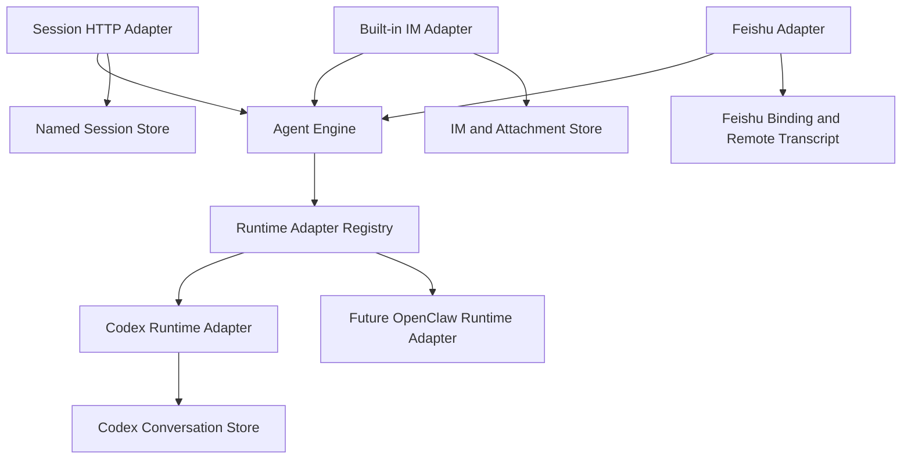

# Agent Engine Decoupling

Chinese version: [agent-engine-decoupling.zh.md](agent-engine-decoupling.zh.md)

## Status

Status: **Architecture proposal; review interface implemented**.

The contract-only implementation is in [`internal/agentengine`](../../internal/agentengine).
It is not wired to the existing Agent, API, IM, or Runtime packages.
That package is the source of truth for exact Go types and method signatures.
This document explains the intended ownership, behavior, and incremental implementation plan.

## 1. Scope

### 1.1 Goal

CSGClaw needs one runtime-neutral execution path for anonymous sessions, built-in IM, Feishu, and future direct Channels:

```text
Channel Adapter or Session API -> Agent Engine -> Runtime Adapter
```

The design has two public resource interfaces:

- `Agents()` manages persisted Agent resources and Runtime lifecycle.
- `Conversations(agentID)` executes conversations for one selected Agent.

The interface follows the Kubernetes client style by selecting a resource scope first and then exposing focused operations.
It does not introduce a Kubernetes controller, API server, object metadata model, or reconciliation framework.

The design must:

- Keep anonymous sessions independent from IM Rooms and Messages.
- Preserve built-in IM collaboration behavior.
- Keep Runtime-specific protocols behind `ConversationRuntime`.
- Support text, files, live progress, interactions, and CSGClaw Structured Output.
- Reuse current storage owners instead of creating an Engine database.
- Allow implementation in small, reviewable phases.

### 1.2 Non-goals

This proposal does not:

- Replace the existing Agent, IM, Participant, Team, Task, or Runtime stores.
- Turn `/api/v1/agents/{id}/llm` into an Agent execution API.
- Implement a remote Agent Engine or Engine HTTP protocol.
- Implement the complete OpenAI Responses API or a `previous_response_id` chain.
- Add a Files API or new Feishu file-download support.
- Make Agent Engine own transcripts, attachments, credentials, or Runtime-native conversation mappings.
- Add compatibility, fallback, or dual execution paths.
- Claim direct OpenClaw support before OpenClaw exposes a suitable direct protocol.

## 2. Current Product Constraints

### 2.1 Existing State Owners

The architecture keeps these current ownership boundaries:

| State | Owner |
|---|---|
| Agent, Profile, Runtime record | `internal/agent` |
| Runtime-native conversation mapping | Concrete Runtime package, currently `internal/runtime/codex` for Codex |
| User, Room, Message, Thread, attachment | `internal/im` |
| Participant and Channel binding | `internal/participant` |
| Team, Task, Scheduled Task, Notification, Work | Their existing services |
| Model transport and proxy authentication | `internal/llm` and `internal/cliproxy` |

Agent Engine must not copy any of this durable state.
It may hold only process-local admission, active-turn, and pending-interaction state.

### 2.2 Existing Execution Paths

The current anonymous Session API still creates an IM Room and Messages:

```text
POST /api/v1/agents/{agent}/sessions/{session_id}/responses
  -> resolve Participant and IM User
  -> EnsureAgentSessionRoom
  -> persist input Message
  -> execute through Codex Channel Bridge
  -> persist final Message
```

The target path removes that IM dependency while preserving the request, SSE, and error shapes.

Built-in IM and host-side Feishu Codex execution currently use `internal/channelbridge/codexbridge`.
That bridge already owns source subscription, deduplication, conversation-key construction, hidden Channel and Thread context, attachment manifests, activity rendering, interactions, Stop, and `/new`.
Those Channel behaviors remain in Channel Adapters when execution moves to Agent Engine.

Feishu currently accepts text, post, and some interactive content.
Image, file, audio, and media input remain unsupported.

Codex exposes direct Session, Prompt, Event, Permission, and User Input APIs.
OpenClaw currently executes through its Channel or sandbox gateway and has no repository-proven direct equivalent of `Run`, streaming events, Cancel, Reset, and Resolve.
The first Runtime Adapter is therefore Codex.

## 3. Target Architecture

### 3.1 Dependency Direction



Agent Engine does not import IM, Participant, Channel, Team, or concrete Runtime packages.
The composition root registers Runtime Adapters and connects the interfaces to their existing owners.
A missing Runtime Adapter returns `runtime_adapter_unavailable` before creating Engine execution state, a Named Session, or a Channel consumer.

### 3.2 Public Resource Interfaces

The exact declarations remain in `internal/agentengine`.
The review surface is:

| Resource | Operations | Purpose |
|---|---|---|
| `Agents()` | Create, Get, List, Update, Delete, Start, Stop, Recreate | Desired Agent configuration and Runtime lifecycle |
| `Conversations(agentID)` | Run, Cancel, Reset, Resolve | Conversation execution scoped to one Agent |
| `ConversationRuntime` | Run, Cancel, Reset, Resolve | Runtime-specific direct execution behind Engine |

`AgentSpec` contains the complete desired state: name, description, instructions, role, Runtime, model, Skills, and MCP servers.
`AgentStatus` contains observed lifecycle state and the current Runtime ID.
Updating an Agent replaces its desired specification as one resource update.

`ConversationInterface` does not expose CRUD methods because Engine does not persist Conversation resources.
`Run`, `Cancel`, `Reset`, and `Resolve` describe the actual lifecycle available to callers.

### 3.3 Conversation Semantics

`ConversationKey` is an opaque caller-owned identity.
Engine validates only that it is non-empty and length-bounded.
It never parses Room, Thread, Channel, Binding, or Session fields from the key.

`TurnID` is an opaque caller-generated identity for one `Run` request.
The Channel Adapter or Session HTTP Adapter generates a random ID after ingress validation and deduplication, but before calling `Run`.
Engine validates only that it is non-empty and length-bounded, and passes it unchanged to the Runtime Adapter.
It is not derived from `ConversationKey` or a source Message ID because those identify different lifecycles.

Each Adapter owns collision-free key construction:

| Caller | Key source |
|---|---|
| Built-in IM | Agent Participant, Room, and optional Thread root |
| Feishu | App Binding, Chat, and optional Thread root |
| Session API | Random internal key stored by the Named Session Store |

Engine permits at most one Turn or Reset for `(agentID, ConversationKey)` at a time.
Different Conversation keys may execute concurrently.
Waiting admission may leave one Turn running while later Turns are queued for the same Conversation.
Cancel therefore uses the Agent-scoped `ConversationKey` and `TurnID` to identify exactly one queued or running Turn.
Resolve additionally carries `InteractionID` to identify one pending interaction.

`TurnID` lives only for the Turn lifecycle.
It is not a Conversation key, Runtime-native conversation mapping, transcript identity, or durable Engine resource.
`Reset` remains scoped to `ConversationKey`, and `Resolve` remains scoped to `ConversationKey` plus `InteractionID`.

`ContinuationPolicy` makes Runtime mapping behavior explicit:

- `create_or_resume` creates a missing native mapping or resumes it.
- `require_existing` returns `conversation_not_resumable` when the mapping is missing.

`ConversationAdmission` selects busy-key behavior:

- `wait` queues behind the active Turn inside Engine.
- `reject_if_busy` returns `conversation_busy` immediately.

`InteractionPolicy` selects caller behavior for blocking Runtime interactions:

- `resolve` allows the caller to answer through `Resolve`.
- `reject` terminates the Turn with `interaction_unsupported`.
- `skip_user_input` submits the Runtime's empty-answer form and safely denies permissions.

Built-in IM uses `resolve`.
The anonymous Session API uses `reject`.
Feishu keeps its current `skip_user_input` behavior.

### 3.4 Input, Events, and Result

`TurnRequest.Input` is one ordered list of `InputPart` values.
A text part contains `Text`.
A file part contains one caller-authorized `InputFile`.
There is no parallel file list and no Engine file-preparation step.

The Event Sink receives ordered, non-terminal progress for one `Run` call:

- Text delta.
- Thought delta.
- Activity update.
- Interaction request.
- Validated output item.

The sink is not an event bus, transcript store, or Channel renderer.
Its sequence number orders events only within the current Run call.

`Run` returns exactly one `TurnResult` and no second raw Runtime error.
`Dispatched=false` means Engine rejected the Turn before Runtime dispatch.
After Runtime dispatch, success, failure, cancellation, and timeout all return `Dispatched=true`.

Stable failure categories include invalid request, unavailable Agent, unavailable Runtime Adapter, busy Conversation, exhausted admission, missing Runtime mapping, unavailable file, unsupported interaction, and Runtime failure.

## 4. Ownership

Each fact has one owner:

| Component | Owns | Does not own |
|---|---|---|
| Agent Service | Agent persistence, desired configuration, Runtime lifecycle, Workspace and Runtime provisioning | Turn input, transcript, Runtime-native conversation mapping |
| Agent Engine | Admission, per-Conversation serialization, dispatch, active Turn, pending interaction, event ordering, normalized result | Durable Agent or Conversation state, files, Channel behavior |
| Runtime Adapter | Native conversation mapping, direct Runtime protocol, Runtime event translation, file exposure to Runtime | Channel subscription, transcript, Agent persistence |
| Channel Adapter | Ingress, identity, binding, deduplication, hidden context, file authorization, transcript, rendering, acknowledgment | Runtime-native mapping, Engine admission |
| Session HTTP Adapter | HTTP validation, Named Session binding, SSE and error mapping | IM Room, Message, Participant, transcript |

The Agent Service and Agent Engine must coordinate lifecycle changes so Restart, Recreate, Delete, or destructive Workspace changes do not replace resources used by an active Turn.
This coordination is an implementation responsibility and is not exposed as a public target or lease abstraction.

## 5. Primary Flows

### 5.1 Anonymous Session

The endpoint remains:

```http
POST /api/v1/agents/{agent}/sessions/{session_id}/responses
```

The target flow is:

```text
Session HTTP Adapter
  -> load or create Named Session binding
  -> generate TurnID
  -> Conversations(agentID).Run
  -> Runtime Adapter
  -> map Engine events to existing SSE
```

The Named Session Store contains only external Session ID, Agent ID, opaque Conversation Key, and `initializing` or `ready` state.
It stores no prompt, output, file, Runtime handle, or interaction.

An `initializing` Session uses `create_or_resume`.
It becomes `ready` after the first result with `Dispatched=true`.
A `ready` Session uses `require_existing`.

The route preserves current request input, `stream`, body limit, timeout, SSE, error envelope, `409 session_busy`, and empty `room_id` response metadata.
It creates no Room, User, Participant, IM Message, Participant Work, or hidden Channel context.

### 5.2 Built-in IM

```text
IM persists user Message
  -> Channel Adapter applies routing and deduplication
  -> build ConversationKey, generate TurnID, and order Input
  -> Conversations(agentID).Run
  -> Runtime Adapter
  -> Channel Adapter renders Activity and final Message
```

The Channel Adapter preserves mentions, Thread context, Skills, Participant Work, Stop, `/new`, superseding, replay, reactions, and transcript behavior.
It may merge the current hidden Channel or new-Thread context into normalized text input before calling Engine.
Engine does not model that context separately.

`/new` calls `Reset` with the same `ConversationKey`.
The Runtime Adapter atomically replaces its native conversation mapping.

### 5.3 Runtime Adapter

Engine selects the registered Adapter for the Agent's ready Runtime after admission.
The selected Adapter:

1. Resolves or creates the native conversation mapping according to `ContinuationPolicy`.
2. Executes the ordered input.
3. Converts native progress into Engine events.
4. Decodes eligible CSGClaw Structured Output before public text is emitted.
5. Returns one terminal result.

The Codex Adapter reuses the existing `conversation_sessions` mapping and `EnsureSession` behavior.
Reset replaces that mapping for the same `ConversationKey`.

An OpenClaw Adapter is added only after OpenClaw provides stable direct submission, terminal state, event delivery, Cancel, Reset, and interaction behavior.
It must not fabricate direct execution through an IM or Feishu event.

## 6. Critical Boundaries

### 6.1 Persistence

Agent Engine has no durable Conversation store.
Runtime Adapters own native conversation mappings.
Channel Adapters own transcripts and source delivery state.
The Named Session Store owns only external Session binding.

An Engine process restart interrupts queued and running Turns.
It does not delete Runtime-native mappings.
The design does not promise replay, exactly-once execution, or recovery of in-flight side effects.

### 6.2 Files

Built-in IM continues to own attachment metadata, blobs, download tokens, and garbage collection.
Before calling Engine, the trusted caller authorizes the file and resolves an `InputFile` containing ID, source path, name, media type, size, and hash.

Engine validates the Input shape but treats `SourcePath` as opaque.
It does not call IM APIs, read file bytes, write Workspace files, manage blobs, or mount sandboxes.
The Runtime Adapter decides how to mount, copy, or expose the file and preserves path, symlink, size, and hash checks.
The caller keeps the resolved source valid until `Run` returns.

Files are included only when newly uploaded or explicitly referenced.
Previous file bytes are not resent merely to continue a Runtime-native conversation.

### 6.3 Structured Output and Interactions

One shared decoder owns the `::csgclaw-output::` grammar.
It validates `resource_link` and detached `request_user_input` payloads before they cross the Engine boundary.
Raw control lines never reach public text or Channel renderers.

A blocking Runtime Permission or User Input keeps the same Turn open and uses `Resolve`.
A detached `request_user_input` completes the current Turn and creates a later Turn after the user answers.
Detached input does not call `Resolve`.

Secret interaction answers must not enter logs or transcripts.
Detached secret answers also must not be inserted into model continuation.

### 6.4 Concurrency and Lifecycle

Server configuration owns global, per-Agent, queue-length, and queue-timeout limits.
Engine owns the only per-Conversation execution queue.
Channel Adapters may retain source-ingress buffering for subscription, deduplication, and acknowledgment, but must not add a second normalized Turn queue.
Engine indexes queued and running Turns by `(agentID, ConversationKey, TurnID)` while Runtime-native conversation mappings remain keyed by Conversation identity.

If a sink fails, Engine requests Runtime cancellation when possible and waits for a true Runtime terminal state before releasing admission.
If cancellation is unsupported, Engine continues supervising the Runtime until termination.

Restart waits for active Turns and preserves the Runtime conversation store.
Recreate and Delete remove Runtime-owned state and do not promise continuation.
A strict caller receives `conversation_not_resumable` when its mapping is gone.

## 7. Incremental Implementation

### Phase 0: Review Contract

- Keep only the standalone interfaces in `internal/agentengine`.
- Review Agent lifecycle, conversation execution, input, event, output, interaction, and error shapes.
- Do not wire the package into existing behavior.

### Phase 1: Engine, Codex, and Anonymous Session

- Implement bounded admission and per-Conversation serialization.
- Implement the Codex Runtime Adapter.
- Add the Named Session Store.
- Route the existing anonymous Session API through Agent Engine.
- Preserve the public API while removing anonymous IM persistence.
- Reject unsupported Runtime Adapters before creating state.

### Phase 2: Built-in IM

- Move built-in IM execution behind Agent Engine.
- Preserve Channel routing, hidden context, files, interactions, Work, Stop, `/new`, transcript, and rendering.
- Run Team, Task, Scheduled Task, Notification, and Work regression coverage.

### Phase 3: Feishu and Additional Runtimes

- Move the supported Feishu text path behind Agent Engine.
- Preserve current mention, Thread, reaction, rendering, and `skip_user_input` behavior.
- Add OpenClaw only after its direct protocol exists.
- Design remote transport and new Channel file support separately when required.

Each phase must be independently reviewable and releasable.
A later phase must not be required to validate an earlier phase.

## 8. Acceptance Criteria

### 8.1 Architecture

- `internal/agentengine` imports no IM, Participant, Channel, Team, or concrete Runtime package.
- `Interface` exposes `Agents()` and Agent-scoped `Conversations(agentID)`.
- Conversation requests do not repeat Agent ID.
- Conversation keys remain opaque and caller-owned.
- Every Run carries a caller-generated opaque Turn ID, and Cancel targets one Turn with its Conversation Key and Turn ID.
- Engine persists no Agent, Conversation, transcript, file, or delivery state.
- Runtime-native conversation mapping has one owner.
- Missing Runtime Adapters fail explicitly with no fallback path.
- The Go contract and both language documents remain synchronized.

### 8.2 Behavior

- Anonymous Sessions create no IM entities and preserve their public API contract.
- Different Conversations can run concurrently while one Conversation remains serialized.
- Built-in IM preserves Room, Thread, Mention, file, Activity, Stop, Work, interaction, and `/new` behavior.
- Feishu preserves its currently supported text behavior without claiming file support.
- Codex conversations continue after Restart.
- Recreate and Delete report missing strict-continuation mappings honestly.
- CSGClaw Structured Output never leaks raw control lines.
- Secret answers enter neither logs nor transcripts.

### 8.3 Verification

- Contract tests cover Run, Cancel, Reset, Resolve, event ordering, terminal results, and stable errors.
- Tests cover one Turn, configured concurrency, busy admission, queue exhaustion, sink failure, and cancellation behavior.
- Tests cover no MCP, local MCP, remote MCP, text input, and file input.
- Anonymous tests verify that IM entity counts do not change.
- Channel tests verify deduplication, replay, superseding, and rendering.
- Runtime tests verify mapping creation, strict continuation, Reset, Restart, Recreate, and Delete semantics.
- Existing Agent, Session API, built-in IM, Feishu, Team, Task, Scheduled Task, Notification, and Work regressions pass.
