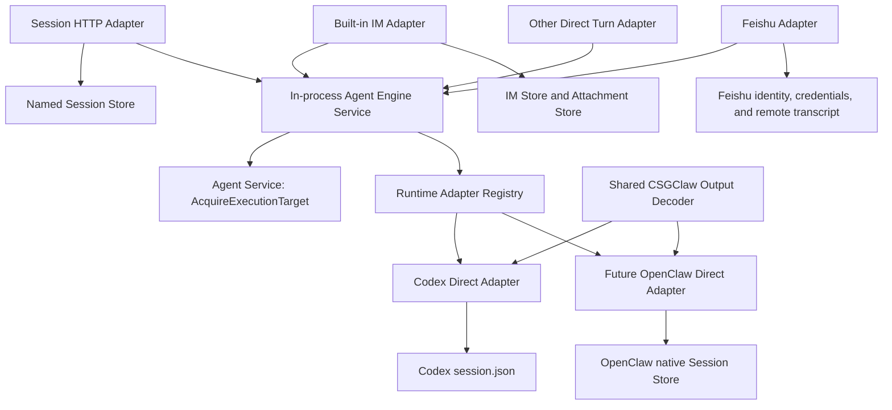

# Agent Engine and IM Decoupling Proposal

Chinese version: [agent-engine-decoupling.zh.md](agent-engine-decoupling.zh.md)

## Status and Review Process

Status: **Proposal, not implemented**.

This document is the review source of truth for the Agent Engine and IM boundary.
The English and Chinese versions must change together.
Implementation starts only after this proposal is accepted.

## Architecture Summary

This document defines the final architecture and implementation boundaries for decoupling Agent Engine from IM.

Every caller follows the same dependency direction:

```text
Channel Adapter or Session API -> Agent Engine -> Runtime Adapter
```

The complete architecture has these boundaries:

1. Agent Service owns Agent, Profile, Skill, MCP, Provider configuration, Runtime lifecycle, and the lifetime of immutable execution targets.
2. Each Channel Adapter owns ingress, identity, Binding, source deduplication, file authorization and source resolution, transcript, acknowledgment, and rendering.
3. Agent Engine is the Runtime-neutral and Channel-neutral execution core responsible only for turn admission, concurrency, dispatch, cancellation, Reset, Interaction routing, event ordering, and terminal results.
4. Runtime Adapter hides native Thread or Session state, protocols, and capability differences; Codex implements the Direct Turn Interface first, while OpenClaw may implement it after a direct protocol exists.
5. IM, Participant, Task, Runtime, and API Adapters each own their persistent state, while Agent Engine neither duplicates that state nor becomes a new conversation database.
6. Model Gateway and CLIProxy retain pure model-call responsibilities and do not participate in Agent conversation orchestration.
7. The current design implements only an in-process Service; remote Engine, new Channel file capabilities, Files API, and the complete Responses API are outside this proposal.

Anonymous APIs, built-in IM, Feishu, Team, Task, Scheduled Task, and Notification always use these boundaries.
A Runtime without a registered `ConversationRuntime` Adapter is unsupported by this architecture and cannot be activated for Agent execution.
An anonymous call that needs no collaboration semantics creates no Room, User, Participant, or IM Message.

Read Section 2 for current code constraints, Sections 3 and 4 for the final architecture and responsibilities, and Sections 7, 9, and 14 for APIs, flows, and acceptance.

## 1. Goals, Principles, and Non-goals

### 1.1 Goals

- Anonymous sessions create no Room, User, Participant, or IM Message.
- Independent anonymous sessions bypass the IM global lock and persistence path.
- Built-in IM, Feishu, anonymous APIs, and other callers execute through the same runtime-neutral Agent Engine.
- Codex implements the first Direct Adapter; OpenClaw uses the same interface only after it exposes a proven direct-execution protocol.
- Existing Agent, Participant, IM, attachment, Task, Workspace, and runtime-native storage remains in place.
- File authorization and source resolution remain at the trusted caller boundary, while materialization runs only after Engine holds the execution-target lease.
- Existing Skill contracts for `resource_link` and `request_user_input` remain valid.

### 1.2 Design Principles

This proposal applies the principles from *A Philosophy of Software Design* that are directly relevant to this problem.

- Each design fact has one owner.
- A small deep interface hides runtime differences instead of spreading Runtime Kind branches to callers.
- Transport concerns cannot enter Engine core before a real remote deployment use case exists.
- A new abstraction must not duplicate existing persistent state.
- An Adapter must own protocol conversion, state mapping, or policy instead of forwarding parameters only.
- Every behavior change has an independent and verifiable contract.
- Public interfaces, lifecycles, and failure semantics are fixed by code comments and contract tests.

### 1.3 Non-goals

- This proposal does not remove Room, User, Participant, Team, or IM from the collaboration product.
- It does not turn `/api/v1/agents/{id}/llm` into an Agent execution API.
- It does not make Agent Engine own transcripts, channel credentials, mentions, membership, or attachment bytes.
- The current implementation does not split Agent Engine into a separate process.
- The design does not implement the complete OpenAI Responses API.
- OpenClaw upstream need not implement a Go interface, but it must expose a direct-execution protocol that its Adapter can call.
- Existing storage layouts remain unchanged.
- Remote Agent Engine, Engine HTTP Client, new Channel file capabilities, Engine Files API, and the complete OpenAI Responses API are not implemented.

## 2. Current Code Facts

### 2.1 Current Entities and Persistence Owners

| State | Current owner | Current storage | Changed by this architecture |
|---|---|---|---|
| Agent, Profile, Runtime Record | `internal/agent` | `agents` section in root `state.json` | No |
| Server Config | `internal/config` | `config.toml` | No |
| Login, Connector, and Model Provider state | `internal/auth`, `internal/connectors`, `internal/config` | `auth` and `model_providers` sections in root `state.json` | No |
| Participant and Channel Binding | `internal/participant` | `participants` section in root `state.json` | No |
| Team metadata | `internal/team` | `teams` section in root `state.json` | No |
| IM User, Room, and Thread metadata | `internal/im` | `im/state.json` | No |
| IM Message | `internal/im` | `im/sessions/{room}.jsonl` and large-message blobs | No |
| IM attachment object and blob | `internal/im` | `im/assets/objects` and `im/assets/blobs/sha256` | No |
| Codex Conversation Key to Thread ID | `internal/runtime/codex` | Runtime `session.json` | No |
| Agent Workspace, Codex Home, Skills, and Runtime Config | Agent Service and concrete Runtime | Existing directories under `agents/{agent}` | No |
| OpenClaw config, Workspace, and native Session data | OpenClaw sandbox Runtime | Existing Agent Home and sandbox volumes | No |
| Task aggregate and events | `internal/taskcore` | JSON and `events.jsonl` under `tasks/{task}` | No |
| Scheduled Task | `internal/scheduledtask` | `scheduled-tasks/state.json` | No |
| Feishu App credential | Participant Channel App Config | Participant data in root `state.json` | No |

The root `state.json` is read and rewritten under the process-wide `localstore.WriteSection` mutex.
IM Service also uses its global lock for Room, Message, Thread, and attachment relationships.
Engine execution state is written to neither Store, while existing attachment data and GC remain owned entirely by IM.
Runtime reconciliation may update only its generated configuration blocks and must not overwrite Workspace user files, Runtime authentication, native Sessions, or unknown configuration fields.

### 2.2 Agent Fields Relevant to Execution

The current Agent already stores runtime identity and execution configuration.
The fields that matter to this proposal include:

```go
type Agent struct {
	ID               string
	Name             string
	Description      string
	Instructions     string
	RuntimeID        string
	RuntimeKind      string
	RuntimeName      string
	SandboxEnabled   bool
	Image            string
	Avatar           string
	BoxID            string
	RuntimeOptions   map[string]any
	MCPServers       map[string]any
	Role             string
	Status           string
	Profile          string
	AgentProfile     AgentProfile
	ProfileComplete  bool
	DetectionResults []ProfileDetectionResult
	CreatedAt        time.Time
	UpdatedAt        time.Time

	// Live observations that are not persisted.
	Availability   *RuntimeAvailability
	StartupPending bool
}

type AgentProfile struct {
	Provider             string
	ModelProviderID      string
	BaseURL              string
	APIKey               string
	Headers              map[string]string
	ModelID              string
	ReasoningEffort      string
	EnableFastMode       bool
	RequestOptions       map[string]any
	Env                  map[string]string
	ProfileComplete      bool
	EnvRestartRequired   bool
	ImageUpgradeRequired bool
}
```

### 2.3 Current Anonymous Session Path

```text
POST /api/v1/agents/{agent}/sessions/{session_id}/responses
  -> resolve the unique CSGClaw Agent Participant
  -> resolve the Participant's IM User
  -> EnsureAgentSessionRoom
  -> persist the Admin input Message
  -> use Room ID as the Codex Conversation Key
  -> run the turn and subscribe to IM, Work, and Codex events
  -> persist the final Agent Message
```

Current tests explicitly treat the following behavior as contract:

- An auditable anonymous Room is created.
- One `session_id` cannot switch Agents.
- An overlapping turn for the same Session returns `409 session_busy`.
- Different Sessions can run concurrently.
- Errors and SSE events use Responses-like shapes.
- The streaming Codex path waits for a runtime terminal state.
- Interactive requests fail fast.
- Failure to persist the final audit Message prevents successful completion.

The input Message also passes through Codex Channel Bridge, which injects `current_channel`, `room_id`, and `participant_id` as Hidden Context.
An anonymous Agent can therefore currently behave as if it were in a regular built-in IM Room and invoke messaging or collaboration Skills that depend on that context.

The Session API creates no audit Room automatically.
Section 7.1 defines the target Session boundary.

### 2.4 Current Built-in IM and Feishu Paths

Both built-in IM and Feishu Codex execution are driven directly by `internal/channelbridge/codexbridge`.
The bridge currently owns:

- Channel event subscription, deduplication, superseding, and queueing.
- Room or Thread to Codex Conversation Key mapping.
- `EnsureSession`, Prompt, and Codex event subscription.
- Hidden Channel Context and Thread Context.
- Attachment manifests.
- Processing reactions, activity rendering, and final message delivery.
- Participant Work leases, status, and Stop.
- Permission, native User Input, and Detached User Input.
- `/new` and conversation reset.

The Feishu Codex Bridge subscribes to Feishu events in the CSGClaw host.
It currently converts text, post, and some interactive content into `BotEvent`.
Feishu image, file, audio, and media messages are ignored, so complete Feishu file support is not an existing capability.
Runtime User Input on Feishu is currently continued with an empty answer and a notice that rich interactions are available only in the CSGClaw Web UI.

### 2.5 OpenClaw Is Not Yet a Codex-equivalent Executor

Codex and OpenClaw both implement process or sandbox lifecycle APIs.
Only Codex exposes session, prompt, event, permission, and user-input APIs that the host can invoke directly.

The current primary execution path for OpenClaw is:

```text
CSGClaw IM Message
  -> Participant Event SSE
  -> built-in CSGClaw Channel inside the sandbox
  -> OpenClaw Agent Loop
  -> Participant Message API
  -> CSGClaw IM
```

When OpenClaw is bound to Feishu, CSGClaw writes Feishu App credentials into the sandbox gateway configuration and the runtime's own Feishu Channel sends and receives messages.
The repository does not currently prove an equivalent direct `RunTurn + EventSink + Cancel + Interaction` protocol for OpenClaw.

### 2.6 Other Functional Paths That Must Not Be Missed

This decoupling cannot validate normal chat only.
The current code also contains these channel-dependent or IM-dependent flows:

- Team room creation, membership, and Team Event delivery.
- Team Task, Approval, Claim, Assign, Plan, Start, and result projection.
- Agent Task wake-up through a Direct Room and `task_assigned` Event.
- Scheduled Task creation of Agent Tasks followed by IM delivery.
- Notification Participant Push, Pull, Relay, Webhook, and IM fanout.
- Participant Event Pending, Inflight, Ack, Requeue, Seen, and 30-minute replay.
- Participant Work Lease, thinking status, Stop, and tombstones.
- Agent-to-Agent mentions, `notify_all_agents`, and loop prevention.
- `/new`, which resets Codex internally and sends `/new` to OpenClaw.
- Runtime restart, recreation, Skill preservation, MCP updates, and external Binding activation.

These functions do not belong in Agent Engine.
The final Channel execution path must still deliver them to the correct Agent.

### 2.7 Current Concurrency Controls and Code Index

The anonymous API currently has only the per-`session_id` single-turn lock in `Handler.sessionTurns`, with no bounded global or per-Agent admission.
The Codex Channel Bridge has a default queue length of 32 per Bot.
Participant Bridge keeps at most 64 Pending Events per Participant.
These limits belong to different layers and cannot be added together as system capacity.
Codex app-server Manager registers an independent turn waiter per Thread, and `Prompt` has no explicit process-wide serialization lock.
Current tests do not prove that one real Codex app-server can sustain 64 concurrent turns on different Threads, so code structure alone cannot justify that value.

The review primarily used these code locations:

| Fact | Primary code location |
|---|---|
| Agent fields, decoding, and root-state writes | `internal/agent/model.go`, `internal/agent/store.go`, `internal/localstore/root_state.go` |
| Anonymous Session API and contract tests | `internal/api/agent_sessions.go`, `internal/api/agent_sessions_test.go` |
| IM locks, Rooms, Messages, and Session files | `internal/im/service.go`, `internal/im/session_store.go` |
| Attachment objects, materialization, and GC | `internal/im/asset_store.go` |
| Codex Conversation Mapping | `internal/runtime/codex/appserver_manager.go`, `internal/runtime/codex/runtime.go` |
| Codex Channel Bridge and Renderer | `internal/channelbridge/codexbridge`, `internal/channelbridge/runtimebridge` |
| OpenClaw Channel config and sandbox lifecycle | `internal/runtime/openclawsandbox`, `internal/runtime/sandboxgateway` |
| Current host Feishu Bridge input capability | `internal/channelbridge/feishu_client.go` |
| Participant Event, replay, and attachment materialization | `internal/im/participant_bridge.go`, `internal/api/participant_bridge.go` |
| Binding activation and Runtime Restart/Recreate | `internal/participant/feishubind`, `internal/agent/lifecycle.go`, `internal/agent/service_profiles.go` |
| Team, Task, Scheduled Task, and Work Lease | `internal/team`, `internal/agenttask`, `internal/taskcore`, `internal/scheduledtask`, `internal/worklease` |

## 3. Final Architecture

### 3.1 Dependency Direction



Agent Engine does not import `im`, `participant`, `channel`, `team`, or concrete runtime packages.
The Composition Root registers concrete Runtime Adapters.
Channel, API, and Runtime packages may depend on the runtime-neutral contract package.
In-process callers use Engine Service directly, with no forwarding-only Local Client.
A missing `ConversationRuntime` Adapter fails Session execution or Binding activation with `runtime_adapter_unavailable` before any execution state is created.

When an OpenClaw Direct Adapter is registered, Host Channel Adapters are the sole consumers for CSGClaw-managed Bindings.
Its Direct Adapter must call a runtime-native direct-execution protocol and must not fabricate a turn through an IM Message or Feishu event.
OpenClaw support does not block the first Codex Engine milestone while that direct protocol is unavailable.

### 3.2 Core Concepts

`ConversationKey` is a stable opaque string produced by the caller.
Engine validates only that it is non-empty and length-bounded and never parses Channel, Binding, Room, Thread, or Session fields from it.
Engine locks and active state use `(AgentID, ConversationKey)`.

Each caller owns collision-free key construction inside its Adapter:

| Caller | Conversation Key source |
|---|---|
| Built-in IM | Adapter-owned encoding of Agent Participant, Room, and optional Thread root |
| Feishu | Adapter-owned encoding of App Binding, Chat, and optional Thread root |
| Session API | Random internal key persisted by Named Session Store |

A Conversation keeps the same key after explicit Reset.
The Runtime Adapter atomically replaces its native mapping during Reset, so the next turn does not require a special creation mode.

`ContinuationPolicy` makes runtime mapping behavior explicit:

- `create_or_resume` creates a mapping when none exists and otherwise resumes it.
- `require_existing` fails with `conversation_not_resumable` when the mapping is missing.

The Session API uses `create_or_resume` while a Named Session is `initializing` and `require_existing` only after a dispatched first turn proves that the Runtime Mapping exists.
Channel Adapters choose the policy from their own recovery semantics without exposing Channel facts to Engine.

`ConversationAdmission` fixes where same-Conversation waiting is owned:

- `wait` queues behind the active Turn inside Engine.
- `reject_if_busy` returns `conversation_busy` without a second caller-side lock.

The Session API uses `reject_if_busy` and maps that error to the existing `409 session_busy` response.
Channel Adapters normally use `wait`.

`InteractionPolicy` states what the caller can do when a Runtime asks for a blocking interaction:

- `resolve` registers the interaction in Engine and allows the Adapter to call `ResolveInteraction`.
- `reject` terminates the turn with the caller's stable unsupported-interaction error.
- `skip_user_input` sends the Runtime's empty-answer form for native user input and safely denies permissions.

Built-in IM uses `resolve`, the Session API uses `reject`, and Feishu preserves its current `skip_user_input` behavior.

`ExecutionID` identifies one queued or running turn.
It is used for cancellation, interaction routing, logging, and rejecting a duplicate active execution.

`EventSink` receives ordered progress events for one turn.
It is not an event bus, transcript store, or channel renderer.
`RunTurn` returns one `TurnResult` and never a second raw Go error.
Before Runtime dispatch, a rejected result has `Dispatched=false`; after Runtime accepts the turn, every success, failure, cancellation, and timeout has `Dispatched=true` and is represented by that result alone.
If a sink write fails, Engine requests cancellation when supported and does not release the execution permit before the Runtime reaches a true terminal state.
When cancellation is unsupported, Engine continues supervising the Runtime until termination instead of reporting an early completion.

`InteractionID` identifies a permission or user-input request awaited by a running runtime.

## 4. Component Responsibilities

### 4.1 Agent Engine Responsibilities

Agent Engine only:

1. Enforces bounded global and per-Agent admission, applies the requested `ConversationAdmission`, and is the sole owner of `ConversationKey` execution serialization.
2. Acquires an immutable execution target from Agent Service only after a queued turn is admitted and holds it until the Runtime terminates.
3. Executes an optional caller-provided, runtime-neutral `FilePlan` only while that target lease is held, validates its `PreparedFile` results, and releases them after Runtime termination.
4. Serializes turns and resets for the same `ConversationKey`.
5. Dispatches turns through the runtime-neutral `ConversationRuntime` interface.
6. Holds the current process's Active Execution and Pending Interaction registries.
7. Applies the caller's `InteractionPolicy`, normalizes errors, preserves event ordering, and returns one terminal result.
8. Verifies that Cancel and ResolveInteraction match the active Agent, Conversation, and Execution, while Reset is serialized for its authorized Conversation.

Agent Engine does not own:

- Room, User, Participant, Channel Binding, or credentials.
- Transcript, audit record, Message, Mention, or Thread Context.
- Attachment blobs, download tokens, or historical file indexes.
- Agent Profile editing, Skill installation, MCP editing, Runtime provisioning, or recreation.
- `previous_response_id`, OpenAI Response objects, or HTTP authentication.
- Team, Task, Scheduled Task, Notification, or Participant Work persistence.

### 4.2 Agent Service Responsibilities

- Preserve the current Agent Store and API shapes.
- Persist Profile, Instructions, Runtime Options, MCP, and Runtime Records.
- Manage Create, Start, Stop, Delete, Restart, Recreate, and Upgrade.
- Continue materializing Workspace, Skill, Provider, and Sandbox configuration.
- Be the sole owner of execution-target lease issuance, reference counting, and transition gates.
- Stop issuing new leases and wait for existing leases before Restart, Recreate, Delete, or destructive Workspace changes.
- Return a stable busy or timeout error instead of removing a Runtime or Workspace still used by a turn.
- Preserve the current Codex restart and Gateway sync or recreate behavior after Profile updates.

### 4.3 Runtime Adapter Responsibilities

- Map the opaque `ConversationKey` to a runtime-native Thread or Session.
- Persist that mapping in the existing Runtime Store.
- Execute Turn, Reset, Cancel, and native Interaction operations.
- Convert runtime events into stable runtime-neutral events.
- Select native output sources that may contain CSGClaw Structured Output.
- Run the shared Decoder before any public text delta.
- Declare capabilities instead of requiring upper layers to inspect Runtime Kind.

The Codex Adapter must reuse `EnsureSession(runtimeID, conversationKey)` and existing `conversation_sessions` persistence, while honoring `ContinuationPolicy` for creation and strict recovery.
Codex Runtime Store is the sole owner of that Conversation Mapping.
When `require_existing` finds no mapping, the Adapter returns `conversation_not_resumable` instead of entering the existing implicit-creation branch.
Reset atomically replaces the mapping with a new native Thread for the same key.

An OpenClaw Direct Adapter is valid only after the upstream runtime or gateway provides:

- A stable Conversation Key or Session Key.
- Direct submission of one turn with an explicit terminal state.
- Ordered streaming or an explicit non-streaming result.
- Cancellation or an explicit declaration that it is unsupported.
- Reset.
- Input that is not fabricated through an IM Room or Feishu event.

### 4.4 Channel Adapter Responsibilities

Each Channel Adapter:

- Subscribes to and validates Channel events and identities.
- Resolves AgentChannelBinding and creates an opaque collision-free `ConversationKey`.
- Owns existing source deduplication, acknowledgment, replay, transcript, rendering, reactions, Work, Stop, `/new`, and Detached Input semantics.
- Authorizes file access and builds an immutable `FilePlan` that resolves Channel-owned sources without exposing them to Engine.
- Creates an unpredictable `ExecutionID`, invokes Engine directly, and renders progress and terminal results.

Adapters may reuse low-level helpers for key encoding, output rendering, and event translation.
A helper that only forwards an Engine request is not a separate architectural layer.
Channel Adapters may keep their existing bounded source-ingress buffer for subscription, deduplication, acknowledgment, and replay, but maintain no second execution queue after an event is normalized.
When a newer source event supersedes an older queued Engine execution, the Adapter cancels the older `ExecutionID`; if it is already dispatched, the Adapter suppresses stale rendering while Engine supervises it to termination.
Engine is the sole owner of per-Conversation serialization and execution admission.

### 4.5 Session HTTP Adapter Responsibilities

- Preserve the existing request, SSE, and stable error shapes.
- Use one minimal Named Session Store for external Session names, Agent ownership, opaque Conversation Keys, and `initializing` or `ready` state.
- Select `create_or_resume` while the record is `initializing`, mark it `ready` after the first result with `Dispatched=true`, and select `require_existing` afterward.
- Use Engine `reject_if_busy` admission and map `conversation_busy` to the existing `409 session_busy` response without a second in-process lock.
- Use `InteractionPolicy=reject` to preserve the existing fail-fast anonymous interaction behavior.
- Map Engine progress events to the existing SSE event shapes.
- Enforce existing body limits, timeouts, and error mapping.

The Store contains no prompts, outputs, runtime handles, files, interactions, or secrets.
It does not read IM state or implement a `previous_response_id` chain.

### 4.6 IM, Participant, Team, Task, and Notification Responsibilities

- IM continues to own Room, User, Message, Thread, attachment objects, and attachment GC.
- Participant continues to own Agent to Channel Identity mappings and Feishu credentials.
- Team continues to create rooms, add members, and send messages through `TeamChannelAdapter`.
- Task and Scheduled Task continue to use their current stores and trigger model.
- Notification Participant continues to own Push, Pull, Relay, Webhook, and fanout.
- Participant Work remains the channel-visible work-status and Stop-control projection.

These components trigger an Agent indirectly through a Channel Adapter.
They do not write Agent Engine state.

### 4.7 Model Gateway and CLIProxy Responsibilities

- `/api/v1/agents/{id}/llm` remains a pure model proxy.
- `internal/cliproxy` continues to provide local authentication and model transport for Codex, Claude Code, and similar providers.
- OpenClaw may continue to use the Agent LLM route as its model endpoint.
- Agent Engine does not own provider tokens, model protocols, or LLM conversation history.

## 5. Conversation and Persistence

### 5.1 Why Engine Does Not Persist Conversations

Codex already stores canonical Conversation key to Thread ID in the runtime's `session.json`.
Persisting a Runtime Handle again in Engine would create two states that must be updated atomically.
The OpenClaw Adapter likewise owns its native Session mapping.

Queued and running turns are interrupted when Engine restarts.
That is the honest semantic of the current in-process execution model.

### 5.2 What the Eleventh Turn Sends

Assume a Room has completed ten turns.
On the eleventh turn:

- Channel supplies the new user input.
- Channel supplies the same stable `ConversationKey`.
- Channel supplies a `FilePlan` only for new or explicitly referenced files; Engine prepares them after acquiring the target lease.
- Channel may supply bounded Hidden Context, such as a new Thread's root context.
- Engine does not read the previous ten IM Messages.
- Runtime Adapter restores the native Thread by the canonical Conversation key, and that Thread holds model context.

The Channel transcript and runtime-native context are different facts.
The former is for presentation and audit, while the latter continues execution.

### 5.3 Recovery Boundaries After State Loss

- Agent Engine has no persistent Conversation state to recover.
- Restarting Engine does not delete Thread mappings in Codex `session.json`.
- When a Named Session record is missing, the same external Session ID creates a new Named Session.
- An `initializing` Named Session retries `create_or_resume`; this safely resumes a Mapping created before a crash or creates one when no Mapping exists.
- When a `ready` Named Session exists but its Runtime Mapping is missing, `require_existing` returns `conversation_not_resumable`.
- Engine never silently creates a new Runtime Conversation for a request marked `require_existing`.
- A process crash interrupts in-flight turns, and this API does not claim exactly-once execution or replay recovery without a caller request ID.

### 5.4 Named Session Store

The Session API needs one lightweight Named Session Store, not a Response Chain.
It atomically stores only this binding when a Session first binds to an Agent:

```text
session_id
agent_id
conversation_key
state = initializing | ready
created_at
```

The first request atomically creates a random `ConversationKey` in `initializing` state and uses `create_or_resume`.
An `initializing` record continues to use `create_or_resume`, including after a crash between Binding persistence and Runtime Mapping creation.
After the first `TurnResult` with `Dispatched=true`, the Session Adapter atomically marks the record `ready`; later requests use `require_existing`.
Engine `reject_if_busy` admission owns overlap detection, and the Session Adapter maps `conversation_busy` to `409 session_busy`.

The Store lives in an API-specific snapshot rather than root `state.json` or the IM Store.
Creation and the one `initializing` to `ready` transition use the existing small-store pattern of writing a temporary file and atomically replacing the snapshot.
Ordinary turns do not update the Store.
No Store lock is held while a Runtime turn executes.
Named Sessions do not expire automatically by default, preserving current persistence semantics.
Only an explicit management operation or a separately confirmed retention policy may delete a Named Session Binding.

The Store records no prompt, output, files, Runtime handle, or turn status beyond the Binding initialization state.
After a process crash, an `initializing` record retries idempotent Mapping creation or resume, while a `ready` record requires its saved Runtime Mapping.
It never claims whether an interrupted request ran zero, one, or more side effects.

The Named Session Store is the only source for Session bindings.

## 6. File Boundary

### 6.1 Preserve the IM Attachment Store

The current attachment object directly stores `RoomID`, `MessageID`, `CreatedBy`, and `DownloadToken`.
Current GC discovers references by scanning live Rooms and Messages.
IM continues to own attachment schemas, blobs, and GC as one unit.

File handling follows these rules:

- Built-in IM uploads continue to use the IM Asset Store.
- IM Messages continue to store attachment metadata.
- The built-in IM Adapter authorizes selected attachments and constructs a `FilePlan` backed by the existing attachment source.
- After admission and target acquisition, Engine invokes that plan with the leased Workspace; the concrete plan may use the existing `MaterializeAttachment` path without exposing IM types to Engine.
- The plan validates the safe destination, size, and hash before returning immutable `PreparedFile` values and a release function.
- Engine keeps the lease, calls a non-nil release function exactly once after Runtime termination, and accepts only prepared files rooted in the leased execution target's Workspace.
- Engine never accepts arbitrary external paths or calls IM APIs.
- Materialization uses atomic creation and rejects symbolic links, path escape, and replacement of an existing destination.
- Runtime opens with no-follow semantics and revalidates path, size, and hash immediately before use.
- Feishu keeps its current message-type support; adding Feishu file download and materialization is a separate feature.

### 6.2 Whether Files Are Resent Every Turn

File bytes are not resent every turn.
The built-in IM `FilePlan` materializes a new attachment, an explicitly referenced historical attachment, or a file missing from the Workspace cache after Engine acquires the target lease.
IM retains the Message to Attachment relationship, while the runtime-native Thread retains model-side semantic context.

## 7. Public API and Behavior Changes

### 7.1 Existing Session API

The endpoint remains unchanged:

```http
POST /api/v1/agents/{agent}/sessions/{session_id}/responses
```

Its internal execution path is:

```text
Session HTTP Adapter -> Named Session Store -> Agent Engine -> Runtime Adapter
```

If the Agent's Runtime has no registered `ConversationRuntime` Adapter, the route returns `runtime_adapter_unavailable` before creating a Named Session record.

The following must remain stable:

- Request `input` and `stream` shapes.
- `session_id` validation.
- `409 session_busy` for overlapping turns in one Session.
- Concurrent turns in different Sessions.
- Current SSE event names and ordering.
- Current error envelope and stable error codes.
- Current request body limit and turn timeout unless separately reviewed.

The route has the following final behavior:

- Every Session uses the Named Session Store and never reads an IM Session mapping.
- An `initializing` Named Session uses `create_or_resume`; a `ready` Named Session uses `require_existing`.
- A Session does not create an anonymous Room.
- Inputs and outputs are not written as IM Messages.
- Response metadata always returns an empty `room_id` to preserve its shape.
- Anonymous turn success is independent of IM persistence.
- A supported Codex or OpenClaw Agent requires no CSGClaw Participant to execute through this route.
- A Session does not inject `current_channel`, `room_id`, or `participant_id`, so it provides no messaging, attachment, Team, or collaboration Skills that require the current Room.
- Session Activity and Work appear only as API events and are not projected into an IM Room or Participant Work.
- Native Permission and User Input requests keep the current fail-fast anonymous interaction error through `InteractionPolicy=reject`.

A caller that needs Rooms, membership, mentions, audit messages, or Channel Skills must use built-in IM rather than treating the anonymous API as a hidden IM entrypoint.

The current route does not apply uniform Bearer validation.
Changing its authentication is a separate product and security decision and is not implicit in this architecture.

### 7.2 Explicitly Deferred APIs

The following interfaces are outside this decoupling and cannot shape the Engine contract or current Session API:

- `/v1/models`.
- `/v1/responses` and `previous_response_id` chains.
- `/v1/csgclaw/*` extensions.
- Remote Agent Engine, Engine HTTP Client, and Engine Files API.
- New file download or materialization capabilities for Channels that do not support them today.

If a real external caller appears later, transport, authentication, quotas, file upload, and versioning must be designed separately on top of the stable in-process Service.

## 8. Structured Output and Interaction

### 8.1 CSGClaw Structured Output

Existing Skill contracts remain unchanged:

```text
::csgclaw-output::resource_link <ResourceLink JSON>
::csgclaw-output::request_user_input <RequestUserInputArgs JSON>
```

The pipeline is:

```text
Skill stdout or Assistant Output
  -> Runtime Adapter selects an eligible native output source
  -> shared CSGClaw Decoder intercepts, parses, validates, and cleans
  -> runtime-neutral OutputItem
  -> Agent Engine EventSink
  -> Channel Renderer or existing Session SSE
```

The Parser exists only in the shared Decoder.
Agent Engine, Channel, and Web UI never scan raw control lines.
Cross-chunk suffixes that may form a control prefix remain buffered until they are safe to publish.

`resource_link` completes with the current turn.
The Channel renders it as a safe link and saves it in its transcript.

### 8.2 Blocking Interaction

A native Codex Permission or `request_user_input` pauses the active turn.
This flow is enabled only when the caller selects `InteractionPolicy=resolve`.
Its flow is:

```text
Runtime emits InteractionRequired
  -> Engine registers Active Interaction
  -> Channel displays it and authorizes the responder
  -> ResolveInteraction
  -> Engine routes to Runtime Adapter
  -> the same turn resumes and completes
```

`ResolveInteraction` applies only to a running turn.
It must be callable concurrently with the paused `RunTurn` and must not wait behind normal turns for the same Conversation.
With `reject`, Engine returns the caller's stable unsupported-interaction failure without leaving a pending Interaction.
With `skip_user_input`, native User Input receives the Runtime's empty-answer representation and native Permission is denied safely.

### 8.3 Detached Input

Structured-output `request_user_input` is not a Blocking Interaction.
It preserves the current two-turn semantic:

```text
Turn A completes successfully
  -> Channel displays DeferredInputRequest
  -> user answers
  -> Channel creates Turn B
  -> Turn B uses the same ConversationKey
```

Detached Input does not call `ResolveInteraction`.
It does not hold Turn A's permit.
One question may continue successfully only once.

Clickable Detached Input is enabled only in built-in CSGClaw IM.
Feishu does not provide this interaction capability.

Secret answers must preserve current security behavior.
Their original values never enter the transcript, logs, or model continuation.
The response JSON sent to the model replaces secret values with `<redacted>`.

### 8.4 Control Scope and Authorization

Each Adapter authorizes the current user for the Conversation before sending a control request.
It sends `AgentID + ConversationKey + ExecutionID` for Cancel and adds `InteractionID` for Resolve.
The Adapter creates `ExecutionID` with a cryptographically secure random generator.
Engine validates its shape, rejects an active duplicate, looks up the active execution, and verifies that every supplied field matches before routing the request to the internally held Runtime handle.
After authorization, Reset sends `AgentID + ConversationKey` and serializes with ordinary turns for that key.
An Interaction can be resolved successfully only once; duplicates return idempotent success or stable `interaction_already_resolved`.

## 9. Key Flows

### 9.1 Agent Lifecycle

```text
Agent API
  -> Agent Service persists Agent/Profile
  -> provision Workspace, Skill, MCP, Provider, and Runtime Config
  -> Runtime New/Start
  -> Agent Service opens the execution-target lease gate
  -> Agent becomes executable
```

Agent Service continues to manage Stop, Delete, Recreate, and Upgrade.
These operations close the target lease gate and wait for active leases to finish before replacing or deleting the Runtime or Workspace.
Agent Service reopens the gate only after the new target is ready.
Channel consumers are managed independently by the Binding lifecycle and are not recreated for Runtime restart.
Codex Restart preserves its Runtime Store and Conversation Mapping.
Recreate and Delete remove the Runtime Store by definition and do not promise Conversation continuation; a strict caller receives `conversation_not_resumable`, while a Channel whose recovery policy permits a new Conversation may use `create_or_resume`.

### 9.2 Feishu Binding Lifecycle

```text
create Registration
  -> persist pending Registration
  -> Finalize obtains App credentials
  -> Participant Service persists Feishu AgentChannelBinding
  -> activate Binding
```

Activation requires a registered `ConversationRuntime` Adapter; otherwise it fails with `runtime_adapter_unavailable` and starts no consumer.
Host Feishu Adapter is the sole consumer, and Runtime Channel credentials are not provisioned.

### 9.3 Sending a Feishu Message to Codex

```text
Feishu WebSocket Event
  -> CSGClaw Feishu Adapter validates identity, filters mentions, and deduplicates
  -> AgentChannelBinding
  -> Chat/Thread produces ConversationKey and ExecutionID
  -> Agent Engine
  -> Codex Direct Adapter
  -> Codex Event
  -> Feishu Renderer
  -> Feishu Message API
```

This flow creates no built-in IM Room or Message.
It preserves current Feishu text, post, interactive-content, mention, and thread behavior; file messages remain outside this proposal.

### 9.4 Future Feishu Message to OpenClaw

```text
Feishu Event -> CSGClaw Feishu Adapter -> Agent Engine -> Direct Adapter -> Feishu reply
```

This flow exists only after the OpenClaw Direct Adapter satisfies Section 4.3 and is registered for execution.
Runtime-side Feishu Channel credentials are not provisioned for CSGClaw-managed Bindings.
Only Host Feishu Adapter consumes a given Bot.

### 9.5 Built-in IM Chat

```text
user Message is persisted by IM first
  -> Participant routing, Mention, and NotifyAll rules
  -> built-in IM Adapter deduplicates and produces ConversationKey and ExecutionID
  -> Agent Engine
  -> Runtime Adapter
  -> IM Renderer persists Activity and final Message
```

Built-in IM and Feishu share execution semantics only after entering Engine.
Feishu messages are not copied into built-in IM first.
Binding activation requires a registered `ConversationRuntime` Adapter and starts no execution path when that requirement is not met.

### 9.6 `/new`

```text
Channel parses /new
  -> Engine.ResetConversation(ResetConversationRequest)
  -> Runtime Adapter atomically creates and stores a replacement native mapping
  -> Channel saves an acknowledgement
```

The `ConversationKey` remains stable, so the next turn uses `require_existing` against the replacement mapping.
OpenClaw must implement equivalent native Reset only when its Direct Adapter is added.

### 9.7 Team, Task, Scheduled Task, and Notification

These functions continue to produce a Channel Event or Message first.
A Channel Adapter invokes Agent Engine directly.

The final path preserves:

- Agent Task Direct Room creation and `task_assigned` Event.
- Team member mentions and Agent-to-Agent messages.
- Scheduled Task Task and Run state.
- Notification Pull Ack and fanout.
- Participant Event replay, acknowledgement, and idempotency.
- Work Lease and Stop.

### 9.8 Channel Deduplication and Delivery

Each Channel Adapter preserves its current source-ingress deduplication, acknowledgment, replay, superseding, rendering, and delivery rules.
One normalized source event creates one unpredictable Execution ID before calling Engine.
Replayed source events are filtered by the Adapter's existing source identity rules.
Engine adds no persistence for source-event delivery and makes no cross-process exactly-once claim.
If terminal delivery fails, the Adapter reports or retries it according to the existing Channel contract without rerunning Runtime automatically.
When a newer source event supersedes an older queued Engine execution, the Adapter cancels the older Execution before Runtime dispatch.
If the older Execution is already dispatched, the Adapter suppresses stale rendering while Engine still waits for true Runtime termination.

### 9.9 Profile, Model, MCP, and Skill Updates

```text
Agent API updates desired configuration
  -> Agent Service persists it
  -> Runtime Config Controller decides Restart/Recreate
  -> Codex Restart or Gateway Sync/Recreate
  -> Agent Service publishes the ready execution target
```

Changing the model provider may still restart Codex.
CLIProxy and the LLM route keep their current responsibilities.
During Restart/Recreate, Agent Service closes the target lease gate and waits for active leases to finish.
Channel Adapter stays active and continues with subsequent messages after the target becomes available.

## 10. Admission and Concurrency

Server Config is the sole owner of global, per-Agent, queue-length, and queue-timeout limits.
Defaults must preserve the existing contract that different Sessions can run concurrently and must be selected through contract tests and provider benchmarks.
The implementation uses bounded semaphores and keyed Conversation locks rather than a scheduling subsystem.

Rules are:

- One Conversation has at most one Turn or Reset at a time.
- Different Conversations may run concurrently on one Agent.
- Engine owns execution-resource admission and Conversation serialization.
- A global semaphore bounds total work, an optional per-Agent semaphore bounds one Agent, and a keyed lock serializes one Conversation.
- Codex per-Agent defaults must come from cross-Thread contract tests and real-provider benchmarks, not from the absence of a global Prompt lock.
- A Runtime Adapter may still enforce a lower transient limit for process, MCP, or sandbox resources.
- A full queue returns `429` with `Retry-After`.
- When Runtime supports cancellation, Engine waits for Runtime termination before releasing the permit.
- When cancellation is unsupported or a sink fails, Engine supervises the turn to a true terminal state before releasing the permit.
- Event buffers are bounded.
- Final defaults require tests with real providers, mock providers, MCP variants, and child-process counts.

### 10.1 Failure Contract and Observability

Failures before Runtime dispatch produce a `TurnResult` with `Dispatched=false` and a stable Error Code for invalid input, unauthorized access, unavailable Agent, `runtime_adapter_unavailable`, busy Conversation, exhausted admission, file preparation failure, unsupported interaction policy, and strict continuation failure.
After Runtime dispatch, exactly one `TurnResult` with `Dispatched=true` carries the terminal outcome, with no second raw Runtime error contract.
Every Execution is correlated by Agent ID, hashed Conversation Key, Execution ID, and Runtime Kind.
Metrics cover at least queue wait, Runtime latency, running and queued permits, cancellation outcome, sink failure, and each stable Error Code.
Logs and metrics contain no prompt, model output, credential, secret answer, raw file path, or unhashed external Message ID.
Named Session and Runtime Mapping diagnostics may use the hashed Conversation Key, while Engine still copies neither persistent record.

## 11. Package Layout

Implementation adds deep modules in place and avoids moving existing packages broadly.

```text
internal/
  agent/
    model.go                    # existing Agent aggregate
    service.go                  # lifecycle and ExecutionTarget provider
    store.go                    # preserve existing format

  agentengine/
    service.go                  # in-process admission, Turn, Reset, and control
    types.go                    # Turn Request, Event, Result, and Error
    admission.go                # bounded semaphores and Conversation locks
    control.go                  # Active Execution and Interaction registry

  runtime/
    runtime.go                  # existing lifecycle interface
    conversation.go             # runtime-neutral direct-turn interface
    codex/                      # Codex Direct Adapter and current Session Store
    openclawsandbox/            # existing lifecycle; future Direct Adapter after protocol support

  outputprotocol/
    csgclaw/                    # sole Structured Output grammar and scanner

  channelbridge/
    csgclaw/                    # built-in IM Adapter
    feishu/                     # Feishu Adapter
    runtimebridge/              # reuse current Renderer

  api/
    agent_sessions.go           # keep Session route, use Engine internally
    named_sessions.go           # Named Session Store

  im/                           # preserve Room, Message, and Attachment Store
  participant/                  # preserve Channel Binding and credentials
  team/ taskcore/ scheduledtask/# preserve current stores and workflows
  llm/ cliproxy/                # preserve model-only responsibilities
```

A package that only forwards parameters should be merged.
`agentengine` must not import `im`, `participant`, `channelbridge`, `team`, or concrete runtime subpackages.
`outputprotocol/csgclaw` must not import Runtime, Engine, Channel, or IM.

## 12. Implementation Requirements

Implementation proceeds in independently releasable phases.
A later phase does not block acceptance of an earlier phase.

### 12.1 Phase 1: Engine, Codex, and Anonymous Session

- Establish regression contracts for the existing anonymous API.
- Place the `::csgclaw-output::` Decoder in one low-level package while preserving Payload schemas, existing Skills, and secret-redaction semantics.
- Implement Agent Engine without persistence together with opaque `ConversationKey`, bounded admission, Target Lease, `FilePlan`, Cancel, Reset, Interaction policy, and the sole `TurnResult` contract.
- Implement the Codex Direct Adapter first against the `ConversationRuntime` contract.
- Execute the existing Session API through the `initializing` or `ready` Named Session Store and Agent Engine.
- Reject a Runtime without a registered `ConversationRuntime` Adapter before creating Named Session or execution state.
- Preserve `409 session_busy` through Engine `reject_if_busy` admission and preserve the existing fail-fast anonymous interaction behavior.
- Anonymous Sessions execute only through the Named Session Store and Agent Engine and never create or write IM Rooms.
- Implement only an in-process Service, with no Local Client, HTTP Client, Files API, or remote-deployment abstraction.

### 12.2 Phase 2: Built-in IM

- Route every supported built-in IM Binding through Agent Engine and reject Binding activation when its Runtime has no registered `ConversationRuntime` Adapter.
- Preserve Channel Hidden Context, Channel Skills, Participant Work, deduplication, superseding, replay, reactions, rendering, transcript, and per-Conversation ordering.
- Prepare existing IM attachments through `FilePlan` after target lease acquisition without changing the IM Asset Store.
- Cancel a superseded queued Engine execution before Runtime dispatch and suppress stale rendering only for an already dispatched execution.
- Run Team, Task, Scheduled Task, Notification, and Work Lease regression coverage when their Channel path is migrated.

### 12.3 Phase 3: Feishu Text Path

- Route Feishu Bindings through Host Feishu Adapter and Agent Engine, and reject activation when the Runtime has no registered `ConversationRuntime` Adapter.
- Preserve current text, post, interactive-content, mention, thread, reaction, rendering, and `skip_user_input` behavior.
- Keep unsupported Feishu file messages unchanged; file download and materialization require a separate proposal.

### 12.4 Deferred Runtime and Transport Work

- Add an OpenClaw Direct Adapter only after OpenClaw exposes a proven direct-execution protocol.
- Design new Channel file capabilities, remote Agent Engine, authentication, upload, quota, and versioning separately.
- Keep the new Engine state independent from existing Agent, IM, and Runtime storage layouts.

## 13. Implementation Notes and Interface Governance

- Exported types and methods have Go Doc, while fields receive comments when their semantics are not obvious from the type.
- Comments cover ownership, lifecycle, concurrency, terminal behavior, and secret handling where relevant.
- Agent Engine Service and every Runtime Adapter have contract tests.
- Runtime differences remain inside Adapters and capabilities.
- Storage writes must preserve unknown sections and current file permissions.
- Session request, SSE, and stable error shapes remain stable.
- Runtime Adapters never own Channel consumption; Host Channel Adapters are the sole consumers of CSGClaw and Feishu events.
- Any change to a public interface, Event, Error, authentication rule, persistence format, or lifecycle semantic first updates both documents.

## 14. Acceptance Criteria

### 14.1 Architecture

- Agent Engine does not depend on IM, Participant, Channel, Team, or concrete runtimes.
- Engine types contain no Room, User, Participant, Channel, Response ID, or Attachment ID.
- Engine invokes a runtime-neutral `FilePlan` only after target lease acquisition and releases its prepared files only after Runtime termination.
- Engine accepts only an opaque, non-empty, length-bounded `ConversationKey` and never parses Channel identity from it.
- Engine is the sole owner of same-Conversation execution serialization, including fail-fast busy admission.
- Each caller has one tested, collision-free Conversation Key encoder inside its Adapter.
- Codex Conversation Mapping has one owner in the Runtime Store.
- `::csgclaw-output::` grammar has one implementation.
- `RunTurn` returns one `TurnResult` with an explicit `Dispatched` state and no second raw error channel.
- A new anonymous Session changes no IM Room, User, Participant, or Message count.

### 14.2 Preserved Contracts

- Existing Agent, Participant, Team, IM, Attachment, Task, Scheduled Task, and Codex Session storage stays owned by its current module.
- Existing anonymous request, SSE, and error shapes remain stable.
- Session responses keep an empty `room_id` and never create or resume an IM Room.
- Built-in IM and Feishu preserve their current Channel Hidden Context and channel-dependent Skills; anonymous Sessions intentionally provide none.
- Participant Work remains a Channel projection and is preserved for built-in IM.
- `/api/v1/agents/{id}/llm` behavior is unchanged.
- Codex completes Turn, Cancel, Reset, Interaction, and capability declaration through the common contract.
- OpenClaw must pass the same contract tests when its future Direct Adapter is added.
- Only Host Channel Adapters consume built-in IM and Feishu events in CSGClaw-managed mode.
- A Runtime without a registered `ConversationRuntime` Adapter fails Session execution or Binding activation with `runtime_adapter_unavailable` and starts no alternate execution path.
- Named Sessions do not expire automatically or rebind an Agent.

### 14.3 Functionality

- Built-in IM Room, Thread, Mention, file, `/new`, Stop, and Activity behavior works.
- Feishu keeps its current text, post, interactive-content, Chat, Thread, Mention, reaction, Stop, and Activity behavior without adding file support.
- Resource Link never leaks raw control text.
- Built-in IM Blocking Interaction resumes the same turn, anonymous Session rejects it with the existing stable error, and Feishu preserves `skip_user_input` behavior.
- Detached Input creates exactly one follow-up turn.
- Original Detached Input secret values enter neither model continuation, transcript, nor logs.
- Team, Agent Task, Scheduled Task, Notification, and Work Lease pass regression tests.
- Existing Codex Conversations continue after Agent Restart.
- Recreate and Delete remove Runtime Mapping; strict continuation returns `conversation_not_resumable` instead of claiming recovery.
- Restart, Recreate, and Delete stop new target leases, wait for active leases, and never delete a Workspace still used by a turn.
- Cancel and Resolve match the active Agent, Conversation Key, Execution, and Interaction, while Reset uses authorized Conversation scope and serializes with turns.
- `FilePlan` runs only under the target lease, prepared files remain valid until Runtime termination, and Engine rejects path escape, symlink, or replacement attacks before Runtime reads them.

### 14.4 Concurrency and Correctness

- Test one turn, the configured concurrency limit, and over-limit behavior with mock and real providers.
- Test without MCP, with local MCP, and with remote MCP.
- Record wall time, p50, p95, p99, CPU, RSS, child-process count, and complete event traces.
- Empty output, missing terminal state, incorrect terminal state, and mismatched results are failures.
- Verify same-Conversation serialization, cross-Conversation concurrency, cancellation, and permit release.
- Verify that a slow Conversation for one Channel Agent does not block another Conversation.
- Verify that IM Room count does not affect anonymous Engine admission or pre-runtime latency.
- Verify an unsupported Runtime is rejected before Named Session, Binding consumer, or Engine execution state is created.
- Verify that an `initializing` Named Session binding is persisted before the first Runtime mapping is created, retries `create_or_resume` after a crash, and becomes `ready` only after a result with `Dispatched=true`.
- Verify that ordinary Named Session turns perform no Store write.
- Verify honest restart behavior when a turn is interrupted, when an initializing Mapping exists or is missing, and when a ready Mapping is missing.
- Verify that existing Channel replay rules suppress duplicate Source Messages without Engine persistence.
- Verify that a superseded queued execution is canceled before Runtime dispatch while an already dispatched execution reaches a real terminal state with stale rendering suppressed.
- Verify that sink failure and a Runtime without cancellation retain their permit until the Runtime reaches a true terminal state.

## Appendix A: Main Go Interface Drafts

These interfaces fix boundaries and need not be copied mechanically during implementation.
Names may change during implementation, but ownership and dependency direction must remain stable.

```go
// Service executes process-local agent turns without exposing channel details.
// TurnResult is the only turn outcome before and after runtime dispatch.
type Service interface {
	// RunTurn admits and dispatches one turn and emits ordered progress.
	RunTurn(ctx context.Context, request TurnRequest, sink EventSink) TurnResult

	// CancelTurn idempotently cancels one scoped queued or running execution.
	CancelTurn(ctx context.Context, request ControlRequest) error

	// ResetConversation serializes with turns for the same ConversationKey.
	ResetConversation(ctx context.Context, request ResetConversationRequest) error

	// ResolveInteraction resolves one scoped active interaction exactly once.
	ResolveInteraction(ctx context.Context, resolution InteractionResolution) error
}

// ConversationKey is opaque to Engine and has caller-owned encoding.
type ConversationKey string

// ContinuationPolicy makes creation versus strict recovery explicit.
type ContinuationPolicy string

const (
	ContinuationCreateOrResume ContinuationPolicy = "create_or_resume"
	ContinuationRequireExisting ContinuationPolicy = "require_existing"
)

// ConversationAdmission selects wait or fail-fast behavior for a busy key.
type ConversationAdmission string

const (
	ConversationAdmissionWait ConversationAdmission = "wait"
	ConversationAdmissionRejectIfBusy ConversationAdmission = "reject_if_busy"
)

// InteractionPolicy declares how the caller handles blocking interactions.
type InteractionPolicy string

const (
	InteractionResolve InteractionPolicy = "resolve"
	InteractionReject InteractionPolicy = "reject"
	InteractionSkipUserInput InteractionPolicy = "skip_user_input"
)

// ExecutionTarget is the immutable target pinned by one lease.
type ExecutionTarget struct {
	AgentID string
	RuntimeID string
	RuntimeKind string
	Workspace string
}

// ExecutionTargetLease keeps one immutable target alive until Release.
type ExecutionTargetLease interface {
	Target() ExecutionTarget
	Release()
}

// TargetProvider is implemented by Agent Service, which owns the lease gate.
type TargetProvider interface {
	AcquireExecutionTarget(ctx context.Context, agentID string) (ExecutionTargetLease, error)
}

// TurnRequest contains execution identity, normalized input, and an optional file plan.
type TurnRequest struct {
	ExecutionID string
	AgentID string
	ConversationKey ConversationKey
	Continuation ContinuationPolicy
	Admission ConversationAdmission
	Interaction InteractionPolicy
	Input []InputPart
	Context []ContextItem
	FilePlan FilePlan
}

// EventSink receives ordered, bounded, non-terminal progress events.
type EventSink interface {
	Emit(ctx context.Context, event TurnEvent) error
}

// FilePlan resolves caller-authorized sources only after Engine holds a target lease.
type FilePlan interface {
	Prepare(ctx context.Context, target ExecutionTarget) (PreparedFileSet, error)
}

// PreparedFileSet remains valid until Release is called after Runtime termination.
// Engine invokes a non-nil Release exactly once; nil means no cleanup is required.
type PreparedFileSet struct {
	Files []PreparedFile
	Release func()
}

// ConversationRuntime adapts one runtime to direct channel-neutral turns.
// The adapter owns native conversation mapping and persistence.
type ConversationRuntime interface {
	Capabilities(ctx context.Context, target ExecutionTarget) ConversationCapabilities
	RunTurn(ctx context.Context, request RuntimeTurnRequest, progress EventSink) TurnResult
	CancelTurn(ctx context.Context, request RuntimeControlRequest) error
	ResetConversation(ctx context.Context, target ExecutionTarget, key ConversationKey) error
	ResolveInteraction(ctx context.Context, resolution RuntimeInteractionResolution) error
}

// PreparedFile is created by a trusted FilePlan under the target lease.
// Path must remain valid until RunTurn returns and must be inside Workspace.
type PreparedFile struct {
	Path string
	Name string
	MediaType string
	SizeBytes int64
	SHA256 string
}

// ControlRequest identifies an active execution after caller authorization.
type ControlRequest struct {
	AgentID string
	ConversationKey ConversationKey
	ExecutionID string
}

// ResetConversationRequest is authorized by the caller and serialized by Engine.
type ResetConversationRequest struct {
	AgentID string
	ConversationKey ConversationKey
}

// InteractionResolution carries one answer for an active interaction.
type InteractionResolution struct {
	AgentID string
	ConversationKey ConversationKey
	ExecutionID string
	InteractionID string
	Answer InteractionAnswer
}

// TurnResult is the sole turn outcome before and after runtime dispatch.
type TurnResult struct {
	ExecutionID string
	Dispatched bool
	Status TurnStatus
	Output []OutputItem
	Error *TurnError
}

// ConversationCapabilities reports optional direct-execution behavior.
type ConversationCapabilities struct {
	StreamingText bool
	Cancellation bool
	Reset bool
	BlockingInteractions bool
	StructuredOutput bool
	PreparedFiles bool
}
```

## Appendix B: FAQ

### B.1 Architecture and Terminology

#### What does a Channel Adapter own?

A Channel Adapter owns source subscription, identity, Binding, deduplication, file authorization and source resolution, transcript, acknowledgment, and rendering.
It normalizes a turn and calls Agent Engine directly.
A helper is acceptable inside an Adapter when it hides real source policy, but a forwarding-only shared layer is not part of the architecture.

#### What is Conversation Handle?

Conversation Handle is an opaque native Runtime Thread or Session reference.
Agent Engine does not access it.
Runtime Adapter creates, restores, or replaces the native handle from opaque `ConversationKey` and `ContinuationPolicy`.

#### What does Event Sink do?

Event Sink receives ordered progress events for one turn.
Runtime Adapter sends text deltas, activities, output items, and interactions to it.
It neither stores history nor renders UI directly.

#### What is Binding?

`AgentChannelBinding` is the persistent relation between an Agent and a Channel Participant or App Identity, owned by Participant or Channel.
Runtime Conversation Mapping relates `ConversationKey` to a native Thread or Session and is owned by Runtime Adapter.
Agent Engine persists no additional mapping.

### B.2 Conversation and Persistence

#### Why does Agent Engine not persist records?

Runtime already persists the native mapping required for continuation.
Engine only holds current-process queue, execution, and interaction state.
The Session API's external name-to-key binding lives in a separate Named Session Store.

#### Is a Codex Conversation a Codex Thread?

Normally one `ConversationKey` maps to one Codex Thread.
Codex Runtime persists the mapping, and callers do not depend on the concrete Thread ID.

#### Can the next turn continue after Agent Engine restarts?

Yes, when the Runtime Conversation Mapping still exists.
A Named Session in `initializing` state retries `create_or_resume`, while a `ready` Session requires the existing Mapping.
A running turn is interrupted, and pending interactions are not recovered.
The API does not claim exactly-once behavior for an interrupted request.

### B.3 Channel and Runtime

#### Do third-party Channels pass through built-in IM first?

No.
Third-party Channels share only the `Agent Engine -> Runtime Adapter` execution path with built-in IM.
Each owns its identity, transcript, credentials, and rendering.

#### How does a Codex Agent bound to Feishu execute?

The host Feishu Adapter subscribes to messages, resolves the Agent through Binding, and invokes Agent Engine and Codex Direct Adapter.
Replies use Feishu APIs and do not pass through built-in IM.

#### How does an OpenClaw Agent bound to Feishu execute?

It is unsupported until OpenClaw exposes a stable direct-execution protocol and its Adapter passes the common contract tests.
After that, Host Feishu Adapter calls Agent Engine and the OpenClaw Direct Adapter.

#### Must OpenClaw change upstream code to implement the Go interface?

Not necessarily.
The CSGClaw Adapter implements the Go interface, but the upstream runtime must expose a stable direct-execution protocol.
A Channel Gateway alone does not satisfy the target interface.

#### How does `/new` work?

Channel calls Engine Reset and Runtime Adapter performs the native reset.
Codex atomically replaces its native mapping while keeping the same `ConversationKey`.
OpenClaw must provide equivalent native behavior before its Direct Adapter is supported.

### B.4 Files

#### How does Agent Engine receive a file uploaded to IM?

The built-in IM Adapter authorizes the attachment and supplies a runtime-neutral `FilePlan`.
After acquiring the target lease, Engine invokes the plan to materialize immutable `PreparedFile` values in the leased Workspace and calls its release function only after Runtime termination.
The plan may use the existing trusted IM materializer, while Engine neither imports IM types nor calls IM APIs.

#### Must a file be sent on every turn?

No.
The built-in IM Adapter includes it in a `FilePlan` only on first use, explicit reuse, or Workspace cache loss.

#### How are Feishu files handled?

They remain unsupported and are ignored as they are today.
Feishu file download and materialization require a separate proposal.

#### How are files transferred when Engine is separately deployed?

Engine is not separately deployed in the current design.
Remote transport, Files API, and their security protocol are deferred rather than leaking into the in-process interface.

### B.5 Profile, Model, and Runtime

#### Who owns Profile, Instructions, Skills, and MCP?

Agent Service persists them, and Runtime provisioning materializes them.
Agent Engine does not copy that configuration.

#### Who owns Activity?

Runtime produces Activity, Engine normalizes order and errors, and Channel decides presentation and persistence.

#### Does changing Provider or Model still restart Codex?

Current behavior remains.
Some Codex configuration changes restart app-server automatically while preserving the `conversation_sessions` mapping.

#### Where are LLM Bridge and CLIProxy?

`/api/v1/agents/{id}/llm` remains the Model Gateway.
CLIProxy continues to provide authentication and model transport for Codex, Claude Code, and similar providers.
Neither participates in Agent conversation orchestration.

#### Why do Restart, Recreate, and Delete need a Target Lease?

A lease pins one execution to one immutable target containing the Runtime and Workspace it may use.
Agent Service stops issuing new leases and waits for active leases before replacing a Runtime or deleting a Workspace.
Restart preserves the Runtime Store and Conversation Mapping, while Recreate and Delete remove them and do not promise continuation.

#### How are Cancel and Resolve scoped safely?

Adapters authorize the user and send an unpredictable Execution ID together with Agent ID and Conversation Key.
Engine matches those values against its active registry and also matches Interaction ID for Resolve.
Reset has no Execution ID, so the Adapter authorizes the Conversation and Engine serializes Reset on its key.

### B.6 Structured Output and Interaction

#### Who parses `resource_link` and `request_user_input`?

Runtime Adapter selects eligible output, the shared Decoder parses and cleans it, Engine forwards normalized Output Items, and Channel Renderer presents them.
Web UI does not parse raw control lines.

#### Are existing Skills that use Links and `request_user_input` affected?

The protocol and Payload shapes remain unchanged.
Implementation must pass the existing Skill regression tests.

#### What does `ResolveInteraction` do?

It answers a Runtime Permission or User Input while its turn is still running and resumes that same turn.
It does not apply to Deferred Input produced after a turn completes.

#### How do callers without a blocking-interaction UI behave?

The Session API selects `reject` and returns its stable unsupported-interaction error.
Feishu selects `skip_user_input`, which sends an empty native User Input answer and safely denies native Permission requests.

#### Do Links and detached `request_user_input` call `ResolveInteraction`?

Links require no Resolve operation.
Detached `request_user_input` creates Turn B after Turn A completes and also does not call Resolve.

#### Does a secret answer enter the model?

For Detached Input produced by Structured Output, the original value does not enter model continuation.
Current response behavior replaces it with `<redacted>` in continuation JSON and excludes it from public transcripts and logs.
A native Blocking Interaction follows its Runtime's response contract and requires separate tests for secret transport and logging boundaries.
