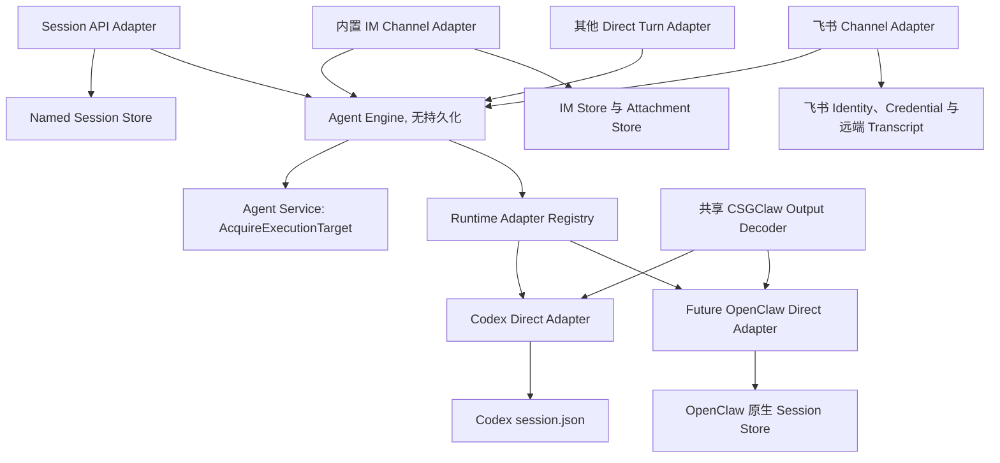

# Agent Engine 与 IM 解耦方案

英文版本：[agent-engine-decoupling.md](agent-engine-decoupling.md)

## 状态与评审流程

状态：**方案阶段，尚未实现**。

本文档是 Agent Engine 与 IM 边界的评审依据。
中英文版本必须同步修改。
只有方案被确认后才开始实现。

## 架构摘要

本文档定义 Agent Engine 与 IM 解耦后的最终架构和实现边界。

所有调用都遵循同一条依赖方向：

```text
Channel Adapter 或 Session API -> Agent Engine -> Runtime Adapter
```

完整架构由以下边界构成：

1. Agent Service 拥有 Agent、Profile、Skill、MCP、Provider 配置、Runtime 生命周期和不可变 Execution Target 的生命周期。
2. Channel Adapter 拥有接入、身份、Binding、来源去重、文件授权与来源解析、Transcript、Ack 和渲染。
3. Agent Engine 是 Runtime 和 Channel 中立的进程内执行核心，只负责 Turn 准入、并发、分派、取消、Reset、Interaction 路由、Event 顺序和终态。
4. Runtime Adapter 隐藏原生 Thread 或 Session 状态、协议和能力差异；Codex 先实现 Direct Turn Interface，OpenClaw 只在具备直接协议后再实现。
5. IM、Participant、Task、Runtime 和 API Adapter 分别持有自己的持久化状态，Agent Engine 不复制这些状态，也不成为新的对话数据库。
6. Model Gateway 与 CLIProxy 保持纯模型调用职责，不参与 Agent Conversation 编排。
7. 当前只实现进程内 Service；远程 Engine、新增 Channel 文件能力、Files API 和完整 Responses API 不属于本方案。

匿名 API、内置 IM、飞书、Team、Task、Scheduled Task 和 Notification 始终通过上述边界执行 Agent。
没有注册 `ConversationRuntime` Adapter 的 Runtime 不受该架构支持，也不能激活 Agent 执行。
不需要协作语义的匿名调用不创建 Room、User、Participant 或 IM Message。

阅读时先看第 2 节了解当前代码约束，再看第 3 至 4 节理解最终架构和职责，API、流程与验收分别位于第 7、9 和 14 节。

## 1. 目标、原则与非目标

### 1.1 目标

- 匿名会话不创建 Room、User、Participant 或 IM Message。
- 相互独立的匿名会话不经过 IM 的全局锁和持久化路径。
- 内置 IM、飞书、匿名 API 和其他调用方通过同一个 Runtime 中立的 Agent Engine 执行 Turn。
- Codex 首先实现 Direct Adapter；只有 OpenClaw 提供经过验证的直接执行协议后，才接入同一接口。
- 保留当前 Agent、Participant、IM、附件、Task、Workspace 和 Runtime 原生存储。
- 文件授权与来源解析保留在受信任的调用边界，文件物化只能在 Engine 持有 Execution Target Lease 后执行。
- 保留现有 Skill 的 `resource_link` 和 `request_user_input` 协议。

### 1.2 设计原则

本方案采用 *A Philosophy of Software Design* 中与当前问题直接相关的原则。

- 每个设计事实只有一个 Owner。
- 用少量深接口隐藏 Runtime 差异，而不是把 Runtime Kind 分支扩散到调用方。
- Engine 只协调 Runtime 中立的文件准备接口，不依赖具体 Channel 或文件协议。
- 不用新的抽象复制现有持久化状态。
- Adapter 必须承担协议转换、状态映射或策略，而不是只转发参数。
- 每项行为变化都必须有独立且可验证的契约。
- 公开接口、生命周期和失败语义必须被代码注释和契约测试固定。

### 1.3 非目标

- 不从协作产品中删除 Room、User、Participant、Team 或 IM。
- 不把 `/api/v1/agents/{id}/llm` 变成 Agent 执行 API。
- 不让 Agent Engine 管理 Transcript、Channel Credential、Mention、成员关系或附件字节。
- 当前实现不拆分进程。
- 不实现完整 OpenAI Responses API。
- 不要求 OpenClaw 上游实现 Go 接口，但它必须提供可被 Adapter 调用的直接执行协议。
- 不改变现有 Storage Layout。
- 不实现远程 Agent Engine、Engine HTTP Client、新增 Channel 文件能力、Engine Files API 或完整 OpenAI Responses API。

## 2. 当前代码事实

### 2.1 当前实体与持久化 Owner

| 状态 | 当前 Owner | 当前存储 | 本架构是否改变 |
|---|---|---|---|
| Agent、Profile、Runtime Record | `internal/agent` | 根 `state.json` 的 `agents` Section | 否 |
| Server Config | `internal/config` | `config.toml` | 否 |
| 登录、Connector 和 Model Provider 状态 | `internal/auth`、`internal/connectors`、`internal/config` | 根 `state.json` 的 `auth` 和 `model_providers` Section | 否 |
| Participant 和 Channel Binding | `internal/participant` | 根 `state.json` 的 `participants` Section | 否 |
| Team Metadata | `internal/team` | 根 `state.json` 的 `teams` Section | 否 |
| IM User、Room、Thread Metadata | `internal/im` | `im/state.json` | 否 |
| IM Message | `internal/im` | `im/sessions/{room}.jsonl` 及大消息 Blob | 否 |
| IM Attachment Object 和 Blob | `internal/im` | `im/assets/objects` 和 `im/assets/blobs/sha256` | 否 |
| Codex Conversation Key 到 Thread ID | `internal/runtime/codex` | Runtime 的 `session.json` | 否 |
| Agent Workspace、Codex Home、Skill 和 Runtime Config | Agent Service 与具体 Runtime | `agents/{agent}` 下的现有目录 | 否 |
| OpenClaw Config、Workspace 和原生 Session 数据 | OpenClaw Sandbox Runtime | 现有 Agent Home 和 Sandbox Volume | 否 |
| Task Aggregate 和 Event | `internal/taskcore` | `tasks/{task}` 下的 JSON 和 `events.jsonl` | 否 |
| Scheduled Task | `internal/scheduledtask` | `scheduled-tasks/state.json` | 否 |
| 飞书 App Credential | Participant 的 Channel App Config | 根 `state.json` 的 Participant 数据 | 否 |

根 `state.json` 通过 `localstore.WriteSection` 在进程级互斥锁内读写整个文件。
IM Service 还使用自己的全局锁保护 Room、Message、Thread 和 Attachment 关联。
Engine 执行状态不写入这两个 Store，现有 Attachment 数据和 GC 继续由 IM 独立负责。
Runtime Reconcile 只能更新自己生成的配置块，不能覆盖 Workspace 用户文件、Runtime Auth、原生 Session 或未知配置字段。

### 2.2 Agent 中与执行有关的字段

当前 Agent 已经保存执行配置和 Runtime 身份。
值得关注的字段示例如下：

```go
type Agent struct {
	ID               string
	Name             string
	Description      string
	Instructions     string
	RuntimeID        string
	RuntimeKind      string
	RuntimeName      string
	SandboxEnabled   bool
	Image            string
	Avatar           string
	BoxID            string
	RuntimeOptions   map[string]any
	MCPServers       map[string]any
	Role             string
	Status           string
	Profile          string
	AgentProfile     AgentProfile
	ProfileComplete  bool
	DetectionResults []ProfileDetectionResult
	CreatedAt        time.Time
	UpdatedAt        time.Time

	// 运行时观测值，不持久化。
	Availability   *RuntimeAvailability
	StartupPending bool
}

type AgentProfile struct {
	Provider             string
	ModelProviderID      string
	BaseURL              string
	APIKey               string
	Headers              map[string]string
	ModelID              string
	ReasoningEffort      string
	EnableFastMode       bool
	RequestOptions       map[string]any
	Env                  map[string]string
	ProfileComplete      bool
	EnvRestartRequired   bool
	ImageUpgradeRequired bool
}
```

### 2.3 当前匿名 Session 路径

```text
POST /api/v1/agents/{agent}/sessions/{session_id}/responses
  -> 解析唯一 CSGClaw Agent Participant
  -> 解析 Participant 对应的 IM User
  -> EnsureAgentSessionRoom
  -> 持久化 Admin 输入 Message
  -> 使用 Room ID 作为 Codex Conversation Key
  -> 运行 Turn 并订阅 IM、Work 和 Codex Event
  -> 持久化最终 Agent Message
```

当前测试明确把以下行为当作契约：

- 创建可审计的匿名 Room。
- 同一个 `session_id` 不能切换 Agent。
- 同一个 Session 的重叠 Turn 返回 `409 session_busy`。
- 不同 Session 可以并发。
- 返回 OpenAI 风格错误和 Responses 风格 SSE Event。
- 流式 Codex 路径等待 Runtime 终态。
- 交互请求快速失败。
- 最终审计 Message 持久化失败时不能返回成功终态。

当前输入 Message 还会经过 Codex Channel Bridge 注入 `current_channel`、`room_id` 和 `participant_id` Hidden Context。
因此匿名 Agent 当前可以误以为自己处于一个普通内置 IM Room，并调用依赖该上下文的消息或协作 Skill。

Session API 不为匿名执行自动创建审计 Room。
第 7.1 节定义目标 Session 边界。

### 2.4 当前内置 IM 和飞书路径

Codex 的内置 IM 和飞书都由 `internal/channelbridge/codexbridge` 直接驱动。
Bridge 当前同时负责：

- Channel 事件订阅、去重、Supersede 和队列。
- Room 或 Thread 到 Codex Conversation Key 的转换。
- `EnsureSession`、Prompt 和 Codex Event 订阅。
- Hidden Channel Context 和 Thread Context。
- Attachment Manifest。
- Processing Reaction、Activity 渲染和最终消息发送。
- Participant Work Lease、状态和 Stop。
- Permission、原生 User Input 和 Detached User Input。
- `/new` 或 Conversation Reset。

飞书 Codex Bridge 由 CSGClaw Host 订阅飞书事件。
它当前只把文本、Post 和部分交互内容转成 `BotEvent`。
飞书的 Image、File、Audio 和 Media 消息当前被忽略，所以“飞书上传文件已完整支持”不是现有能力。
飞书上的 Runtime User Input 当前会被自动以空答案继续，并提示丰富交互只支持 CSGClaw Web UI。

### 2.5 OpenClaw 当前不是 Codex 的同级执行实现

Codex 和 OpenClaw 都实现了进程或 Sandbox 生命周期接口。
只有 Codex 暴露了 Host 可以直接调用的 Session、Prompt、Event、Permission 和 User Input 能力。

OpenClaw 当前的主要执行路径是：

```text
CSGClaw IM Message
  -> Participant Event SSE
  -> Sandbox 内置 CSGClaw Channel
  -> OpenClaw Agent Loop
  -> Participant Message API
  -> CSGClaw IM
```

OpenClaw 绑定飞书时，CSGClaw 会把飞书 App Credential 写入 Sandbox Gateway 配置，然后由 Runtime 自己的飞书 Channel 收发消息。
OpenClaw 目前没有被仓库代码证明具备与 Codex 等价的直接 `RunTurn + EventSink + Cancel + Interaction` 协议。

### 2.6 其他不能遗漏的功能路径

最终架构不能只覆盖普通 Chat。
当前代码还包含以下依赖 Channel 或 IM 的功能：

- Team 创建 Room、添加成员和发送 Team Event。
- Team Task、Approval、Claim、Assign、Plan、Start 和结果投影。
- Agent Task 通过 Direct Room 和 `task_assigned` Event 唤醒 Agent。
- Scheduled Task 先创建 Agent Task，再通过 IM 触发 Agent。
- Notification Participant 的 Push、Pull、Relay、Webhook 和 IM Fanout。
- Participant Event 的 Pending、Inflight、Ack、Requeue、Seen 和 30 分钟重放。
- Participant Work Lease、Thinking 状态、Stop 和 Tombstone。
- Agent-to-Agent Mention、`notify_all_agents` 和防回环规则。
- `/new` 对 Codex 调用内部 Reset，对 OpenClaw 发送 `/new`。
- Runtime Restart、Recreate、Skill 保留、MCP 更新和外部 Binding 激活。

这些功能不属于 Agent Engine。
最终 Channel 执行路径必须保证它们仍能到达正确的 Agent。

### 2.7 当前并发控制与代码索引

当前匿名 API 只有 `Handler.sessionTurns` 提供的每 `session_id` 单 Turn 锁，没有全局或每 Agent 的有界准入。
当前 Codex Channel Bridge 的每 Bot 队列默认长度为 32。
当前 Participant Bridge 每 Participant 最多保留 64 个 Pending Event。
这些限制属于不同层级，不能直接相加当作系统容量。
Codex app-server Manager 按 Thread 注册独立 Turn Waiter，并且 `Prompt` 没有显式的进程级串行锁。
但当前测试没有证明一个真实 Codex app-server 能在不同 Thread 上达到 64 个并发 Turn，因此该值不能仅凭代码结构假定。

评审使用的主要代码位置如下：

| 事实 | 主要代码位置 |
|---|---|
| Agent 字段、反序列化和根状态写入 | `internal/agent/model.go`、`internal/agent/store.go`、`internal/localstore/root_state.go` |
| 匿名 Session API 和契约测试 | `internal/api/agent_sessions.go`、`internal/api/agent_sessions_test.go` |
| IM 锁、Room、Message 和 Session 文件 | `internal/im/service.go`、`internal/im/session_store.go` |
| Attachment Object、物化和 GC | `internal/im/asset_store.go` |
| Codex Conversation Mapping | `internal/runtime/codex/appserver_manager.go`、`internal/runtime/codex/runtime.go` |
| Codex Channel Bridge 和 Renderer | `internal/channelbridge/codexbridge`、`internal/channelbridge/runtimebridge` |
| OpenClaw Channel 配置和 Sandbox Lifecycle | `internal/runtime/openclawsandbox`、`internal/runtime/sandboxgateway` |
| 飞书 Host Bridge 的当前输入能力 | `internal/channelbridge/feishu_client.go` |
| Participant Event、重放和附件物化 | `internal/im/participant_bridge.go`、`internal/api/participant_bridge.go` |
| Binding 激活和 Runtime Restart/Recreate | `internal/participant/feishubind`、`internal/agent/lifecycle.go`、`internal/agent/service_profiles.go` |
| Team、Task、Scheduled Task 和 Work Lease | `internal/team`、`internal/agenttask`、`internal/taskcore`、`internal/scheduledtask`、`internal/worklease` |

## 3. 最终架构

### 3.1 依赖方向



Agent Engine 不 Import `im`、`participant`、`channel`、`team` 或具体 Runtime Package。
具体 Runtime Adapter 由 Composition Root 注册。
Channel、API 和 Runtime 都可以依赖 Runtime 中立的 Contract Package。
进程内调用直接使用 Engine Service，不增加只转发参数的 Local Client。
缺少 `ConversationRuntime` Adapter 时，Session 执行或 Binding 激活在创建任何执行状态前返回 `runtime_adapter_unavailable`。

注册 OpenClaw Direct Adapter 后，CSGClaw 管理的 Binding 只由 Host Channel Adapter 消费。
它的 Direct Adapter 必须调用 Runtime 的直接执行协议，不能用 IM Message 或飞书 Event 模拟 Turn。
在该直接执行协议可用前，OpenClaw 不阻塞第一阶段 Codex Engine 的实现。

### 3.2 核心概念

`ConversationKey` 是由调用方生成的稳定不透明字符串。
Engine 只校验它非空且长度有界，不解析其中的 Channel、Binding、Room、Thread 或 Session 字段。
Engine 使用 `(AgentID, ConversationKey)` 作为锁和活动状态键。

每个调用方在自己的 Adapter 内负责生成不会碰撞的 Key：

| 调用方 | Conversation Key 来源 |
|---|---|
| 内置 IM | Adapter 对 Agent Participant、Room 和可选 Thread Root 的内部编码 |
| 飞书 | Adapter 对 App Binding、Chat 和可选 Thread Root 的内部编码 |
| Session API | Named Session Store 持久化的随机内部 Key |

显式 Reset 后仍使用同一个 `ConversationKey`。
Runtime Adapter 在 Reset 中原子替换原生 Mapping，因此下一轮不需要特殊创建模式。

`ContinuationPolicy` 明确本轮对 Runtime Mapping 的要求：

- `create_or_resume` 在 Mapping 不存在时创建，存在时恢复。
- `require_existing` 在 Mapping 不存在时返回 `conversation_not_resumable`。

Session API 在 Named Session 处于 `initializing` 时使用 `create_or_resume`，只有第一个已分派 Turn 证明 Runtime Mapping 存在后，才改用 `require_existing`。
Channel Adapter 根据自身恢复语义选择策略，不把 Channel 事实暴露给 Engine。

`ConversationAdmission` 固定同 Conversation 等待行为的唯一 Owner：

- `wait` 在 Engine 内排在活动 Turn 之后。
- `reject_if_busy` 不增加调用方本地锁，直接返回 `conversation_busy`。

Session API 使用 `reject_if_busy`，并把该错误映射为现有 `409 session_busy`。
Channel Adapter 通常使用 `wait`。

`InteractionPolicy` 声明 Runtime 请求 Blocking Interaction 时调用方具备的处理能力：

- `resolve` 在 Engine 注册 Interaction，并允许 Adapter 调用 `ResolveInteraction`。
- `reject` 使用调用方稳定的“不支持交互”错误结束 Turn。
- `skip_user_input` 对原生 User Input 提交 Runtime 的空答案形式，并安全拒绝 Permission。

内置 IM 使用 `resolve`，Session API 使用 `reject`，飞书保持当前 `skip_user_input` 行为。

`ExecutionID` 标识一个排队中或运行中的 Turn。
它用于取消、Interaction 路由、日志和拒绝重复的活动 Execution。

`EventSink` 是一次 Turn 内的有序进度事件接收器。
它不是 Event Bus、Transcript Store 或 Channel Renderer。
`RunTurn` 只返回一个 `TurnResult`，不再返回第二套裸 Go Error。
Runtime 分派前被拒绝的 Result 使用 `Dispatched=false`；Runtime 接受 Turn 后，成功、失败、取消和超时都使用 `Dispatched=true`，并只通过该 Result 表达。
Progress Event 的 `Emit` 失败时，Engine 在 Runtime 支持取消时请求取消，但 Runtime 到达真实终态前不能释放 Permit。
Runtime 不支持取消时，Engine 继续监督到终态，不能提前报告完成。

`InteractionID` 标识仍在运行的 Runtime 正在等待的 Permission 或 User Input。

## 4. 组件职责

### 4.1 Agent Engine 的职责

Agent Engine 只负责：

1. 执行有界的全局与每 Agent 准入，应用请求指定的 `ConversationAdmission`，并成为 `ConversationKey` 执行串行化的唯一 Owner。
2. 排队 Turn 获得准入后才从 Agent Service 获取不可变 Execution Target，并持有到 Runtime 真实终态。
3. 仅在持有该 Target Lease 时执行可选的、调用方提供的 Runtime 中立 `FilePlan`，校验其 `PreparedFile` 结果，并在 Runtime 终止后释放文件。
4. 保证同一个 `ConversationKey` 的 Turn 和 Reset 串行。
5. 把 Turn 分派给 Runtime 中立的 `ConversationRuntime`。
6. 保存当前进程内的 Active Execution 和 Pending Interaction Registry。
7. 应用调用方的 `InteractionPolicy`，归一化错误、保证 Event 顺序并返回唯一终态。
8. 校验 Cancel 和 ResolveInteraction 与活动 Agent、Conversation 和 Execution 一致，并按已授权 Conversation 串行执行 Reset。

Agent Engine 不负责：

- Room、User、Participant、Channel Binding 或 Credential。
- Transcript、审计记录、Message、Mention 或 Thread Context。
- Attachment Blob、下载 Token 或历史文件索引。
- Agent Profile 编辑、Skill 安装、MCP 编辑、Runtime Provision 或 Recreate。
- `previous_response_id`、OpenAI Response Object 或 HTTP 鉴权。
- Team、Task、Scheduled Task、Notification 或 Participant Work 的持久化。

### 4.2 Agent Service 的职责

- 保持 Agent Store 和 API Shape 不变。
- 持久化 Profile、Instructions、Runtime Options、MCP 和 Runtime Record。
- 管理 Create、Start、Stop、Delete、Restart、Recreate 和 Upgrade。
- 继续物化 Workspace、Skill、Provider 和 Sandbox 配置。
- 成为 Execution Target Lease 发放、引用计数和生命周期 Gate 的唯一 Owner。
- 在 Restart、Recreate、Delete 或破坏性 Workspace 更新前停止发放新 Lease，并等待已有 Lease 释放。
- Runtime 或 Workspace 仍被 Turn 使用时返回稳定的 Busy 或 Timeout 错误，不能继续删除。
- 保留当前 Profile 更新后的 Codex Restart 和 Gateway Sync 或 Recreate 语义。

### 4.3 Runtime Adapter 的职责

- 把不透明 `ConversationKey` 映射到 Runtime 原生 Thread 或 Session。
- 在当前 Runtime Store 中持久化该映射。
- 执行 Turn、Reset、Cancel 和原生 Interaction。
- 把 Runtime Event 转成稳定的 Runtime 中立 Event。
- 识别允许包含 CSGClaw Structured Output 的原生输出源。
- 在任何公开文本 Delta 之前运行共享 Decoder。
- 声明能力，而不是让上层判断 Runtime Kind。

Codex Adapter 必须复用现有 `EnsureSession(runtimeID, conversationKey)` 和 `conversation_sessions` 持久化，但必须根据 `ContinuationPolicy` 区分创建和严格恢复。
Codex Runtime Store 是该 Conversation Mapping 的唯一 Owner。
当 `require_existing` 找不到 Mapping 时，Adapter 返回 `conversation_not_resumable`，不能调用现有的隐式创建分支。
Reset 必须为同一个 Key 原子替换新的原生 Thread Mapping。

OpenClaw Direct Adapter 只有在上游或 Gateway 提供以下能力后才算成立：

- 稳定的 Conversation Key 或 Session Key。
- 一次 Turn 的直接提交和明确终态。
- 有序 Streaming 或明确的非流式结果。
- Cancel 或明确声明不支持。
- Reset。
- 不通过 IM Room 或飞书事件伪造输入。

### 4.4 Channel Adapter 的职责

每个 Channel Adapter 负责：

- 订阅、校验、身份解析、AgentChannelBinding、Ack 和发送。
- 生成不透明且不会碰撞的 `ConversationKey`。
- 保留已有来源去重、Ack、Replay、Transcript、Reaction、Work、Stop、`/new` 和 Detached Input 语义。
- 在受信任边界授权文件访问，并构造不向 Engine 暴露 Channel 来源的不可变 `FilePlan`。
- 生成不可预测的 `ExecutionID`，直接调用 Engine，并渲染 Progress 和终态。
- 渲染 Activity、Text、Resource Link 和 Interaction。

Adapter 可以复用 Key 编码、Output 渲染和 Event 转换等低层 Helper。
只转发 Engine 请求的 Helper 不能成为独立架构层。
Channel Adapter 可以保留现有有界 Source Ingress Buffer，用于订阅、去重、Ack 和 Replay，但 Source Event 归一化后不维护第二套执行队列。
新 Source Event Supersede 仍在 Engine 排队的旧 Execution 时，Adapter 取消旧 `ExecutionID`；旧 Execution 已分派时，Adapter 抑制过期渲染，Engine 继续监督到真实终态。
同 Conversation 的唯一 Turn 队列由 Engine 拥有。

### 4.5 Session HTTP Adapter 的职责

- 保持现有 Session Request、Response、SSE 和 Error Shape。
- 在唯一的 Named Session Store 中原子绑定 `session_id`、Agent、不透明 `ConversationKey` 以及 `initializing` 或 `ready` 状态。
- Record 为 `initializing` 时使用 `create_or_resume`，第一个 `Dispatched=true` 的 Result 返回后标记为 `ready`，后续 Turn 使用 `require_existing`。
- 使用 Engine 的 `reject_if_busy` Admission，把 `conversation_busy` 映射为现有 `409 session_busy`，不保留第二套进程内锁。
- 使用 `InteractionPolicy=reject` 保留现有匿名交互 fail-fast 行为。
- 把 Engine Progress Event 映射为现有 SSE Event。
- 实施当前 Body Limit、Timeout 和错误映射。

Named Session Store 不保存 Prompt、Output、Runtime Handle、文件或 Secret。
它不读取 IM Store，也不实现 `previous_response_id` Response Chain。

### 4.6 IM、Participant、Team、Task 和 Notification 的职责

- IM 继续拥有 Room、User、Message、Thread、Attachment Object 和 Attachment GC。
- Participant 继续拥有 Agent 与 Channel Identity 的映射和飞书 Credential。
- Team 继续通过 `TeamChannelAdapter` 创建 Room、添加成员和发送消息。
- Task 和 Scheduled Task 继续使用现有 Store 和触发模型。
- Notification Participant 继续拥有 Push、Pull、Relay、Webhook 和 Fanout。
- Participant Work 继续是 Channel 可见的工作状态和 Stop 控制投影。

这些组件通过对应 Channel Adapter 间接触发 Agent。
它们不直接写入 Agent Engine 状态。

### 4.7 Model Gateway 与 CLIProxy 的职责

- `/api/v1/agents/{id}/llm` 继续是纯模型代理。
- `internal/cliproxy` 继续负责 Codex、Claude Code 等 Provider 的本地认证和协议传输。
- OpenClaw 可以继续把 Agent LLM Route 作为模型 Endpoint。
- Agent Engine 不接管 Provider Token、模型协议或 LLM 对话历史。

## 5. Conversation 与持久化

### 5.1 为什么 Engine 不持久化 Conversation

Codex 已经把 Canonical Conversation Key 到 Thread ID 的映射保存在 Runtime 的 `session.json` 中。
让 Engine 再保存 Runtime Handle 会产生两个必须原子更新的状态源。
OpenClaw 由自己的 Adapter 保存原生 Session Mapping。

Engine 重启时，排队中和运行中的 Turn 会中断。
这是当前进程内执行模型的真实语义。

### 5.2 第十一轮对话发送什么

假设一个 Room 已完成十轮对话。
第十一轮时：

- Channel 提供新的用户输入。
- Channel 提供同一个稳定 `ConversationKey`。
- Channel 只为本轮新增或明确再次引用的文件提供 `FilePlan`；Engine 获取 Target Lease 后再准备文件。
- Channel 可以提供有界的 Hidden Context，例如新 Thread 的 Root Context。
- Engine 不读取前十轮 IM Message。
- Runtime Adapter 通过 Canonical Conversation Key 恢复原生 Thread，原生 Thread 持有模型上下文。

Channel Transcript 和 Runtime 原生上下文是两个不同事实。
前者用于展示和审计，后者用于继续执行。

### 5.3 丢失状态后的恢复边界

- Agent Engine 没有需要恢复的 Conversation 持久化状态。
- Engine 重启不会删除 Codex `session.json` 中的 Thread Mapping。
- Named Session 记录不存在时，相同外部 Session ID 会创建新的 Named Session。
- `initializing` Named Session 重试 `create_or_resume`；如果崩溃前 Mapping 已创建则安全恢复，否则创建新 Mapping。
- `ready` Named Session 存在但 Runtime Mapping 丢失时，`require_existing` 返回 `conversation_not_resumable`。
- 标记为 `require_existing` 的请求不会被 Engine 静默创建新的 Runtime Conversation。
- 进程崩溃会中断正在执行的 Turn，在调用方没有 Request ID 的前提下，该 API 不承诺 Exactly-once 执行或重放恢复。

### 5.4 Named Session Store

Session API 只需要一个轻量 Named Session Store，不需要 Response Chain。
Session 第一次绑定 Agent 时只原子保存以下 Binding：

```text
session_id
agent_id
conversation_key
state = initializing | ready
created_at
```

第一次请求原子创建随机 `ConversationKey`，状态为 `initializing`，并使用 `create_or_resume`。
Record 为 `initializing` 时持续使用 `create_or_resume`，包括 Binding 已持久化但 Runtime Mapping 尚未创建时发生崩溃的场景。
第一个 `Dispatched=true` 的 `TurnResult` 返回后，Session Adapter 原子地把 Record 标记为 `ready`；后续请求使用 `require_existing`。
重叠检测由 Engine `reject_if_busy` Admission 负责，Session Adapter 把 `conversation_busy` 映射为 `409 session_busy`。

Store 位于 API 专用目录，不放入根 `state.json` 或 IM Store。
创建以及唯一一次从 `initializing` 到 `ready` 的转换沿用小型 Store 模式，先写临时文件，再原子替换 Snapshot。
普通 Turn 不更新 Store。
执行 Runtime Turn 时不持有 Store Lock。
Named Session 默认不自动过期，只有显式管理操作或另行确认的保留策略可以删除 Binding。

Store 不记录 Prompt、Output、File、Runtime Handle 或 Turn Status，只记录 Binding 初始化状态。
进程崩溃后，`initializing` Record 幂等重试 Mapping 创建或恢复，`ready` Record 则严格要求已保存的 Runtime Mapping。
Store 不声称被中断的请求产生了零次、一次或多次副作用。

Named Session Store 是 Session Binding 的唯一来源。

## 6. 文件边界

### 6.1 保留 IM Attachment Store

当前 Attachment Object 直接保存 `RoomID`、`MessageID`、`CreatedBy` 和 `DownloadToken`。
当前 GC 通过存活 Room 和 Message 扫描 Attachment Reference。
Attachment Schema、Blob 和 GC 继续由 IM 作为一个整体负责。

文件处理遵循以下规则：

- 内置 IM 上传仍写入现有 IM Asset Store。
- IM Message 仍保存 Attachment Metadata。
- 内置 IM Adapter 授权选中的 Attachment，并构造由现有 Attachment Source 支持的 `FilePlan`。
- Engine 完成 Admission 并获取 Target 后，使用已 Lease 的 Workspace 调用该 Plan；具体 Plan 可以复用现有 `MaterializeAttachment`，但不向 Engine 暴露 IM 类型。
- Plan 在返回不可变 `PreparedFile` 值和 Release Function 前校验安全目标、大小和 Hash。
- Engine 持有 Lease，只在 Runtime 终止后恰好调用一次非空 Release Function，并且只接受位于已 Lease Execution Target Workspace 内的 Prepared File。
- Engine 不接受任意外部 Path，也不调用 IM API。
- Materializer 使用原子创建，并拒绝符号链接、路径逃逸和替换已有目标。
- Runtime 使用 No-follow 语义打开文件，并在使用前再次校验路径、大小和 Hash。
- 飞书保持当前 Message Type 支持；飞书文件下载与物化作为独立功能另行设计。

### 6.2 文件是否需要每轮重发

文件字节不需要每轮重发。
Engine 获取 Target Lease 后，内置 IM `FilePlan` 只物化新 Attachment、明确再次引用的历史 Attachment，或 Workspace Cache 中已丢失的文件。
IM 负责保留 Message 到 Attachment 的关联，Runtime 原生 Thread 负责保留模型侧语义上下文。

## 7. 公共 API 与行为变化

### 7.1 现有 Session API

入口保持不变：

```http
POST /api/v1/agents/{agent}/sessions/{session_id}/responses
```

内部执行路径为：

```text
Session HTTP Adapter -> Named Session Store -> Agent Engine -> Runtime Adapter
```

Agent 的 Runtime 没有注册 `ConversationRuntime` Adapter 时，Route 在创建 Named Session Record 前返回 `runtime_adapter_unavailable`。

必须保留：

- Request 的 `input` 和 `stream` Shape。
- `session_id` 校验。
- 同 Session 重叠 Turn 的 `409 session_busy`。
- 不同 Session 并发。
- 当前 SSE Event 名称和顺序。
- 当前 Error Envelope 和稳定 Error Code。
- 当前请求 Body Limit 和 Turn Timeout，除非另行评审。

Route 的最终行为如下：

- 所有 Session 都使用 Named Session Store，不读取 IM Session Mapping。
- `initializing` Named Session 使用 `create_or_resume`，`ready` Named Session 使用 `require_existing`。
- Session 不创建匿名 Room。
- 输入和输出不写入 IM Message。
- Response Metadata 为保持 Shape 始终返回空字符串 `room_id`。
- 匿名 Turn 的成功状态与 IM 持久化无关。
- 受支持的 Codex 和 OpenClaw Agent 无需 CSGClaw Participant 即可通过该 Route 执行。
- Session 不注入 `current_channel`、`room_id` 或 `participant_id`，因此不提供依赖当前 Room 的消息、附件、Team 和协作 Skill。
- Session 的 Activity 和 Work 只进入 API Event，不投影到 IM Room 或 Participant Work。
- 原生 Permission 和 User Input 通过 `InteractionPolicy=reject` 保持当前匿名交互 fail-fast 错误。

需要 Room、成员、Mention、审计消息或 Channel Skill 的调用方必须使用内置 IM，而不能把匿名 API 当作隐藏的 IM 入口。

当前 Route 没有统一 Bearer 校验。
是否改变其鉴权是独立的产品和安全决策，不属于该架构的隐含行为。

### 7.2 明确延期的 API

以下接口不属于本次解耦，不能反向影响 Engine Contract 或当前 Session API：

- `/v1/models`。
- `/v1/responses` 和 `previous_response_id` Chain。
- `/v1/csgclaw/*` 扩展。
- 远程 Agent Engine、Engine HTTP Client 和 Engine Files API。
- 当前不支持文件的 Channel 所需的新下载或物化能力。

如果未来确有外部调用场景，应基于已经稳定的进程内 Service 另行设计传输协议、鉴权、配额、文件上传和版本治理。

## 8. Structured Output 与 Interaction

### 8.1 CSGClaw Structured Output

现有 Skill 契约保持不变：

```text
::csgclaw-output::resource_link <ResourceLink JSON>
::csgclaw-output::request_user_input <RequestUserInputArgs JSON>
```

处理链为：

```text
Skill stdout 或 Assistant Output
  -> Runtime Adapter 选择合格的原生输出源
  -> 共享 CSGClaw Decoder 截留、解析、校验和清理
  -> Runtime 中立 OutputItem
  -> Agent Engine EventSink
  -> Channel Renderer 或现有 Session SSE
```

Parser 只能存在于共享 Decoder。
Agent Engine、Channel 和 Web UI 都不能扫描原始控制行。
可能构成控制前缀的跨 Chunk 后缀必须在公开 Delta 前缓冲。

`resource_link` 与当前 Turn 一起完成。
Channel 把它渲染为安全链接并写入自己的 Transcript。

### 8.2 Blocking Interaction

Codex 原生 Permission 或 `request_user_input` 会暂停当前 Turn。
只有调用方选择 `InteractionPolicy=resolve` 时才启用该流程。
流程如下：

```text
Runtime 发出 InteractionRequired
  -> Engine 注册 Active Interaction
  -> Channel 展示并校验响应人
  -> ResolveInteraction
  -> Engine 路由到 Runtime Adapter
  -> 同一个 Turn 恢复并完成
```

`ResolveInteraction` 只服务仍在运行的 Turn。
它必须能与被暂停的 `RunTurn` 并发调用，不能排在同一个 Conversation 的普通 Turn 队列之后。
使用 `reject` 时，Engine 返回调用方的稳定“不支持交互”错误，不留下 Pending Interaction。
使用 `skip_user_input` 时，原生 User Input 收到 Runtime 的空答案表示，原生 Permission 被安全拒绝。

### 8.3 Detached Input

结构化输出中的 `request_user_input` 不是 Blocking Interaction。
它保持当前两段式语义：

```text
Turn A 成功完成
  -> Channel 展示 DeferredInputRequest
  -> 用户回答
  -> Channel 创建 Turn B
  -> Turn B 使用同一个 ConversationKey
```

Detached Input 不调用 `ResolveInteraction`。
它不占用 Turn A 的 Permit。
同一个问题只能成功续接一次。

可点击的 Detached Input 只在内置 CSGClaw IM 中启用。
飞书不提供该交互能力。

Secret 答案必须保持当前安全行为。
原值不能进入 Transcript、日志或模型续接。
进入模型的 Response JSON 中，Secret 值替换为 `<redacted>`。

### 8.4 Control Scope 与授权

每个 Adapter 在发送控制请求前，先校验当前用户有权操作该 Conversation。
Cancel 请求提交 `AgentID + ConversationKey + ExecutionID`，Resolve 再增加 `InteractionID`。
Adapter 使用密码学安全随机数生成器创建 `ExecutionID`。
Engine 校验其格式、拒绝重复的活动 ID、查找 Active Execution，并在所有字段匹配后把请求路由到内部持有的 Runtime Handle。
Reset 在完成授权后提交 `AgentID + ConversationKey`，并与同一 Key 的普通 Turn 串行执行。
同一个 Interaction 只能成功 Resolve 一次，重复请求返回幂等成功或稳定的 `interaction_already_resolved`。

## 9. 关键流程

### 9.1 Agent 生命周期

```text
Agent API
  -> Agent Service 保存 Agent/Profile
  -> Provision Workspace、Skill、MCP、Provider 和 Runtime Config
  -> Runtime New/Start
  -> Agent Service 打开 Execution Target Lease Gate
  -> Agent 可执行
```

Stop、Delete、Recreate 和 Upgrade 仍由 Agent Service 管理。
这些操作先关闭 Target Lease Gate，再等待活动 Lease 结束，然后才能替换或删除 Runtime 或 Workspace。
新 Target 就绪后，Agent Service 才重新打开 Gate。
Channel Consumer 由 Binding 生命周期独立管理，不随 Runtime Restart 重建。
Codex Restart 保留 Runtime Store 和 Conversation Mapping。
Recreate 和 Delete 按定义删除 Runtime Store，不承诺继续原 Conversation；严格调用方收到 `conversation_not_resumable`，允许创建新 Conversation 的 Channel 可以使用 `create_or_resume`。

### 9.2 飞书 Binding 生命周期

```text
创建 Registration
  -> 保存待完成 Registration
  -> Finalize 获得 App Credential
  -> Participant Service 保存 Feishu AgentChannelBinding
  -> 激活 Binding
```

激活要求存在已注册的 `ConversationRuntime` Adapter；否则返回 `runtime_adapter_unavailable`，不启动任何 Consumer。
Host Feishu Adapter 是唯一 Consumer，不 Provision Runtime Channel Credential。

### 9.3 从飞书向 Codex 发送消息

```text
飞书 WebSocket Event
  -> CSGClaw Feishu Adapter 做身份校验、Mention 过滤和去重
  -> AgentChannelBinding
  -> Chat/Thread 生成 ConversationKey 和 ExecutionID
  -> Agent Engine
  -> Codex Direct Adapter
  -> Codex Event
  -> Feishu Renderer
  -> 飞书 Message API
```

该流程不创建内置 IM Room 或 Message。
它保留当前飞书 Text、Post、Interactive Content、Mention 和 Thread 行为；文件消息不属于本方案。

### 9.4 未来从飞书向 OpenClaw 发送消息

```text
飞书 Event -> CSGClaw Feishu Adapter -> Agent Engine -> Direct Adapter -> 飞书回复
```

该流程只有在 OpenClaw Direct Adapter 满足 4.3 节并注册为可执行 Adapter 后才存在。
CSGClaw 管理的 Binding 不 Provision Runtime 侧飞书 Channel Credential。
同一个 Bot 只能由 Host Feishu Adapter 消费。

### 9.5 内置 IM Chat

```text
用户 Message 先由 IM 持久化
  -> Participant 路由、Mention 和 NotifyAll 规则
  -> 内置 IM Adapter 去重并生成 ConversationKey 和 ExecutionID
  -> Agent Engine
  -> Runtime Adapter
  -> IM Renderer 持久化 Activity 和最终 Message
```

内置 IM 与飞书只在进入 Engine 后共享执行语义。
飞书消息不会先复制到内置 IM。
Binding 激活要求已注册 `ConversationRuntime` Adapter；条件不满足时不启动任何执行路径。

### 9.6 `/new`

```text
Channel 解析 /new
  -> Engine.ResetConversation(ResetConversationRequest)
  -> Runtime Adapter 原子创建并保存新的原生 Mapping
  -> Channel 保存确认消息
```

`ConversationKey` 保持不变，因此下一轮使用 `require_existing` 读取新的 Mapping。
OpenClaw 只有在加入 Direct Adapter 时才需要实现等价的原生 Reset。

### 9.7 Team、Task、Scheduled Task 和 Notification

这些功能继续先生成 Channel Event 或 Message。
Channel Adapter 直接调用 Agent Engine。

最终路径必须保留：

- Agent Task 的 Direct Room 创建和 `task_assigned` Event。
- Team Member Mention 和 Agent-to-Agent 消息。
- Scheduled Task 的 Task 与 Run 状态。
- Notification Pull Ack 和 Fanout。
- Participant Event Replay、Ack 和 Idempotency。
- Work Lease 和 Stop。

### 9.8 Channel 去重与投递

每个 Channel Adapter 保留现有 Source Ingress 的去重、Ack、Replay、Supersede、渲染和投递规则。
一个归一化 Source Event 在调用 Engine 前生成一个不可预测的 Execution ID。
重复 Source Event 由 Adapter 按现有 Source Identity 规则过滤。
Engine 不为 Source Event 投递新增持久化，也不承诺跨进程 Exactly-once。
终态投递失败时，Adapter 按当前 Channel Contract 报错或重试，不自动重跑 Runtime。
新 Source Event Supersede 仍在 Engine 排队的旧 Execution 时，Adapter 在 Runtime 分派前取消旧 Execution。
旧 Execution 已分派时，Adapter 抑制过期渲染，Engine 仍等待 Runtime 到达真实终态。

### 9.9 Profile、Model、MCP 和 Skill 更新

```text
Agent API 更新期望配置
  -> Agent Service 持久化
  -> Runtime Config Controller 判断 Restart/Recreate
  -> Codex Restart 或 Gateway Sync/Recreate
  -> Agent Service 发布就绪的 Execution Target
```

模型 Provider 变化仍可能重启 Codex。
CLIProxy 和 LLM Route 的职责不变。
Restart/Recreate 时，Agent Service 关闭 Target Lease Gate，并等待活动 Lease 结束。
Channel Adapter 保持运行，并在 Target 恢复可用后继续处理后续消息。

## 10. 准入与并发

Server Config 是全局、每 Agent、排队长度和排队超时的唯一配置 Owner。
默认值必须保留不同 Session 可以并发的现有 Contract，并通过 Contract Test 和 Provider Benchmark 确定。
实现使用有界 Semaphore 和按 Conversation Keyed Lock，不引入独立调度子系统。

规则如下：

- 同一个 Conversation 同时只有一个 Turn 或 Reset。
- 不同 Conversation 可以在同一个 Agent 上并发。
- Engine 负责执行资源 Admission 和 Conversation 串行化。
- Global Semaphore 限制总工作量，可选 Per-Agent Semaphore 限制单个 Agent，Keyed Lock 串行化同一 Conversation。
- Codex 的 Per-Agent 默认值必须由不同 Thread 的 Contract Test 和真实 Provider 压测确定，不能因为 Manager 没有全局 Prompt 锁就假定为 64。
- Runtime Adapter 仍可以根据进程、MCP 或 Sandbox 资源施加更低的瞬时上限。
- 排队满时返回 `429` 和 `Retry-After`。
- Runtime 支持取消时，Engine 等待 Runtime 确认终止后释放 Permit。
- Runtime 不支持取消或 Sink 失败时，Engine 继续监督到真实终态后释放 Permit，不能把仍在运行的 Turn 当成已结束。
- Event Buffer 必须有界。
- 默认值必须通过真实 Provider、Mock Provider、MCP 开关和子进程数量测试后再最终确认。

### 10.1 失败契约与可观测性

Runtime 分派前的失败产生 `Dispatched=false` 的 `TurnResult`，并使用稳定 Error Code 表示无效请求、未授权、Agent 不可用、`runtime_adapter_unavailable`、Conversation Busy、Admission 已满、文件准备失败、不支持的 Interaction Policy 和严格续接失败。
Runtime 分派后只允许一个 `Dispatched=true` 的 `TurnResult` 表达终态，不能再返回第二套裸 Runtime Error 语义。
每个 Execution 使用 Agent ID、Conversation Key Hash、Execution ID 和 Runtime Kind 关联。
指标至少覆盖 Queue Wait、Runtime Latency、运行与排队 Permit、取消结果、Sink Failure 和各稳定 Error Code。
日志和指标不能包含 Prompt、模型 Output、Credential、Secret Answer、原始文件 Path 或未 Hash 的外部 Message ID。
Named Session 与 Runtime Mapping 的诊断可以使用 Conversation Key Hash，但 Engine 不复制两者的持久化记录。

## 11. Package Layout

实现优先原地增加深模块，不大规模移动现有 Package。

```text
internal/
  agent/
    model.go                    # 现有 Agent Aggregate
    service.go                  # Lifecycle 和 ExecutionTarget Provider
    store.go                    # 保持现有格式

  agentengine/
    service.go                  # 进程内 Admission、Turn、Reset 和控制
    types.go                    # Turn Request、Event、Result 和 Error
    admission.go                # 有界 Semaphore 和 Conversation Lock
    control.go                  # Active Execution 和 Interaction Registry

  runtime/
    runtime.go                  # 现有 Lifecycle Interface
    conversation.go             # Runtime 中立 Direct Turn Interface
    codex/                      # Codex Direct Adapter 和现有 Session Store
    openclawsandbox/            # 现有 Lifecycle；具备协议后再实现 Direct Adapter

  outputprotocol/
    csgclaw/                    # 唯一 Structured Output Grammar 和 Scanner

  channelbridge/
    csgclaw/                    # 内置 IM Adapter
    feishu/                     # 飞书 Adapter
    runtimebridge/              # 复用当前 Renderer

  api/
    agent_sessions.go           # 保留 Session Route，内部改用 Engine
    named_sessions.go           # Named Session Store

  im/                           # 保持 Room、Message、Attachment Store
  participant/                  # 保持 Channel Binding 和 Credential
  team/ taskcore/ scheduledtask/# 保持现有 Store 和工作流
  llm/ cliproxy/                # 保持纯模型职责
```

如果一个新 Package 只把参数原样传给下一层，应合并它。
`agentengine` 禁止 Import `im`、`participant`、`channelbridge`、`team` 或具体 Runtime 子包。
`outputprotocol/csgclaw` 禁止 Import Runtime、Engine、Channel 或 IM。

## 12. 实现要求

实现按可独立发布的阶段推进。
后续阶段不阻塞前一阶段验收。

### 12.1 第一阶段：Engine、Codex 与匿名 Session

- 为现有匿名 API 建立回归契约。
- 把 `::csgclaw-output::` Decoder 放入唯一的低层 Package，并保持 Payload Schema、现有 Skill 和 Secret 脱敏语义不变。
- 实现无持久化 Agent Engine，以及不透明 `ConversationKey`、有界 Admission、Target Lease、`FilePlan`、Cancel、Reset、Interaction Policy 和唯一 `TurnResult` Contract。
- 先实现满足 `ConversationRuntime` Contract 的 Codex Direct Adapter。
- 现有 Session API 通过包含 `initializing` 或 `ready` 状态的 Named Session Store 和 Agent Engine 执行。
- Runtime 没有注册 `ConversationRuntime` Adapter 时，在创建 Named Session 或 Execution State 前拒绝请求。
- 通过 Engine `reject_if_busy` Admission 保留 `409 session_busy`，并保留现有匿名交互 fail-fast 行为。
- 匿名 Session 只通过 Named Session Store 和 Agent Engine 执行，并且不创建或写入 IM Room。
- 当前只实现进程内 Service，不增加 Local Client、HTTP Client、Files API 或远程部署抽象。

### 12.2 第二阶段：内置 IM

- 所有受支持的内置 IM Binding 都通过 Agent Engine 执行；Runtime 没有注册 `ConversationRuntime` Adapter 时拒绝激活 Binding。
- 保留 Channel Hidden Context、Channel Skill、Participant Work、去重、Supersede、Replay、Reaction、Renderer、Transcript 和每 Conversation 顺序语义。
- 获取 Target Lease 后通过 `FilePlan` 准备现有 IM Attachment，不改变 IM Asset Store。
- Runtime 分派前取消已被 Supersede 的 Engine 排队 Execution；只有已分派 Execution 才使用过期渲染抑制。
- Team、Task、Scheduled Task、Notification 和 Work Lease 的 Channel 路径迁移时运行对应回归测试。

### 12.3 第三阶段：飞书文本路径

- 飞书 Binding 通过 Host Feishu Adapter 和 Agent Engine 执行；Runtime 没有注册 `ConversationRuntime` Adapter 时拒绝激活。
- 保留现有 Text、Post、Interactive Content、Mention、Thread、Reaction、Renderer 和 `skip_user_input` 行为。
- 保持当前不支持的飞书文件消息不变；文件下载与物化需要单独方案。

### 12.4 延期的 Runtime 与传输工作

- OpenClaw 只有在提供经过验证的直接执行协议后，才增加 Direct Adapter。
- 新增 Channel 文件能力、远程 Agent Engine、鉴权、上传、配额和版本治理另行设计。
- 新增 Engine State 与现有 Agent、IM 和 Runtime Storage Layout 保持独立。

## 13. 实现注意事项与接口治理

- Exported Type 和 Method 必须有 Go Doc，Field 只在类型无法直观表达语义时增加注释。
- 注释在相关场景中说明 Owner、生命周期、并发、终态和 Secret 语义。
- Agent Engine Service 和每个 Runtime Adapter 必须有 Contract Test。
- Runtime 差异只能出现在 Adapter 和 Capability 中。
- Storage 写入不能覆盖未知 Section 或改变现有文件权限。
- Session Route 的 Request、SSE 和稳定错误保持不变。
- Runtime Adapter 不拥有 Channel 消费；Host Channel Adapter 是 CSGClaw 与飞书 Event 的唯一 Consumer。
- 任何公开接口、Event、Error、鉴权、持久化格式或生命周期语义的修改，都必须先更新中英文文档。

## 14. 验收标准

### 14.1 架构

- Agent Engine 不依赖 IM、Participant、Channel、Team 或具体 Runtime。
- Engine 类型不包含 Room、User、Participant、Channel、Response ID 或 Attachment ID。
- Engine 只在获取 Target Lease 后调用 Runtime 中立的 `FilePlan`，并且只在 Runtime 终止后释放 Prepared File。
- Engine 只接受不透明、非空且长度有界的 `ConversationKey`，不会从中解析 Channel Identity。
- Engine 是同 Conversation 执行串行化的唯一 Owner，包括 fail-fast Busy Admission。
- 每个调用方在自己的 Adapter 内只有一个经过测试且无碰撞的 Conversation Key Encoder。
- Codex Conversation Mapping 只有 Runtime Store 一个 Owner。
- `::csgclaw-output::` Grammar 只有一个实现。
- `RunTurn` 只返回一个带显式 `Dispatched` 状态的 `TurnResult`，没有第二套裸 Error Channel。
- 匿名新 Session 不改变 IM Room、User、Participant 或 Message 数量。

### 14.2 保留的契约

- 现有 Agent、Participant、Team、IM、Attachment、Task、Scheduled Task 和 Codex Session Storage 继续由当前模块拥有。
- 现有匿名 Route 的 Request、SSE 和错误 Shape 保持稳定。
- Session Response 的 `room_id` 始终为空，并且不创建或续接 IM Room。
- 内置 IM 和飞书保留当前 Channel Hidden Context 和依赖 Channel 的 Skill；匿名 Session 明确不提供这些 Context。
- Participant Work 保持 Channel Projection，并在内置 IM 中继续保留。
- `/api/v1/agents/{id}/llm` 行为不变。
- Codex 通过公共 Contract 完成 Turn、Cancel、Reset、Interaction 和能力声明。
- OpenClaw 的未来 Direct Adapter 必须通过相同 Contract Test。
- CSGClaw 管理模式下只有 Host Channel Adapter 消费内置 IM 和飞书事件。
- Runtime 没有注册 `ConversationRuntime` Adapter 时，Session 执行或 Binding 激活返回 `runtime_adapter_unavailable`，且不启动替代执行路径。
- Named Session 默认不自动过期或重新绑定 Agent。

### 14.3 功能

- 内置 IM 的 Room、Thread、Mention、文件、`/new`、Stop 和 Activity 正常。
- 飞书保持当前 Text、Post、Interactive Content、Chat、Thread、Mention、Reaction、Stop 和 Activity 行为，不新增文件支持。
- Resource Link 不泄漏原始控制行。
- 内置 IM 的 Blocking Interaction 恢复同一个 Turn，匿名 Session 使用现有稳定错误拒绝交互，飞书保持 `skip_user_input` 行为。
- Detached Input 只创建一个后续 Turn。
- Detached Input 的 Secret 原值不进入模型续接、Transcript 或日志。
- Team、Agent Task、Scheduled Task、Notification 和 Work Lease 全部回归。
- Agent Restart 后 Codex 已有 Conversation 可以继续。
- Recreate 和 Delete 删除 Runtime Mapping；严格续接返回 `conversation_not_resumable`，不声称可以恢复。
- Restart、Recreate 和 Delete 会先停止新 Target Lease，等待活动 Lease，并且不会删除仍被 Turn 使用的 Workspace。
- Cancel 和 Resolve 必须匹配活动的 Agent、Conversation Key、Execution 和 Interaction，Reset 使用已授权的 Conversation Scope 并与 Turn 串行。
- `FilePlan` 只在 Target Lease 下运行，Prepared File 在 Runtime 终止前保持有效，Engine 在 Runtime 读取前拒绝路径逃逸、符号链接或替换攻击。

### 14.4 并发与正确性

- 使用 Mock 和真实 Provider 测试单 Turn、配置并发上限和超过上限的场景。
- 分别测试无 MCP、本地 MCP 和远程 MCP。
- 记录 Wall Time、p50、p95、p99、CPU、RSS、子进程数和完整 Event Trace。
- 空输出、缺少终态、错误终态或结果不匹配都算失败。
- 验证同 Conversation 串行、不同 Conversation 并行、取消和 Permit 释放。
- 验证同一个 Channel Agent 的慢 Conversation 不阻塞另一个 Conversation。
- 验证 IM Room 数量不影响匿名 Engine 的 Admission 和 Runtime 前置耗时。
- 验证不受支持的 Runtime 在创建 Named Session、Binding Consumer 或 Engine Execution State 前被拒绝。
- 验证 `initializing` Named Session Binding 在第一次创建 Runtime Mapping 前已完成持久化，崩溃后重试 `create_or_resume`，并且只在 `Dispatched=true` 的 Result 后变为 `ready`。
- 验证普通 Named Session Turn 不写 Store。
- 验证 Turn 被中断、initializing Mapping 存在或丢失、ready Mapping 丢失时的真实重启语义。
- 验证现有 Channel Replay 规则无需 Engine 持久化即可抑制重复 Source Message。
- 验证 Supersede 的排队 Execution 在 Runtime 分派前被取消，已分派 Execution 到达真实终态且过期渲染被抑制。
- 验证 Sink 失败和不支持取消的 Runtime 继续占用 Permit，直到 Runtime 到达真实终态。

## 附录 A：主要 Go 接口草案

这些接口用于固定边界，不要求实现时机械复制名称。
实现时名称可以调整，但 Owner 和依赖方向必须保持稳定。

```go
// Service executes process-local agent turns without exposing channel details.
// TurnResult is the only turn outcome before and after runtime dispatch.
type Service interface {
	// RunTurn admits and dispatches one turn and emits ordered progress.
	RunTurn(ctx context.Context, request TurnRequest, sink EventSink) TurnResult

	// CancelTurn idempotently cancels one scoped queued or running execution.
	CancelTurn(ctx context.Context, request ControlRequest) error

	// ResetConversation serializes with turns for the same ConversationKey.
	ResetConversation(ctx context.Context, request ResetConversationRequest) error

	// ResolveInteraction resolves one scoped active interaction exactly once.
	ResolveInteraction(ctx context.Context, resolution InteractionResolution) error
}

// ConversationKey is opaque to Engine and has caller-owned encoding.
type ConversationKey string

// ContinuationPolicy makes creation versus strict recovery explicit.
type ContinuationPolicy string

const (
	ContinuationCreateOrResume ContinuationPolicy = "create_or_resume"
	ContinuationRequireExisting ContinuationPolicy = "require_existing"
)

// ConversationAdmission selects wait or fail-fast behavior for a busy key.
type ConversationAdmission string

const (
	ConversationAdmissionWait ConversationAdmission = "wait"
	ConversationAdmissionRejectIfBusy ConversationAdmission = "reject_if_busy"
)

// InteractionPolicy declares how the caller handles blocking interactions.
type InteractionPolicy string

const (
	InteractionResolve InteractionPolicy = "resolve"
	InteractionReject InteractionPolicy = "reject"
	InteractionSkipUserInput InteractionPolicy = "skip_user_input"
)

// ExecutionTarget is the immutable target pinned by one lease.
type ExecutionTarget struct {
	AgentID string
	RuntimeID string
	RuntimeKind string
	Workspace string
}

// ExecutionTargetLease keeps one immutable target alive until Release.
type ExecutionTargetLease interface {
	Target() ExecutionTarget
	Release()
}

// TargetProvider is implemented by Agent Service, which owns the lease gate.
type TargetProvider interface {
	AcquireExecutionTarget(ctx context.Context, agentID string) (ExecutionTargetLease, error)
}

// TurnRequest contains execution identity, normalized input, and an optional file plan.
type TurnRequest struct {
	ExecutionID string
	AgentID string
	ConversationKey ConversationKey
	Continuation ContinuationPolicy
	Admission ConversationAdmission
	Interaction InteractionPolicy
	Input []InputPart
	Context []ContextItem
	FilePlan FilePlan
}

// EventSink receives ordered, bounded, non-terminal progress events.
type EventSink interface {
	Emit(ctx context.Context, event TurnEvent) error
}

// FilePlan resolves caller-authorized sources only after Engine holds a target lease.
type FilePlan interface {
	Prepare(ctx context.Context, target ExecutionTarget) (PreparedFileSet, error)
}

// PreparedFileSet remains valid until Release is called after Runtime termination.
// Engine invokes a non-nil Release exactly once; nil means no cleanup is required.
type PreparedFileSet struct {
	Files []PreparedFile
	Release func()
}

// ConversationRuntime adapts one runtime to direct channel-neutral turns.
// The adapter owns native conversation mapping and persistence.
type ConversationRuntime interface {
	Capabilities(ctx context.Context, target ExecutionTarget) ConversationCapabilities
	RunTurn(ctx context.Context, request RuntimeTurnRequest, progress EventSink) TurnResult
	CancelTurn(ctx context.Context, request RuntimeControlRequest) error
	ResetConversation(ctx context.Context, target ExecutionTarget, key ConversationKey) error
	ResolveInteraction(ctx context.Context, resolution RuntimeInteractionResolution) error
}

// PreparedFile is created by a trusted FilePlan under the target lease.
// Path must remain valid until RunTurn returns and must be inside Workspace.
type PreparedFile struct {
	Path string
	Name string
	MediaType string
	SizeBytes int64
	SHA256 string
}

// ControlRequest identifies an active execution after caller authorization.
type ControlRequest struct {
	AgentID string
	ConversationKey ConversationKey
	ExecutionID string
}

// ResetConversationRequest is authorized by the caller and serialized by Engine.
type ResetConversationRequest struct {
	AgentID string
	ConversationKey ConversationKey
}

// InteractionResolution carries one answer for an active interaction.
type InteractionResolution struct {
	AgentID string
	ConversationKey ConversationKey
	ExecutionID string
	InteractionID string
	Answer InteractionAnswer
}

// TurnResult is the sole turn outcome before and after runtime dispatch.
type TurnResult struct {
	ExecutionID string
	Dispatched bool
	Status TurnStatus
	Output []OutputItem
	Error *TurnError
}

// ConversationCapabilities reports optional direct-execution behavior.
type ConversationCapabilities struct {
	StreamingText bool
	Cancellation bool
	Reset bool
	BlockingInteractions bool
	StructuredOutput bool
	PreparedFiles bool
}
```

## 附录 B：FAQ

### B.1 架构与术语

#### Channel Adapter 负责什么？

Channel Adapter 负责来源订阅、身份、Binding、去重、文件授权与来源解析、Transcript、Ack 和渲染。
它把 Turn 归一化后直接调用 Agent Engine。
Adapter 内部可以使用隐藏真实来源策略的 Helper，但架构不设置只做参数转发的共享层。

#### Conversation Handle 是什么？

Conversation Handle 是 Runtime 原生 Thread 或 Session 的不透明引用。
Agent Engine 不接触该 Handle。
Runtime Adapter 根据不透明 `ConversationKey` 和 `ContinuationPolicy` 创建、恢复或替换原生 Handle。

#### Event Sink 负责什么？

Event Sink 是一次 Turn 内接收有序进度事件的接口。
Runtime Adapter 向它发送文本 Delta、Activity、Output Item 和 Interaction。
它不保存历史，也不直接渲染 UI。

#### 什么是 Binding？

`AgentChannelBinding` 是 Agent 与 Channel Participant 或 App Identity 的持久关系，由 Participant 或 Channel 拥有。
Runtime 的 Conversation Mapping 是 `ConversationKey` 与原生 Thread 或 Session 的关系，由 Runtime Adapter 拥有。
Agent Engine 不持久化额外 Mapping。

### B.2 Conversation 与持久化

#### Agent Engine 为什么不需要持久化记录？

对话延续所需的原生映射已经由 Runtime 保存。
Engine 只保存当前进程中的排队、运行和 Interaction 状态。
Session API 的外部名称到 Key 的 Binding 由独立 Named Session Store 保存。

#### Codex Conversation 是否等于 Codex Thread？

通常一个 `ConversationKey` 映射一个 Codex Thread。
映射由 Codex Runtime 保存，调用方不依赖具体 Thread ID。

#### 如果 Agent Engine 重启，下一轮还能继续吗？

可以，前提是 Runtime 的 Conversation Mapping 仍存在。
处于 `initializing` 状态的 Named Session 重试 `create_or_resume`，`ready` Session 则要求已有 Mapping 必须存在。
正在运行的 Turn 会中断，Pending Interaction 不恢复。
API 不对被中断的请求承诺 Exactly-once 语义。

### B.3 Channel 与 Runtime

#### 第三方 Channel 是否会先走内置 IM？

不会。
第三方 Channel 和内置 IM 只共享 `Agent Engine -> Runtime Adapter` 的执行部分。
它们各自拥有身份、Transcript、Credential 和渲染。

#### Codex 绑定飞书后如何执行？

CSGClaw Host 的 Feishu Adapter 订阅消息，根据 Binding 找到 Agent，再调用 Agent Engine 和 Codex Direct Adapter。
回复通过飞书 API 发送，不经过内置 IM。

#### OpenClaw 绑定飞书后如何执行？

OpenClaw 在提供稳定的直接执行协议且 Adapter 通过公共 Contract Test 前不受支持。
满足条件后，Host Feishu Adapter 调用 Agent Engine 和 OpenClaw Direct Adapter。

#### OpenClaw 是否必须修改上游代码来实现 Go 接口？

不一定。
CSGClaw 内的 Adapter 实现 Go 接口，但上游必须提供稳定的直接执行协议。
如果上游只有 Channel Gateway，则尚未满足目标接口。

#### `/new` 如何工作？

Channel 调用 Engine Reset，Runtime Adapter 执行原生 Reset。
Codex 在保持相同 `ConversationKey` 的同时原子替换原生 Mapping。
OpenClaw 的 Direct Adapter 只有提供等价原生行为后才受支持。

### B.4 文件

#### Agent Engine 如何拿到 IM 上传文件？

内置 IM Adapter 对 Attachment 完成授权，并提供 Runtime 中立的 `FilePlan`。
Engine 获取 Target Lease 后调用该 Plan，在租用的 Workspace 中物化不可变 `PreparedFile` 值，并且只在 Runtime 终止后调用 Release Function。
Plan 可以复用现有受信任 IM Materializer，但 Engine 不导入 IM 类型，也不调用 IM API。

#### 文件是否每轮都要发送？

不需要。
内置 IM Adapter 只在文件首次使用、再次明确引用或 Workspace Cache 丢失时把它加入 `FilePlan`。

#### 飞书文件如何处理？

保持当前不支持并忽略的行为。
飞书文件下载和物化需要单独方案。

#### Engine 独立部署时如何传文件？

当前不独立部署 Engine。
远程传输、Files API 和对应安全协议全部延期，不能提前污染进程内接口。

### B.5 Profile、模型与 Runtime

#### Profile、Instructions、Skills 和 MCP 属于哪里？

它们由 Agent Service 持久化，并由 Runtime Provisioning 物化。
Agent Engine 不复制这些配置。

#### Activity 属于哪里？

Runtime 产生 Activity，Engine 归一化顺序和错误，Channel 决定展示和持久化。

#### 修改 Provider 或 Model 是否仍会重启 Codex？

会保留当前语义。
部分 Codex 配置变化会自动重启 app-server，现有 `conversation_sessions` 映射保留。

#### LLM Bridge 和 CLIProxy 在哪里？

`/api/v1/agents/{id}/llm` 继续是 Model Gateway。
CLIProxy 继续负责 Codex、Claude Code 等 Provider 的认证和模型传输。
它们不参与 Agent Conversation 编排。

#### Restart、Recreate 或 Delete 为什么需要 Target Lease？

Lease 把一次执行固定到它可以使用的不可变 Runtime 和 Workspace Target。
Agent Service 在替换 Runtime 或删除 Workspace 前停止发放新 Lease，并等待活动 Lease 结束。
Restart 保留 Runtime Store 和 Conversation Mapping，Recreate 与 Delete 会删除它们且不承诺继续 Conversation。

#### Cancel 和 Resolve 如何安全限定作用域？

Adapter 先完成用户鉴权，再提交不可预测的 Execution ID、Agent ID 和 Conversation Key。
Engine 将这些值与 Active Registry 匹配，Resolve 还必须匹配 Interaction ID。
Reset 没有 Execution ID，因此 Adapter 先授权 Conversation，Engine 再按 Key 串行执行。

### B.6 Structured Output 与 Interaction

#### 谁解析 `resource_link` 和 `request_user_input`？

Runtime Adapter 选择合格输出源，共享 Decoder 解析和清理，Engine 转发规范化 Output Item，Channel Renderer 展示。
Web UI 不解析原始控制行。

#### 现有使用 Links 和 `request_user_input` 的 Skill 会受影响吗？

不会修改协议和 Payload Shape。
实现必须通过现有 Skill 回归测试。

#### `ResolveInteraction` 是做什么的？

它回答仍在运行的 Runtime Permission 或 User Input，并恢复同一个 Turn。
它不用于已经完成 Turn 后产生的 Deferred Input。

#### 没有 Blocking Interaction UI 的调用方如何处理？

Session API 选择 `reject` 并返回稳定的“不支持交互”错误。
飞书选择 `skip_user_input`，为原生 User Input 发送空答案，并安全拒绝原生 Permission 请求。

#### Links 和 Detached `request_user_input` 会调用 `ResolveInteraction` 吗？

Links 不需要 Resolve。
Detached `request_user_input` 在 Turn A 完成后创建 Turn B，也不调用 Resolve。

#### Secret 答案会进入模型吗？

对于 Structured Output 产生的 Detached Input，原值不会进入模型续接。
当前 Response 行为是在续接 JSON 中替换为 `<redacted>`，并且不写入公开 Transcript 或日志。
原生 Blocking Interaction 遵循 Runtime 自己的回答协议，并且必须单独测试 Secret 的传递和日志边界。
