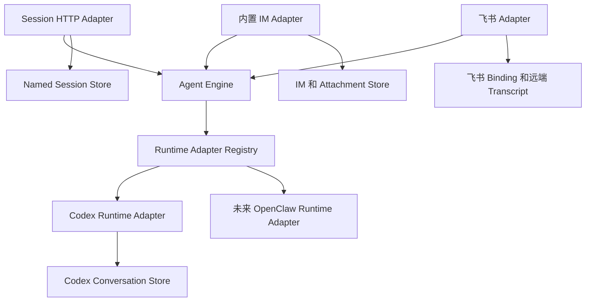

# Agent Engine 解耦

英文版：[agent-engine-decoupling.md](agent-engine-decoupling.md)

## 状态

状态：**架构提案；评审接口已实现**。

仅包含 Contract 的实现位于 [`internal/agentengine`](../../internal/agentengine)。
它尚未接入现有 Agent、API、IM 或 Runtime Package。
该 Package 是精确 Go Type 和 Method Signature 的 Source of Truth。
本文档说明期望的 Owner、行为和增量实现计划。

## 1. 范围

### 1.1 目标

CSGClaw 需要一条 Runtime 中立的执行路径，供匿名 Session、内置 IM、飞书和未来 Direct Channel 使用：

```text
Channel Adapter 或 Session API -> Agent Engine -> Runtime Adapter
```

设计提供两个公共 Resource Interface：

- `Agents()` 管理持久化 Agent Resource 和 Runtime 生命周期。
- `Conversations(agentID)` 为一个已选择的 Agent 执行 Conversation。

接口采用 Kubernetes Client 风格，先选择 Resource Scope，再暴露聚焦的操作。
它不引入 Kubernetes Controller、API Server、Object Metadata Model 或 Reconciliation Framework。

设计必须：

- 让匿名 Session 独立于 IM Room 和 Message。
- 保留内置 IM 的协作行为。
- 把 Runtime 特有协议隐藏在 `ConversationRuntime` 后面。
- 支持 Text、File、实时进度、Interaction 和 CSGClaw Structured Output。
- 复用当前 State Owner，不创建 Engine Database。
- 支持按小步、可评审的阶段实现。

### 1.2 非目标

本方案不：

- 替换现有 Agent、IM、Participant、Team、Task 或 Runtime Store。
- 把 `/api/v1/agents/{id}/llm` 改成 Agent Execution API。
- 实现远程 Agent Engine 或 Engine HTTP 协议。
- 实现完整 OpenAI Responses API 或 `previous_response_id` Chain。
- 增加 Files API 或新的飞书文件下载支持。
- 让 Agent Engine 拥有 Transcript、Attachment、Credential 或 Runtime 原生 Conversation Mapping。
- 增加兼容、Fallback 或双执行路径。
- 在 OpenClaw 暴露合适的直接协议前声称支持 Direct OpenClaw。

## 2. 当前产品约束

### 2.1 现有状态 Owner

架构保留以下当前 Owner 边界：

| 状态 | Owner |
|---|---|
| Agent、Profile、Runtime Record | `internal/agent` |
| Runtime 原生 Conversation Mapping | 具体 Runtime Package，Codex 当前为 `internal/runtime/codex` |
| User、Room、Message、Thread、Attachment | `internal/im` |
| Participant 和 Channel Binding | `internal/participant` |
| Team、Task、Scheduled Task、Notification、Work | 各自现有 Service |
| 模型传输和 Proxy 认证 | `internal/llm` 和 `internal/cliproxy` |

Agent Engine 不能复制这些持久化状态。
它只能持有进程内 Admission、Active Turn 和 Pending Interaction 状态。

### 2.2 现有执行路径

当前匿名 Session API 仍会创建 IM Room 和 Message：

```text
POST /api/v1/agents/{agent}/sessions/{session_id}/responses
  -> 解析 Participant 和 IM User
  -> EnsureAgentSessionRoom
  -> 持久化输入 Message
  -> 通过 Codex Channel Bridge 执行
  -> 持久化最终 Message
```

目标路径删除该 IM 依赖，同时保留 Request、SSE 和 Error Shape。

内置 IM 和 Host 侧飞书 Codex 执行当前使用 `internal/channelbridge/codexbridge`。
该 Bridge 已负责 Source Subscription、Deduplication、Conversation Key 构造、隐藏 Channel 和 Thread Context、Attachment Manifest、Activity 渲染、Interaction、Stop 和 `/new`。
执行迁移到 Agent Engine 后，这些 Channel 行为继续由 Channel Adapter 负责。

飞书当前接收 Text、Post 和部分 Interactive Content。
Image、File、Audio 和 Media Input 继续不受支持。

Codex 暴露直接 Session、Prompt、Event、Permission 和 User Input API。
OpenClaw 当前通过自己的 Channel 或 Sandbox Gateway 执行，仓库中没有经过验证且等价的直接 `Run`、Streaming Event、Cancel、Reset 和 Resolve 协议。
因此第一个 Runtime Adapter 是 Codex。

## 3. 目标架构

### 3.1 依赖方向



Agent Engine 不 Import IM、Participant、Channel、Team 或具体 Runtime Package。
Composition Root 注册 Runtime Adapter，并把接口连接到现有 Owner。
缺少 Runtime Adapter 时，在创建 Engine Execution State、Named Session 或 Channel Consumer 前返回 `runtime_adapter_unavailable`。

### 3.2 公共 Resource Interface

精确声明保留在 `internal/agentengine`。
评审入口为：

| Resource | 操作 | 用途 |
|---|---|---|
| `Agents()` | Create、Get、List、Update、Delete、Start、Stop、Recreate | Agent 期望配置和 Runtime 生命周期 |
| `Conversations(agentID)` | Run、Cancel、Reset、Resolve | 限定到一个 Agent 的 Conversation 执行 |
| `ConversationRuntime` | Run、Cancel、Reset、Resolve | Engine 后面的 Runtime 特有直接执行 |

`AgentSpec` 包含完整期望状态：Name、Description、Instructions、Role、Runtime、Model、Skills 和 MCP Server。
`AgentStatus` 包含观察到的生命周期状态和当前 Runtime ID。
更新 Agent 时，把完整期望 Specification 作为一个 Resource Update 替换。

`ConversationInterface` 不暴露 CRUD Method，因为 Engine 不持久化 Conversation Resource。
`Run`、`Cancel`、`Reset` 和 `Resolve` 描述调用方实际可用的生命周期。

### 3.3 Conversation 语义

`ConversationKey` 是调用方拥有的不透明 Identity。
Engine 只校验其非空且长度有界。
它不会解析 Key 中的 Room、Thread、Channel、Binding 或 Session 字段。

`TurnID` 是调用方为一次 `Run` Request 生成的不透明 Identity。
Channel Adapter 或 Session HTTP Adapter 在完成 Ingress Validation 和 Deduplication 后、调用 `Run` 前生成随机 ID。
Engine 只校验其非空且长度有界，并原样传递给 Runtime Adapter。
它不从 `ConversationKey` 或 Source Message ID 派生，因为这些值标识不同的生命周期。

每个 Adapter 负责构造无碰撞 Key：

| 调用方 | Key 来源 |
|---|---|
| 内置 IM | Agent Participant、Room 和可选 Thread Root |
| 飞书 | App Binding、Chat 和可选 Thread Root |
| Session API | Named Session Store 保存的随机内部 Key |

Engine 同时只允许 `(agentID, ConversationKey)` 存在一个 Turn 或 Reset。
不同 Conversation Key 可以并发执行。
等待 Admission 时，同一个 Conversation 可以有一个正在运行的 Turn 和后续排队的 Turn。
因此 Cancel 使用按 Agent 限定的 `ConversationKey` 和 `TurnID` 精确标识一个排队中或运行中的 Turn。
Resolve 额外携带 `InteractionID` 来标识一个 Pending Interaction。

`TurnID` 只存在于该 Turn 的生命周期内。
它不是 Conversation Key、Runtime 原生 Conversation Mapping、Transcript Identity 或持久化 Engine Resource。
`Reset` 仍按 `ConversationKey` 限定，`Resolve` 仍按 `ConversationKey` 和 `InteractionID` 限定。

`ContinuationPolicy` 明确 Runtime Mapping 行为：

- `create_or_resume` 创建缺失的原生 Mapping，或恢复已有 Mapping。
- `require_existing` 在 Mapping 缺失时返回 `conversation_not_resumable`。

`ConversationAdmission` 选择 Busy Key 行为：

- `wait` 在 Engine 内排在活动 Turn 后面。
- `reject_if_busy` 立即返回 `conversation_busy`。

`InteractionPolicy` 选择调用方如何处理 Blocking Runtime Interaction：

- `resolve` 允许调用方通过 `Resolve` 回答。
- `reject` 使用 `interaction_unsupported` 结束 Turn。
- `skip_user_input` 提交 Runtime 的空答案形式，并安全拒绝 Permission。

内置 IM 使用 `resolve`。
匿名 Session API 使用 `reject`。
飞书保留当前 `skip_user_input` 行为。

### 3.4 Input、Event 和 Result

`TurnRequest.Input` 是一个有序 `InputPart` List。
Text Part 包含 `Text`。
File Part 包含一个调用方已授权的 `InputFile`。
不存在并行 File List，也不存在 Engine File Preparation 步骤。

Event Sink 接收一次 `Run` 调用内有序且非终态的进度：

- Text Delta。
- Thought Delta。
- Activity Update。
- Interaction Request。
- 已验证的 Output Item。

Sink 不是 Event Bus、Transcript Store 或 Channel Renderer。
它的 Sequence Number 只对当前 Run 调用内的 Event 排序。

`Run` 只返回一个 `TurnResult`，没有第二套裸 Runtime Error。
`Dispatched=false` 表示 Engine 在 Runtime 分派前拒绝 Turn。
Runtime 分派后，成功、失败、取消和超时都返回 `Dispatched=true`。

稳定失败类别包括无效请求、Agent 不可用、Runtime Adapter 不可用、Conversation Busy、Admission 已满、Runtime Mapping 缺失、File 不可用、不支持 Interaction 和 Runtime 失败。

## 4. Owner

每个事实只有一个 Owner：

| 组件 | 负责 | 不负责 |
|---|---|---|
| Agent Service | Agent 持久化、期望配置、Runtime 生命周期、Workspace 和 Runtime Provision | Turn Input、Transcript、Runtime 原生 Conversation Mapping |
| Agent Engine | Admission、每 Conversation 串行化、Dispatch、Active Turn、Pending Interaction、Event 顺序、规范化 Result | 持久化 Agent 或 Conversation State、File、Channel 行为 |
| Runtime Adapter | 原生 Conversation Mapping、直接 Runtime 协议、Runtime Event 转换、向 Runtime 暴露 File | Channel Subscription、Transcript、Agent 持久化 |
| Channel Adapter | Ingress、Identity、Binding、Deduplication、Hidden Context、File Authorization、Transcript、Rendering、Ack | Runtime 原生 Mapping、Engine Admission |
| Session HTTP Adapter | HTTP Validation、Named Session Binding、SSE 和 Error Mapping | IM Room、Message、Participant、Transcript |

Agent Service 和 Agent Engine 必须协调生命周期变更，确保 Restart、Recreate、Delete 或破坏性 Workspace 变更不会替换活动 Turn 正在使用的资源。
该协调属于实现职责，不作为公共 Target 或 Lease 抽象暴露。

## 5. 主要流程

### 5.1 匿名 Session

入口保持不变：

```http
POST /api/v1/agents/{agent}/sessions/{session_id}/responses
```

目标流程为：

```text
Session HTTP Adapter
  -> 加载或创建 Named Session Binding
  -> 生成 TurnID
  -> Conversations(agentID).Run
  -> Runtime Adapter
  -> 把 Engine Event 映射为现有 SSE
```

Named Session Store 只包含外部 Session ID、Agent ID、不透明 Conversation Key，以及 `initializing` 或 `ready` 状态。
它不保存 Prompt、Output、File、Runtime Handle 或 Interaction。

`initializing` Session 使用 `create_or_resume`。
第一个 `Dispatched=true` 的 Result 返回后，它变为 `ready`。
`ready` Session 使用 `require_existing`。

Route 保留当前 Request Input、`stream`、Body Limit、Timeout、SSE、Error Envelope、`409 session_busy` 和空 `room_id` Response Metadata。
它不创建 Room、User、Participant、IM Message、Participant Work 或 Hidden Channel Context。

### 5.2 内置 IM

```text
IM 持久化用户 Message
  -> Channel Adapter 执行 Routing 和 Deduplication
  -> 构造 ConversationKey、生成 TurnID，并排列 Input
  -> Conversations(agentID).Run
  -> Runtime Adapter
  -> Channel Adapter 渲染 Activity 和最终 Message
```

Channel Adapter 保留 Mention、Thread Context、Skill、Participant Work、Stop、`/new`、Superseding、Replay、Reaction 和 Transcript 行为。
它可以按当前方式，在调用 Engine 前把 Hidden Channel Context 或新 Thread Context 合并进规范化 Text Input。
Engine 不单独建模该 Context。

`/new` 使用同一个 `ConversationKey` 调用 `Reset`。
Runtime Adapter 原子替换原生 Conversation Mapping。

### 5.3 Runtime Adapter

获得 Admission 后，Engine 为 Agent 已就绪的 Runtime 选择注册的 Adapter。
所选 Adapter：

1. 根据 `ContinuationPolicy` 解析或创建原生 Conversation Mapping。
2. 执行有序 Input。
3. 把原生 Progress 转成 Engine Event。
4. 在公开 Text 发出前解码合格的 CSGClaw Structured Output。
5. 返回一个终态 Result。

Codex Adapter 复用现有 `conversation_sessions` Mapping 和 `EnsureSession` 行为。
Reset 为同一个 `ConversationKey` 替换该 Mapping。

只有 OpenClaw 提供稳定的直接提交、终态、Event Delivery、Cancel、Reset 和 Interaction 行为后，才增加 OpenClaw Adapter。
它不能通过 IM 或飞书 Event 模拟直接执行。

## 6. 关键边界

### 6.1 持久化

Agent Engine 没有持久化 Conversation Store。
Runtime Adapter 拥有原生 Conversation Mapping。
Channel Adapter 拥有 Transcript 和 Source Delivery State。
Named Session Store 只拥有外部 Session Binding。

Engine 进程重启会中断排队中和运行中的 Turn。
它不会删除 Runtime 原生 Mapping。
设计不承诺 Replay、Exactly-once Execution 或 In-flight Side Effect 恢复。

### 6.2 文件

内置 IM 继续拥有 Attachment Metadata、Blob、Download Token 和 GC。
调用 Engine 前，受信任调用方授权文件，并解析包含 ID、Source Path、Name、Media Type、Size 和 Hash 的 `InputFile`。

Engine 校验 Input Shape，但把 `SourcePath` 视为不透明值。
它不调用 IM API、不读取 File Byte、不写 Workspace File、不管理 Blob，也不 Mount Sandbox。
Runtime Adapter 决定如何 Mount、Copy 或暴露 File，并保留 Path、Symlink、Size 和 Hash 校验。
调用方保证已解析 Source 在 `Run` 返回前持续有效。

只有新上传或明确再次引用时才把 File 加入 Input。
不能仅为继续 Runtime 原生 Conversation 而重发之前的 File Byte。

### 6.3 Structured Output 和 Interaction

唯一共享 Decoder 拥有 `::csgclaw-output::` Grammar。
它在 Payload 跨过 Engine 边界前验证 `resource_link` 和 Detached `request_user_input`。
原始控制行不能进入公开 Text 或 Channel Renderer。

Blocking Runtime Permission 或 User Input 保持同一个 Turn 打开，并使用 `Resolve`。
Detached `request_user_input` 完成当前 Turn，并在用户回答后创建后续 Turn。
Detached Input 不调用 `Resolve`。

Secret Interaction Answer 不能进入 Log 或 Transcript。
Detached Secret Answer 也不能插入模型续接。

### 6.4 并发和生命周期

Server Config 是全局、每 Agent、Queue Length 和 Queue Timeout Limit 的 Owner。
Engine 拥有唯一的每 Conversation 执行队列。
Channel Adapter 可以为 Subscription、Deduplication 和 Ack 保留 Source Ingress Buffer，但不能增加第二套规范化 Turn Queue。
Engine 使用 `(agentID, ConversationKey, TurnID)` 索引排队中和运行中的 Turn，Runtime 原生 Conversation Mapping 仍按 Conversation Identity 建立索引。

Sink 失败时，Engine 在可能时请求 Runtime Cancel，并等待 Runtime 真实终态后才释放 Admission。
Runtime 不支持 Cancel 时，Engine 继续监督到终态。

Restart 等待活动 Turn，并保留 Runtime Conversation Store。
Recreate 和 Delete 删除 Runtime 所有的 State，不承诺继续 Conversation。
Mapping 丢失时，严格调用方收到 `conversation_not_resumable`。

## 7. 增量实现

### 阶段 0：评审 Contract

- `internal/agentengine` 只保留独立 Interface。
- 评审 Agent Lifecycle、Conversation Execution、Input、Event、Output、Interaction 和 Error Shape。
- 不把该 Package 接入现有行为。

### 阶段 1：Engine、Codex 和匿名 Session

- 实现有界 Admission 和每 Conversation 串行化。
- 实现 Codex Runtime Adapter。
- 增加 Named Session Store。
- 让现有匿名 Session API 通过 Agent Engine 执行。
- 保留公共 API，同时删除匿名 IM 持久化。
- 在创建 State 前拒绝不受支持的 Runtime Adapter。

### 阶段 2：内置 IM

- 把内置 IM 执行迁移到 Agent Engine 后面。
- 保留 Channel Routing、Hidden Context、File、Interaction、Work、Stop、`/new`、Transcript 和 Rendering。
- 运行 Team、Task、Scheduled Task、Notification 和 Work 回归测试。

### 阶段 3：飞书和更多 Runtime

- 把受支持的飞书 Text Path 迁移到 Agent Engine 后面。
- 保留当前 Mention、Thread、Reaction、Rendering 和 `skip_user_input` 行为。
- 只有 Direct Protocol 存在后才增加 OpenClaw。
- 真正需要时再单独设计远程传输和新 Channel File 支持。

每个阶段必须可以独立评审和发布。
后续阶段不能成为验证前一阶段的前置条件。

## 8. 验收标准

### 8.1 架构

- `internal/agentengine` 不 Import IM、Participant、Channel、Team 或具体 Runtime Package。
- `Interface` 暴露 `Agents()` 和按 Agent 限定的 `Conversations(agentID)`。
- Conversation Request 不重复携带 Agent ID。
- Conversation Key 保持不透明并由调用方拥有。
- 每次 Run 都携带调用方生成的不透明 Turn ID，Cancel 使用 Conversation Key 和 Turn ID 定位一个 Turn。
- Engine 不持久化 Agent、Conversation、Transcript、File 或 Delivery State。
- Runtime 原生 Conversation Mapping 只有一个 Owner。
- 缺少 Runtime Adapter 时明确失败，不启动 Fallback Path。
- Go Contract 和两种语言文档保持同步。

### 8.2 行为

- 匿名 Session 不创建 IM Entity，并保留公共 API Contract。
- 不同 Conversation 可以并发，一个 Conversation 内保持串行。
- 内置 IM 保留 Room、Thread、Mention、File、Activity、Stop、Work、Interaction 和 `/new` 行为。
- 飞书保留当前支持的 Text 行为，不声称支持 File。
- Codex Conversation 在 Restart 后可以继续。
- Recreate 和 Delete 如实报告严格续接 Mapping 缺失。
- CSGClaw Structured Output 不泄漏原始控制行。
- Secret Answer 不进入 Log 或 Transcript。

### 8.3 验证

- Contract Test 覆盖 Run、Cancel、Reset、Resolve、Event 顺序、终态 Result 和稳定 Error。
- 测试覆盖单 Turn、配置并发、Busy Admission、Queue Exhaustion、Sink Failure 和 Cancel 行为。
- 测试覆盖无 MCP、本地 MCP、远程 MCP、Text Input 和 File Input。
- 匿名测试验证 IM Entity 数量不变。
- Channel 测试验证 Deduplication、Replay、Superseding 和 Rendering。
- Runtime 测试验证 Mapping 创建、严格续接、Reset、Restart、Recreate 和 Delete 语义。
- 现有 Agent、Session API、内置 IM、飞书、Team、Task、Scheduled Task、Notification 和 Work 回归测试通过。
