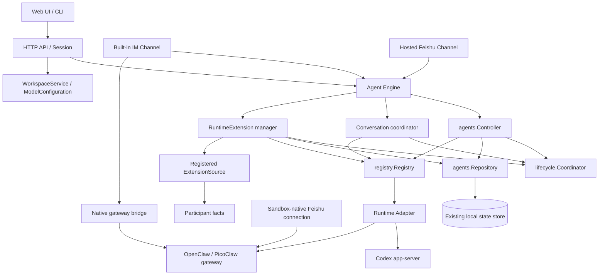

# CSGClaw architecture

中文：[architecture.zh.md](architecture.zh.md)

## Scope

This document describes the Agent Engine consolidation and its follow-up fixes as of 2026-09-05.
[Agent Engine](agent-engine-decoupling.md) specifies resource semantics and concurrency.
[Hosted Feishu](channel/agent-engine-channel-integration.zh.md) and [lark-cli](channel/feishu-lark-cli-document-tool-design.zh.md) describe the channel and its optional Runtime extension.

## Ownership and execution

Hosted execution follows `Channel / Session -> Agent Engine -> Runtime Adapter`.
Agent administration and RuntimeExtension changes use the same Engine and per-Agent lifecycle coordinator.
There is no production `agent.Service`, Agent facade, Codex bridge, or API/Channel access to native Codex brokers.
The Engine imports neither concrete Codex/PicoClaw/OpenClaw implementations nor IM, Participant, or Channel packages.
Runtime adapters depend on the runtime-neutral `agentengine/contract` package.

## Resources and modules

| Resource or module | Actual owner |
| --- | --- |
| `Agents()` | `agentengine/agents.Controller`; desired state, field-masked updates, provisioning and lifecycle |
| `Conversations(agentID)` | `agentengine.Engine`; admission, replay, ordering, cancellation, reset and interaction resolution |
| `RuntimeExtensions(agentID)` | `runtimeExtensionManager`; desired generations, Source resolution, reconciliation and status |
| Agent, Runtime observation and Extension records | `agents.Repository`, using the existing local store |
| Per-Agent execution/mutation exclusion | `lifecycle.Coordinator` |
| Runtime registration and selection | `registry.Registry`, sealed after composition |
| Runtime layout, process and native conversation state | Registered `internal/runtime/*` adapters |
| Managed projection directories and activation | `runtime/extensionstate` |
| Runtime instructions rendering | `runtime/instructions`, invoked by the Runtime adapter |
| Workspace browsing, template export and logs | `agents.WorkspaceService` through narrow API interfaces |
| Model/provider configuration | `agents.ModelConfiguration`; model transport remains in `internal/llm` |
| Participants, Bot credentials, Channel workers, transcripts | Their existing Participant, Channel and IM owners |

Start and Stop are `Agents().Update` operations with `field_mask: ["desired_state"]`.
Recreate and image upgrade are explicit `Agents().Recreate` operations.
Workspace and model helpers do not expand the Agent resource interface.

## Composition

[cli/serve/serve.go](../../cli/serve/serve.go) constructs the Controller and registers Runtime adapters through `internal/app/runtimewiring`.
It creates one shared Engine and injects it into HTTP, Participant administration, tasks, Session and hosted channels.
HTTP constructors require the Engine explicitly; they do not create a substitute Engine.
The API support bundle exposes separate record, workspace, model and Runtime-configuration interfaces.
Feishu's Source is registered through integration setup before startup reconciliation.

Channel Binding Managers own their workers independently.
Agent Stop, Recreate and Runtime reload do not remove a Binding or transcript and do not stop a Channel worker.
Credential changes and explicit disconnect reconcile the affected Binding.
These worker rules describe hosted Codex channels.
OpenClaw and PicoClaw retain their existing sandbox-native channels; binding changes recreate their Runtime through `Agents().Recreate` so current credentials are loaded or removed.

## Conversations and interactions

Callers own external identities, input preparation and delivery.
Engine treats ConversationKey as opaque and owns one active Turn per Agent/key.
Built-in IM uses waiting admission; hosted Feishu uses superseding admission.
The Runtime adapter owns native thread/session mappings and translates Engine requests and events.

Both permission approval and user-input HTTP responses go through the Channel interaction coordinator into `Conversations().Resolve`.
The coordinator validates the trusted UI route; Engine validates and reserves the pending interaction; the selected Runtime adapter answers native requests.
A transcript callback runs before the native request is released.
Duplicate responses cannot repeat that callback.
Skipped questions retain explicit empty answer arrays when the response reaches Codex.
Cancel, expiry, Reset and lifecycle invalidation cancel responses still inside their transcript callback.
Successful Turn completion allows an already accepted native response to finish returning.

Structured questions produced by successful commands become Engine-owned detached interactions.
Failed Turns do not activate them.
Answers, expiry, cancel, reset, a new Turn and Agent lifecycle changes update their status.
Late terminal events update the original rendered card without creating a second conversation path.
Native secret answers reach the native request, while public events and transcripts are redacted.
Detached continuations preserve the existing redacted model-input behavior.

## Runtime capabilities

| Adapter | Lifecycle | Engine conversations | RuntimeExtension |
| --- | --- | --- | --- |
| Local Codex | Supported | Run, Cancel, Reset, Resolve and files | `lark-cli` |
| PicoClaw Sandbox | Supported | No registered Engine conversation implementation | Unsupported |
| OpenClaw Sandbox | Supported | No registered Engine conversation implementation | Unsupported |

This table does not describe sandbox-native gateway protocols as Engine conversation implementations.
OpenClaw and PicoClaw remain supported through those native gateway protocols.
The built-in channel sends `/new` to OpenClaw and `/clear` to PicoClaw, while Codex resets use Engine conversations.
Hosted CSGClaw and Feishu Binding Managers select local Codex Agents.
A missing conversation adapter or Extension driver returns an explicit unsupported status/error; Engine never chooses a legacy execution route.

## RuntimeExtension

An Extension stores only a name, kind, Source reference, failure policy and status.
Sources resolve current integration facts into transient, versioned payloads.
Drivers validate, probe and stage Runtime-private projections.
Engine validates environment conflicts, orders instruction fragments by name and coordinates activation/reload.

Apply/Delete share the same mutation lease as Agent updates and Recreate.
Stopped Runtimes stay stopped during Extension operations.
Running Runtimes reload only when their effective configuration is not loaded.
Recreate reconciles desired Extensions before starting the Runtime.
A required Extension that is not configured and loaded prevents readiness.
Runtime replacement retains Extension desired resources, including when startup fails or the new Adapter reports `extension_unsupported`.
Resources being deleted no longer gate readiness, and a successful cleanup reload is independent of unrelated Extension readiness.

Feishu's optional `feishu-lark-cli` Extension does not gate channel connection.
The UI reads its Engine status, including whether the Runtime actually loaded the generation.
The product exposes fixed init/cleanup actions, not an arbitrary payload or shell-command API.

## Persistence and security

| State | Lifetime / location |
| --- | --- |
| Agent and Extension resources | Existing local state sections, normally `~/.csgclaw/state.json` |
| Participant credentials | Participant store; sandbox-native adapters render the credentials required by their gateway configuration |
| Runtime files and native conversation state | Adapter-owned Agent home under `~/.csgclaw/agents/<agent-id>` |
| Codex Extension projections | `CODEX_HOME/runtime-extensions/<name>/generation-*/` plus an atomic active manifest |
| Built-in transcripts | IM-owned storage |
| Anonymous Session bindings | Agent-scoped Session Binding Store |
| Active Turns, interaction state, replay cache and file index | Process-local |

Source payloads are not persisted by Engine or returned by Extension Get/List.
Private Runtime projections may contain the scoped token or sensitive data needed by the tool.
Feishu source tokens bind the purpose, Agent, Participant and credential revision, including in no-auth deployments.
Deleting or changing the Participant immediately invalidates older tokens.

Runtime-native conversation mappings and durable memory survive supported recreate operations.
Process-local in-flight Turns, interaction handles and file IDs do not survive a server restart.
There is no cross-restart exactly-once message-delivery guarantee.

## Source map

- [Engine contracts](../../internal/agentengine/contract/interface.go), [resource types](../../internal/agentengine/contract/agent.go).
- [Agent controller](../../internal/agentengine/agents/controller.go), [resource operations](../../internal/agentengine/agents/resource_controller.go), [repository](../../internal/agentengine/agents/repository.go).
- [Conversation coordinator](../../internal/agentengine/engine.go), [interaction state](../../internal/agentengine/interactionstate/coordinator.go), [lifecycle](../../internal/agentengine/lifecycle/coordinator.go).
- [Runtime registry](../../internal/agentengine/registry/registry.go), [Codex conversation adapter](../../internal/runtime/codex/conversation_adapter.go).
- [Extension manager](../../internal/agentengine/runtime_extension_manager.go), [projection transaction](../../internal/agentengine/runtime_adapter.go), [generation store](../../internal/runtime/extensionstate/store.go).
- [HTTP dependency bundle](../../internal/api/agent_services.go), [Channel interaction coordinator](../../internal/channel/csgclaw/interaction/interaction.go).
- [Frontend architecture](web/architecture.md), [build](build.md).
