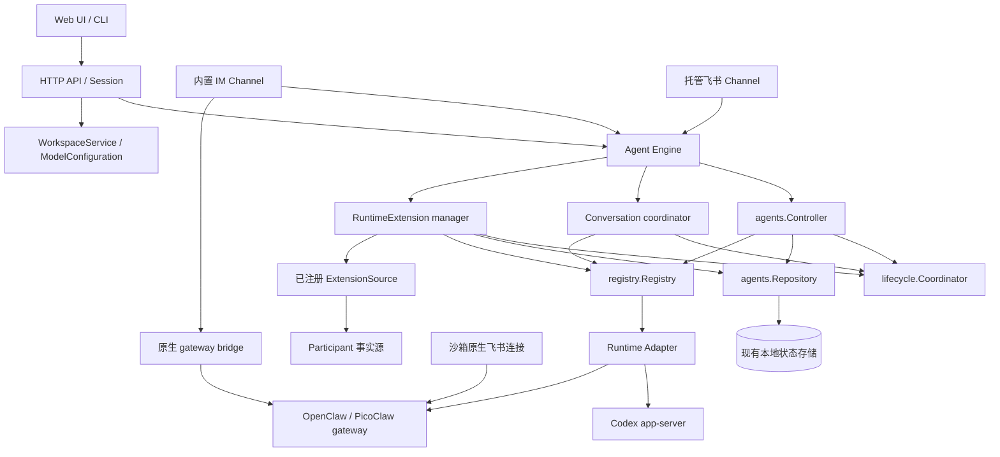

# CSGClaw 架构

English: [architecture.md](architecture.md)

## 范围

本文描述截至 2026-09-05 的 Agent Engine 解耦实现及后续修复。
[Agent Engine](agent-engine-decoupling.zh.md) 说明资源语义与并发规则。
[托管飞书](channel/agent-engine-channel-integration.zh.md)和 [lark-cli](channel/feishu-lark-cli-document-tool-design.zh.md) 分别说明消息渠道和可选 Runtime 扩展。

## 所有权与执行路径

托管对话只走 `Channel / Session -> Agent Engine -> Runtime Adapter`。
Agent 管理和 RuntimeExtension 变更使用同一个 Engine、同一个 Agent 生命周期协调器。
生产代码不再包含 `agent.Service`、Agent facade、旧 Codex bridge，API/Channel 不再访问原生 Codex broker。
Engine 不导入具体 Codex/PicoClaw/OpenClaw 实现，也不导入 IM、Participant 或 Channel 包。
Runtime Adapter 依赖中性的 `agentengine/contract` 契约包。

## 资源与模块

| 资源或模块 | 实际所有者 |
| --- | --- |
| `Agents()` | `agentengine/agents.Controller`；期望状态、field mask 更新、Provision 和生命周期 |
| `Conversations(agentID)` | `agentengine.Engine`；admission、重放、排序、取消、重置和交互解析 |
| `RuntimeExtensions(agentID)` | `runtimeExtensionManager`；期望 generation、Source 解析、对账和状态 |
| Agent、Runtime 观察状态和 Extension 记录 | `agents.Repository`，使用现有本地存储 |
| 同 Agent 执行与变更互斥 | `lifecycle.Coordinator` |
| Runtime 注册与选择 | `registry.Registry`，装配后封闭注册 |
| Runtime 布局、进程、原生会话状态 | 已注册的 `internal/runtime/*` Adapter |
| 托管目录、generation 和激活 | `runtime/extensionstate` |
| Runtime instructions 渲染 | `runtime/instructions`，由 Adapter 调用 |
| Workspace 浏览、模板导出和日志 | `agents.WorkspaceService`，通过窄接口提供给 API |
| 模型和 Provider 配置 | `agents.ModelConfiguration`；模型传输仍属于 `internal/llm` |
| Participant、Bot 凭据、Channel Worker、transcript | 现有 Participant、Channel 和 IM 所有者 |

Start、Stop 是 `Agents().Update` 的 `field_mask: ["desired_state"]` 操作。
Recreate 和镜像升级是显式 `Agents().Recreate` 操作。
Workspace 和模型辅助能力不扩张 Agent 资源接口。

## 装配

[cli/serve/serve.go](../../cli/serve/serve.go) 构建 Controller，通过 `internal/app/runtimewiring` 注册 Runtime Adapter。
它创建共享 Engine，并注入 HTTP、Participant 管理、Task、Session 和托管 Channel。
HTTP 构造函数显式接收 Engine，不自行创建替代实例。
API 支持依赖拆成 record、workspace、model、Runtime 配置四类窄接口。
飞书 Source 通过集成装配注册，在启动对账前就绪。

Channel Binding Manager 独立拥有 Worker。
Agent Stop、Recreate 和 Runtime reload 不删除 Binding 或 transcript，也不关闭 Channel Worker。
凭据变化和显式断开才对对应 Binding 进行重建或删除。
以上 Worker 规则适用于托管 Codex Channel。
OpenClaw 和 PicoClaw 保留既有沙箱原生 Channel，绑定变化通过 `Agents().Recreate` 重建 Runtime，使当前凭据生效或被清除。

## 对话与交互

调用者拥有外部身份、输入准备和投递。
Engine 将 ConversationKey 视为不透明值，按 Agent/key 管理唯一活跃 Turn。
内置 IM 使用等待式 admission，托管飞书使用 supersede admission。
Runtime Adapter 拥有原生 thread/session 映射，并转换 Engine 请求与事件。

权限确认和用户输入 HTTP 回复都先进入 Channel interaction coordinator，再调用 `Conversations().Resolve`。
Channel 校验可信 UI 路由，Engine 校验并认领 pending interaction，所选 Adapter 回复原生请求。
transcript 回调在释放原生请求前完成。
重复回复不会重复执行回调。
被跳过的问题以显式空答案数组传递给 Codex。
Cancel、过期、Reset 和生命周期失效也会取消仍在 transcript 回调中的回复。
Turn 正常完成时，已被原生 Runtime 接受的回复仍可正常返回。

成功命令生成的结构化问题由 Engine 激活为 detached interaction。
失败 Turn 不激活问题。
回复、过期、Cancel、Reset、新 Turn 和 Agent 生命周期变化都会更新问题状态。
Turn 结束后的终态事件更新原卡片，不创建第二条对话执行路径。
原生 secret 答案原样交给原生请求，公共事件和 transcript 脱敏。
detached continuation 保留既有的模型输入脱敏行为。

## Runtime 能力矩阵

| Adapter | 生命周期 | Engine Conversation | RuntimeExtension |
| --- | --- | --- | --- |
| Local Codex | 支持 | Run、Cancel、Reset、Resolve、文件 | `lark-cli` |
| PicoClaw Sandbox | 支持 | 尚无注册的 Engine Conversation 实现 | 不支持 |
| OpenClaw Sandbox | 支持 | 尚无注册的 Engine Conversation 实现 | 不支持 |

沙箱原生 gateway 协议不等于 Engine Conversation Adapter。
OpenClaw 和 PicoClaw 继续通过这些原生 gateway 协议提供支持。
内置 Channel 向 OpenClaw 发送 `/new`、向 PicoClaw 发送 `/clear`，Codex 则通过 Engine Conversation 重置。
托管 CSGClaw 和飞书 Binding Manager 选择 Local Codex Agent。
缺少 Conversation Adapter 或 Extension Driver 时返回明确的不支持状态，不选择旧执行路径。

## RuntimeExtension

Extension 只持久化 name、kind、Source 引用、failure policy 和状态。
Source 将当前业务事实解析为临时、带版本的 payload。
Driver 校验、probe 并准备 Runtime 私有投影。
Engine 检查环境冲突，按 name 排序 instructions fragment，并协调激活与 reload。

Apply/Delete 与 Agent Update/Recreate 共用 mutation lease。
Extension 操作不会启动已停止的 Runtime。
运行中的 Runtime 只在尚未加载有效配置时 reload。
Recreate 在 Runtime 启动前恢复期望 Extension。
必需 Extension 未配置或未加载时，Agent 不进入 ready。
更换 Runtime 时保留 Extension 期望资源，启动失败或新 Adapter 返回 `extension_unsupported` 也不会删除资源。
正在删除的资源不再阻止 ready，清理触发的 reload 成功与其他 Extension 是否 ready 分开判断。

飞书的 `feishu-lark-cli` 是 optional Extension，不阻止 Channel 连接。
UI 读取 Engine 状态，包括 Runtime 是否实际加载当前 generation。
产品只开放固定 init/cleanup action，不开放任意 payload 或 shell 命令接口。

## 持久化与安全

| 状态 | 生命周期或位置 |
| --- | --- |
| Agent 和 Extension 资源 | 现有本地状态 section，通常为 `~/.csgclaw/state.json` |
| Participant 凭据 | Participant Store；沙箱原生 Adapter 将必要凭据渲染到 gateway 配置 |
| Runtime 文件与原生会话 | `~/.csgclaw/agents/<agent-id>` 下的 Adapter 私有布局 |
| Codex Extension 投影 | `CODEX_HOME/runtime-extensions/<name>/generation-*/` 和原子 active manifest |
| 内置 transcript | IM 存储 |
| 匿名 Session Binding | Agent-scoped Session Binding Store |
| 活跃 Turn、interaction、重放缓存、文件索引 | 进程内 |

Engine 不持久化 Source payload，Extension Get/List 也不返回 payload。
Runtime 私有投影可以包含工具运行所需的 scoped token 或敏感文件。
飞书 source token 绑定 purpose、Agent、Participant 和凭据 revision，no-auth 部署也必须校验。
Participant 删除或凭据改变后，旧 token 立即失效。

受支持的 Recreate 保留 Runtime 原生会话映射与持久记忆。
服务重启不恢复进程内的活跃 Turn、interaction handle 和 FileID。
系统不承诺跨重启的消息 exactly-once 投递。

## 代码索引

- [公共契约](../../internal/agentengine/contract/interface.go)、[Agent 资源](../../internal/agentengine/contract/agent.go)。
- [Agent Controller](../../internal/agentengine/agents/controller.go)、[资源操作](../../internal/agentengine/agents/resource_controller.go)、[Repository](../../internal/agentengine/agents/repository.go)。
- [Conversation coordinator](../../internal/agentengine/engine.go)、[interaction state](../../internal/agentengine/interactionstate/coordinator.go)、[Lifecycle coordinator](../../internal/agentengine/lifecycle/coordinator.go)。
- [Runtime Registry](../../internal/agentengine/registry/registry.go)、[Codex Conversation Adapter](../../internal/runtime/codex/conversation_adapter.go)。
- [Extension manager](../../internal/agentengine/runtime_extension_manager.go)、[投影事务](../../internal/agentengine/runtime_adapter.go)、[generation store](../../internal/runtime/extensionstate/store.go)。
- [HTTP 窄接口](../../internal/api/agent_services.go)、[Channel interaction coordinator](../../internal/channel/csgclaw/interaction/interaction.go)。
- [前端架构](web/architecture.md)、[构建](build.zh.md)。
