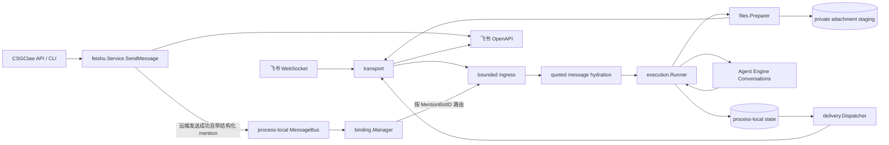

# 飞书直连渠道与 Agent Engine 当前架构

## 1. 范围与原则

本文按 2026-09-04 工作区实现描述 CSGClaw 托管的飞书直连 Worker。
平台所有权见[整体架构](../architecture.zh.md)，Engine 资源和当前解耦边界见[Agent Engine 与 RuntimeExtension](../agent-engine-decoupling.zh.md)。
当前 Binding Manager 只为非沙箱 Codex Agent 创建直连 Worker；PicoClaw、OpenClaw 以及沙箱 Runtime 内原生渠道不在本文范围内。

当前实现遵循以下边界：

- 生产装配为 HTTP API、内置 IM 和托管飞书注入同一个 Agent Engine，但构造函数并不强制全进程只能存在一个实例；
- 飞书渠道直接使用飞书官方 `larksuite/oapi-sdk-go/v3`，不依赖 `lark-bridge-agent-sdk`；
- Agent Engine 是 Conversation admission、Engine 可见的活跃 Turn、Cancel 和 Reset 的执行权威；
- 飞书渠道只保留有界入口缓冲、单进程内展示/投递关联状态，以及进入 Engine 前的临时附件暂存；
- CSGClaw 通过飞书 Bot 发送并结构化提及另一个已激活 Bot 时，由渠道内的本地 handoff 复用目标 Binding 的同一条入站管线；
- Bot 自己发送给自己的消息始终作为回显丢弃，自提及不是创建新 Turn 的调度机制；
- 不提供渠道侧 FIFO、不写 checkpoint/WAL，也不跨重启恢复入站事件或出站投递。

`internal/channel/feishu/service.go` 仍负责飞书 App、Bot、团队和房间等控制面资源。
托管消息数据面位于`internal/channel/feishu/{binding,transport,ingress,context,files,execution,presentation,delivery,state,interaction}`；`participantprovider` 负责把 Participant 凭据适配给 Binding Resolver。

## 2. 运行时拓扑



每个稳定 App Binding 创建一个 Worker。
Worker 拥有自己的 Transport、Intake、Runner、内存 Store、Dispatcher 和按 Binding 隔离的附件暂存目录。
Agent 的 Runtime 停止或重建不会单独断开稳定 Binding；Binding 删除、凭据变更或 Manager 停止时才会关闭或重建对应 Worker。

WebSocket 入站与本地 handoff 是同一 Intake 的两个事件来源，不是两套执行通道。
本地事件保留飞书返回的远端 `message_id`，因此同一消息随后若又经 WebSocket 到达，会被同一个进程内去重窗口合并，只创建一个逻辑 Turn。

| 组件 | 责任 |
| --- | --- |
| `feishu.Service` / `MessageBus` | API/CLI 飞书发送；远端发送成功后为结构化 Bot mention 发布进程内事件 |
| `binding.Manager` | 解析 Binding、凭据变更对账、Worker 启停，以及把本地 mention 事件路由到目标 Worker |
| `transport` | 官方 SDK WebSocket 生命周期、事件转换、身份查询、评论接口、附件下载和单次 OpenAPI 调用 |
| `ingress.Intake` | WebSocket/本地事件的统一过滤、去重、时效判断、引用消息读取和有界内存交接 |
| `context` | 精确 mention 过滤、mention 清理、稳定 Conversation/Turn ID 派生和渠道托管 Prompt 渲染 |
| `files.Preparer` | 入站附件策略、私有暂存、校验和 Engine 文件输入构造 |
| `execution.Runner` | 输入准备，调用 Engine Run/Cancel/Reset，生成展示快照 |
| `presentation` | 本地 Markdown 渲染；代码保留未启用的 CardKit 渲染能力 |
| `state.Store` | 单进程内的 Turn、展示依赖、投递状态和兼容 Card 路由记录 |
| `delivery.Dispatcher` | 依赖感知的进程内投递、终态覆盖和有限重试 |
| `interaction` | 兼容 Card action 的可信路由校验和 Engine 控制调用 |
| `Agent Engine` | Conversation admission、活跃 Turn 和 Runtime 调用 |

依赖方向保持单向：飞书渠道依赖 `agentengine.Interface`，Agent Engine 不依赖飞书协议、SDK、Participant 配置或渠道状态。
飞书 SDK 类型限制在 `transport` 包内。

## 3. Transport 与 Worker 启动

生产 Transport 直接使用飞书官方 Go SDK，当前实现的协议能力包括：

- 注册并转换 WebSocket 消息、文档评论和兼容 Card action；
- 查询 Bot `open_id`，用于忽略 Bot 自身消息和群聊中的精确 @ 过滤；
- 解析文本、富文本和入站附件引用，并下载飞书消息中的图片或文件；
- 读取文档评论上下文并回复评论；
- 发送和更新 Markdown，增加/删除 reaction；
- 上传并发送 Engine 输出的图片或文件；
- 保留 CardKit 发送和更新能力，但当前托管 Worker 不选择 Card 模式。

出站媒体使用 Engine 的 Agent-scoped FileID，不接受任意宿主路径或远程 URL 作为下载来源。
`resource_link` 是外部链接，不会被渠道下载后再上传，以免在 Runtime 授权边界之外形成 SSRF 或权限回退路径。

Transport 不拥有业务排队或重试策略。
文本等操作由 Transport 执行单次 OpenAPI 调用，媒体投递则可能先上传再发送，并缓存已经取得的上传 key。
网络或服务端错误是否重试由进程内 Dispatcher 决定。

Worker 启动顺序为：准备 Bot 身份、绑定 Intake sink、启动 WebSocket、再次确认身份、启动并激活 Intake，最后启动 Dispatcher。
`adapter.Start` 期间到达的事件可以进入 Intake 的有界缓冲，但在 Intake 激活前不会执行；Dispatcher 启动前产生的投递意图会保留在内存 Store 中，随后被唤醒处理。

Binding Manager 启动时还会订阅 `feishu.Service` 的进程内 `MessageBus`。
只有远端发送已经成功、消息带结构化 mention、目标 participant 对应一个活跃 Binding Worker 时，本地事件才会交给目标 Worker；目标不存在或未激活时记录告警并丢弃，不绕过 Binding 生命周期直接调用 Agent Engine。

## 4. 入站缓冲、过滤和会话范围

`ingress.Intake` 不是消息队列。
它只用于让飞书协议回调快速返回：

- 默认容量为 32；
- 最多并发运行 8 个 Intake item handler；
- 写入为非阻塞操作，满载时记录告警并丢弃新事件；
- 最近 256 个逻辑消息 ID 在当前 Binding 内存中去重，优先使用远端 `message_id`，否则使用 Event ID；
- 不按 Conversation 串行，不保证 FIFO，不重试已丢弃事件。

8 个 Intake handler 只限制规范化后事件的短时处理并发；`Runner.Submit` 会另起 goroutine，因此该数值不是 Engine 活跃 Turn 的并发上限。

消息过滤规则为：先忽略当前 Bot 自己发送的消息；`chat_type == "group"` 时只接受明确标记`MentionedBot` 或 mention `open_id` 精确匹配当前 Bot 的消息，其他 chat type 直接接受。
清理 prompt 时只移除当前 Bot 的 mention，占位符中的其他 mention 会保留。

本地 handoff 将 CSGClaw 已发送的消息转换为普通 `transport.Event`，并保留发送 Bot 的`open_id`。
因此：

- `manager bot -> @dev bot`：发送者与目标 Bot 身份不同，可通过自消息过滤，并复用精确 mention、时效、去重、引用读取和 Engine admission；
- `manager bot -> @manager bot`：发送者与目标 Bot 身份相同，在 mention admission 前按自消息丢弃，不创建新的 manager Turn；
- 本地 handoff 不直接调用 Agent Engine，也不为真人 participant 创建 Worker。

自消息过滤是执行安全边界，不能为了支持自提及而放宽，否则 Bot 输出可以再次进入自身输入，造成递归执行或消息风暴。
编排器遍历群成员时必须跳过自己的 participant ID；若任务要求 manager 也给出结果，应在已经运行的当前 Turn 中直接完成 manager 的部分，只向其他 Bot 发 handoff。

Conversation Key 只由稳定 Binding 和飞书会话范围派生，不包含 Runtime 或 Runtime 原生 Session ID。
消息范围始终包含 `ChatID`：只有真实 `ThreadID` 才使用 `ChatID + ThreadID`，否则使用 `ChatID`。
`RootID`/`ParentID` 只表达普通引用关系，不会静默派生新的 Conversation；因此真实话题与主会话隔离，而普通引用继续复用群聊/单聊主会话历史。
文档评论使用文件类型、文件 token 和 comment ID 形成独立范围。

普通消息完成过滤和入队后，Intake 会按 `ParentID`、再按 `RootID` 尝试通过飞书 OpenAPI 读取被引用消息。
读取失败只记录告警，不阻断当前消息。
进入 Agent Engine 前，Feishu Channel 将以下渠道托管字段渲染到文本输入边界：`channel`、`chat_id`、`chat_type`、`binding_id`、`participant_id`、`message_id`、`root_id`、`parent_id` 和 `thread_id`。
引用正文与当前正文明确标记为不可信内容；路由身份和结构化字段在此之前不会作为用户正文参与渠道判断。
该适配位于 Feishu Channel，Agent Engine 不理解飞书协议或引用 API。

进入 Runner 前按远端事件时间执行以下检查：

1. 丢弃早于 Worker 创建时间 30 秒以上的事件；
2. 丢弃相对当前时间延迟超过 2 分钟的事件；
3. 丢弃远端时间领先本机超过 2 分钟的事件；
4. 每个 Conversation/Scope 记录最新远端时间，丢弃早于水位的乱序事件；
5. 时间水位最多保留 1024 个 Scope，达到上限时淘汰一个已有记录。

没有可用远端时间的事件仍可进入处理流程。
去重和时间水位都只在当前进程有效，重启后重新建立。

## 5. Agent Engine admission 与控制

飞书普通消息和可执行的文档评论统一调用：

```go
agentengine.TurnRequest{
    Admission:    agentengine.AdmissionSupersede,
    Continuation: agentengine.ContinuationCreateOrResume,
    Interaction:  agentengine.InteractionSkipUserInput,
}
```

`AdmissionSupersede` 表示同一 Conversation 的新 Turn 取消并替换 Engine 当前 Turn，即 latest-wins。
渠道侧不会等待前一个 Engine Turn 结束，也不会建立第二套 Conversation 队列。

Runner 只取消尚未进入 `Engine.Run` 的旧附件准备；一旦旧 Turn 已进入 Engine，新 Turn 的替换顺序完全由 Engine 的 `AdmissionSupersede` 管理。
如果新附件准备失败，已经进入 Engine 的旧 Turn 不会被飞书渠道提前取消。

`/new` 使用 Engine `Reset`。
Runner 会先取消同一 Conversation 当前 `activeRun` 的 context，停止仍在准备或调用 Engine 的本地 goroutine，再调用 Engine 的原子 Reset。
`Runner.Cancel` 同样先取消匹配的本地 `activeRun`，随后调用 Engine Cancel。

当前 Markdown 展示不提供终止按钮。
代码保留的兼容 Card action 必须通过当前进程内已成功投递的 Card 记录反查 Agent、Conversation 和 Turn，不能信任客户端 action value。
由于生产 Worker 不产生 Card，外部或重启前遗留的 Card 通常没有可信路由，会按过期操作处理。

Worker 关闭时会取消 Worker context、停止 Intake，并让 Runner 取消和等待所有已启动的 Run goroutine。
调用方没有提供 deadline 时，关闭等待默认最多 5 秒；超时会返回错误，然后继续关闭 Dispatcher 和 Transport，而不是无限等待。

## 6. 入站附件

本节描述飞书消息的图片或文件如何转换为 Engine 输入，出站文件见下一节。
默认入站策略为：

- 每条消息最多 8 个附件；
- 单文件最多 20 MiB；
- 单条消息附件总量最多 50 MiB；
- 每个 Binding 最多暂存 200 MiB、32 个文件，并发下载最多 4 个。

Binding 私有暂存目录以 `0700` 模式创建。
下载后校验普通文件、非符号链接和实际大小，探测 MIME 并计算 SHA-256。
Preparer 在 Run 前通过 `Conversations(agentID).Files().Create` 创建 Engine 不可变快照，将 FileID 放入输入。
Runner 在 Run 返回后的 cleanup 中释放输入文件和渠道暂存资源，而不是在 Run 入口复制完成后立即清理。
异常退出遗留的 `feishu-attachment-*` 文件会在该 Binding Worker 下次启动时清理。

## 7. 展示与出站投递

当前托管 Worker 通过代码常量固定选择 Markdown；Participant、CLI 和持久化状态不保存展示模式。
CardKit renderer、transport 操作和 action 处理仅作为未启用的兼容能力保留。

Presentation 当前处理 `TextDelta`、`ThoughtDelta`、`ToolCallStart` 和 `ToolCallUpdate`。
文本/思考流最多每 400 ms 刷新一次，工具状态变化立即刷新；终态由 `TurnResult` 归约并覆盖旧的流式快照。
文本只保留最新约 20 KiB，思考只保留最新 1536 bytes；超过 28 KiB wire 预算的 Markdown 会拆成有依赖关系的多条消息。

`TurnEventOutputItem` 当前不会呈现在飞书中，包括 `resource_link` 和 detached `request_user_input`。
这不影响独立的 `TurnResult.Files` 出站文件能力。
Chat Turn 成功时，Runner 为输出文件建立投递意图，Dispatcher 通过 Agent-scoped Files.Get 读取权威元数据和内容。
符合图片上传条件时上传并发送图片，其余文件使用文件上传和发送。
当前每个 Turn 最多发送 8 个文件，单文件最多 30 MiB，总量最多 50 MiB。
上传 key 按投递意图缓存，发送使用稳定幂等键，重试不重新执行 Agent Turn。
文档评论不创建流式 Markdown 展示或文件投递意图，只在 Turn 结束后回复最多 2000 个字符的最终结果或错误。

Runner 只把投递意图写入当前 Binding 的内存 Store；Dispatcher 在 Engine event sink 之外执行飞书 API，避免网络耗时阻塞 Engine 事件消费。
Store 用于：

- 初始展示消息与更新消息的依赖关系；
- Markdown 创建与更新所需的远端 Message ID 映射；
- reaction 创建/删除依赖；
- 当前进程内的投递状态和兼容 Card 可信路由；
- 终态快照覆盖未投递或等待重试的旧流式更新。

回复位置由真实 `ThreadID` 决定。
只有入站事件包含 `ThreadID` 时，Dispatcher 才设置`ReplyInThread=true` 并把输出留在真实话题中；普通引用只有 `RootID`/`ParentID` 时，输出回复当前入站消息但不升级为话题。
没有引用关系的普通消息按顶层消息发送。

可安全重放的创建操作使用稳定 Feishu UUID，更新和 reaction 删除使用稳定远端 ID；这些操作遇到可重试 OpenAPI 错误时按 2 秒基数指数退避，最多尝试 3 次。
Reaction 创建和评论回复没有等价幂等键，远端结果不明确时不会自动重试。
投递失败不会重新运行 Agent Turn。

Store 以总 Turn 记录 1024 条、总投递记录 4096 条为内存裁剪目标，只淘汰终态 Turn 和不再被待投递项依赖的终态投递。
运行中 Turn、待投递项及其依赖不会为了满足目标而删除，因此高并发或积压时实际记录数可以暂时超过该数值。
它不是 durable outbox；进程退出后待投递和失败记录不会恢复。

飞书 Markdown 消息最多可编辑 20 次。
Dispatcher 最多投递 19 次非终态更新，为终态保留一次编辑额度；若终态仍返回飞书编辑上限错误，会发送独立的 `_（内容已结束）_` 提示。
该 fallback 不包含完整终态内容，也不进行跨重启补偿。

## 8. 重启和故障语义

| 场景 | 当前行为 |
| --- | --- |
| Intake 满载 | 丢弃新事件并告警 |
| WebSocket 与本地 handoff 重复到达同一远端消息 | 按远端 `message_id` 在当前 Binding 最近窗口内只接受一次 |
| Bot 结构化提及另一个活跃 Bot | MessageBus 路由到目标 Worker，并进入目标 Worker 的同一 Intake |
| Bot 结构化提及自己 | 作为自消息丢弃，不创建新 Turn |
| 本地 mention 的目标 Binding 不活跃 | 记录告警并丢弃，不直接调用 Engine |
| 引用消息正文读取失败 | 保留引用 ID 并继续当前 Turn，不把引用正文猜测为可信上下文 |
| 同 Conversation 新消息到达、旧任务仍在附件准备 | Runner 取消旧的本地准备 |
| 同 Conversation 新消息到达、旧 Turn 已进入 Engine | 新 Turn 进入 Engine，由 `AdmissionSupersede` 替换旧 Turn |
| 可安全重放的 OpenAPI 操作失败 | 对可重试错误在当前进程内指数退避，最多 3 次尝试 |
| Reaction 创建或评论回复结果不明确 | 不自动重试，避免重复副作用 |
| Worker/进程重启 | 不恢复入口缓冲、去重窗口、Turn 映射或待投递记录；启动时清理附件残留 |
| `TurnEventOutputItem` | 当前忽略，不把任意链接下载并上传 |
| Chat 成功 Turn 的 `TurnResult.Files` | 通过 Engine 文件快照上传并发送图片/文件，受数量和大小限制 |
| 外部或旧 Card action | 当前 Worker 不产生 Card；无可信内存路由时按过期处理 |

因此当前渠道是明确的单进程 best-effort 语义。
若未来产品要求严格 FIFO、跨重启不丢消息或 exactly-once，应优先在 Agent Engine 或统一渠道基础设施中设计，而不是只在飞书侧增加第二套执行状态机。

## 9. 验证重点

- Transport 事件映射、身份、评论和附件下载接口；
- 群聊精确 mention，以及自消息在 mention admission 前被拒绝；
- bot-to-agent 本地 handoff 到目标 Binding，与 WebSocket 重复投递共享 `message_id` 去重；
- 跨 Bot mention 只执行目标 Agent 一次，自提及不创建 Turn；
- 只有 `ThreadID` 隔离 Conversation；普通 `RootID`/`ParentID` 引用复用主会话；
- 普通引用不进入话题，真实 `ThreadID` 回复保持在话题中；
- 渠道托管 metadata、引用消息读取降级，以及引用正文/当前正文的不可信标记；
- 入口满载、启动期缓冲、历史事件和乱序事件过滤；
- 附件数量/大小/并发配额、校验、清理和取消；
- Engine 请求固定使用 `AdmissionSupersede`；
- 新请求只取消 preflight，Engine 可见 Turn 由 Engine 管理；
- 托管 Worker 固定发送并更新 Markdown，不发送 Card；
- Worker 关闭按 deadline 取消并等待已启动 Run；
- 出站依赖、终态覆盖、编辑额度和有限重试；
- Engine 输出文件的作用域、权威元数据、上传/发送、配额和重试缓存；
- 代码及 `go.mod` 中不存在 `lark-bridge-agent-sdk` 和飞书 WAL/checkpoint 实现。

## 10. 与 RuntimeExtension 的关系

飞书 lark-cli 配置通过 `RuntimeExtensions(agentID)` 管理，不通过该能力执行消息。
Participant 保存凭据，Feishu Source 解析业务事实，Codex Driver 管理配置投影。
连接、切换和断开时，Participant 事实写入与 Extension Apply/Delete 使用同一个 Agent mutation lease。
Channel Binding 随业务事实显式对账，不由 Agent 生命周期反向控制。
二者不承诺与飞书远端服务的分布式事务，清理失败会保留可重试状态。
Binding reconcile 不重启 Runtime；Extension 由 Engine 按需 reload，并通过 live process 的 projection digest 确认加载状态。
完整行为见[lark-cli RuntimeExtension 架构](feishu-lark-cli-document-tool-design.zh.md)。
