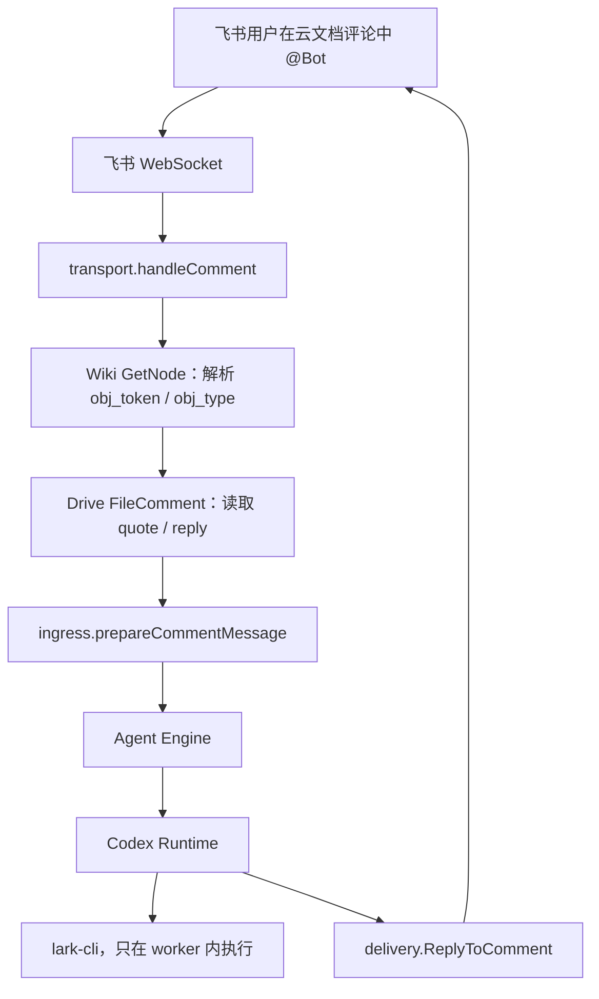

# 飞书直连渠道接入 lark-cli 文档能力方案

本文对齐当前 CSGClaw 代码中的飞书直连渠道和 `lark-cli` 接入方式。当前实现的目标是让绑定飞书
Bot 的 Codex worker 可以在自己的运行上下文中使用 `lark-cli` 读取飞书文档，而不是让飞书
Channel Transport 直接调用文档 API。

当前实现已经落地了 worker 级 `lark-cli` 绑定、配置隔离、运行时环境注入、Feishu 评论 prompt
引导、断开飞书后的本地状态清理。尚未实现多阶段 document-tool CLI、OAuth subject guard、固定
版本安装锁和官方 skill 全量同步。

## 1. 当前结论

- `lark-cli` 是 Codex worker 运行时工具，不是飞书 Channel Transport 的依赖。
- 飞书 Bot 的 `app_id/app_secret` 继续放在 Feishu Agent Participant 的
  `channel_app_config`，不放入 Agent profile、prompt 或普通环境变量。
- worker profile 的 Feishu Channel 页面提供“初始化 lark-cli”按钮。
- 初始化按钮调用 `POST /api/v1/agents/{id}/lark-cli:init`。
- 如果宿主机已有 `lark-cli`，直接执行绑定；如果没有，则尝试通过 `npm install -g` 安装。
- 每个 worker 使用自己的 `<CODEX_HOME>/lark-cli` 作为 `LARKSUITE_CLI_CONFIG_DIR`。
- 每个 worker 使用自己的 `<CODEX_HOME>/lark-cli-source/config.json` 作为 `LARK_CHANNEL_CONFIG`。
- Runtime 只有在 source config 和 bound marker 同时存在时才注入 lark 环境变量。
- 同一宿主机多个 worker 可以同时使用同一个 `lark-cli` 二进制，但不能共用同一个 worker 配置目录。
- 同一个 Feishu AppID 当前不允许绑定给多个 worker；初始化时发现 AppID 被其他 worker 使用会拒绝。
- 断开 Feishu Agent Participant 后，会删除该 worker 的 `lark-cli` 和 `lark-cli-source` 目录。

形象地说：

```text
lark-cli 二进制                  = 楼里的公共工具箱
<worker CODEX_HOME>/lark-cli     = 这个 worker 自己的抽屉
lark-cli-source/config.json      = 这个抽屉里的飞书账号登记表
Participant channel_app_config   = CSGClaw 保存 bot app_id/app_secret 的保险柜
bound.json                       = “这个抽屉已经绑定完成”的门牌
```

## 2. lark-cli 是什么以及如何安装

`lark-cli` 对 CSGClaw 来说是一个外部可执行文件。当前代码通过 `exec.LookPath("lark-cli")` 查找它，
worker 运行时直接执行 `lark-cli ...` 命令。

当前安装逻辑位于 `internal/api/lark_cli.go`：

1. 先在 `PATH` 中查找 `lark-cli`；
2. 找到则复用现有二进制；
3. 找不到则查找 `npm`；
4. 找到 `npm` 后执行：

```bash
npm install -g ${CSGCLAW_LARK_CLI_NPM_PACKAGE:-@larksuite/cli@latest}
```

因此当前代码不需要 JVM。若宿主机已经有 `lark-cli`，初始化阶段也不需要 Node.js；若宿主机没有
`lark-cli`，则需要可用的 Node.js/npm 来完成自动安装。

当前默认 npm 包是 `@larksuite/cli@latest`，可以通过服务进程环境变量
`CSGCLAW_LARK_CLI_NPM_PACKAGE` 覆盖，例如：

```bash
CSGCLAW_LARK_CLI_NPM_PACKAGE=@larksuite/cli@1.2.3
```

生产最佳实践仍建议固定版本和主机级安装锁；这属于后续强化项，当前代码尚未实现。

## 3. 当前初始化不是 config init

当前按钮名叫“初始化 lark-cli”，但实际没有执行 `lark-cli config init`。当前实现使用的是
`lark-channel` source projection：

```bash
LARKSUITE_CLI_CONFIG_DIR=<worker CODEX_HOME>/lark-cli \
LARK_CHANNEL=1 \
LARK_CHANNEL_HOME=<worker CODEX_HOME> \
LARK_CHANNEL_PROFILE=<worker agent_id> \
LARK_CHANNEL_CONFIG=<worker CODEX_HOME>/lark-cli-source/config.json \
lark-cli config bind --source lark-channel --identity bot-only --force --lang zh
```

也就是说，初始化阶段做的是“把 worker 的 Feishu App 信息绑定进这个 worker 自己的 lark-cli
配置抽屉”。App Secret 不通过命令行参数或 stdin 传给 `lark-cli`，而是由 source config 中的
exec provider 按需读取。

完整步骤如下：

1. 校验目标 Agent 存在且 runtime kind 为 Codex；
2. 查找该 Agent 对应的 Feishu Agent Participant；
3. 从 Participant `channel_app_config` 读取 `app_id/app_secret`；
4. 校验这个 `app_id` 没有被其他 worker 使用；
5. 解析该 worker 的 `CODEX_HOME`；
6. 确保 `<CODEX_HOME>/lark-cli` 目录存在，权限为 `0700`；
7. 确保宿主机有 `lark-cli`，必要时用 npm 安装；
8. 写入 `<CODEX_HOME>/lark-cli-source/config.json`，权限为 `0600`；
9. 执行 `lark-cli config bind --source lark-channel --identity bot-only --force --lang zh`；
10. 写入 `<CODEX_HOME>/lark-cli-source/bound.json`，权限为 `0600`；
11. 刷新 worker 的 managed instructions；
12. 如果 Codex worker 当前正在运行，则重启 worker 以加载新环境。

## 4. Bot 信息放在哪里

Feishu Bot app 信息的事实源仍是 Feishu Agent Participant：

```json
{
  "id": "dev",
  "channel": "feishu",
  "type": "agent",
  "channel_user_kind": "app_id",
  "channel_app_config": {
    "app_id": "cli_xxxxxxxxxxxxxxxx",
    "app_secret": "[secret]"
  },
  "agent_id": "agent-dev"
}
```

`channel_app_config.app_secret` 真实落盘，但 API/CLI 的普通展示会脱敏。当前 lark-cli source
provider 需要读取真实 secret 时，会走受限的内部 API：

```text
GET /api/v1/agents/{id}/feishu/app-info
```

这个接口不接受普通 server token 作为 source token。初始化时会为该 worker 生成
`larkcli-src-v1...` 格式的 HMAC token，并写入 source config 的 exec provider 环境变量。该 token
绑定到具体 Agent ID，其他 worker 的 source token 不能读取本 worker 的 app info。

本地 helper 命令是：

```bash
pt app-info --channel feishu --agent-id <agent-id> --exec-provider
```

该命令使用 lark-cli exec secret provider 协议输出 `app_id/app_secret`。普通 CLI 输出和 JSON 输出会
对 `app_secret` 脱敏。

## 5. Worker 私有目录

当前目录结构为：

```text
<agent home>/
└── .codex/
    ├── workspace/
    └── home/                                      # CODEX_HOME
        ├── AGENTS.md
        ├── config.toml
        ├── skills/
        ├── lark-cli/                              # LARKSUITE_CLI_CONFIG_DIR, 0700
        │   └── lark-channel/
        │       └── config.json                    # lark-cli 管理
        └── lark-cli-source/                       # 0700
            ├── config.json                        # LARK_CHANNEL_CONFIG, 0600
            └── bound.json                         # CSGClaw 绑定完成标记, 0600
```

`lark-cli-source/config.json` 是给 `lark-cli config bind --source lark-channel` 读取的 source config。
它保存：

- 当前 worker 的 `app_id`；
- exec provider 命令路径；
- `pt app-info --channel feishu --agent-id <agent-id> --exec-provider` 参数；
- `CSGCLAW_BASE_URL`；
- scoped source token；
- exec provider 输出限制。

它不保存 `app_secret` 明文。

`bound.json` 是 CSGClaw 自己的 marker。Runtime 根据 `config.json` 和 `bound.json` 是否同时存在来
判断该 worker 是否已经完成 lark-cli 绑定。

## 6. Runtime 环境变量

Codex Runtime 启动 worker session 时，如果检测到：

```text
<CODEX_HOME>/lark-cli-source/config.json
<CODEX_HOME>/lark-cli-source/bound.json
```

会注入：

```text
LARKSUITE_CLI_CONFIG_DIR=<CODEX_HOME>/lark-cli
LARK_CHANNEL=1
LARK_CHANNEL_HOME=<CODEX_HOME>
LARK_CHANNEL_PROFILE=<agent_id>
LARK_CHANNEL_CONFIG=<CODEX_HOME>/lark-cli-source/config.json
```

这些变量的含义：

| 变量 | 当前含义 |
| --- | --- |
| `LARKSUITE_CLI_CONFIG_DIR` | 这个 worker 自己的 `lark-cli` 配置目录 |
| `LARK_CHANNEL` | 标记当前进程运行在 lark-channel source 上下文 |
| `LARK_CHANNEL_HOME` | 当前 worker 的 `CODEX_HOME` |
| `LARK_CHANNEL_PROFILE` | 当前 worker 的 Agent ID |
| `LARK_CHANNEL_CONFIG` | 当前 worker 的 source config 文件 |

这些 key 已加入 runtime reserved env。宿主进程继承来的同名变量会被过滤，Agent Profile 里的同名变量
也不能覆盖。这样同一个宿主机上多个 worker 同时运行时，虽然共用一个 `lark-cli` 二进制，但每个
worker 的 `lark-cli` 配置抽屉不同。

## 7. 多 worker 如何区分

多 worker 的区分点不是 `lark-cli` 二进制，而是运行时环境和配置目录。

示例：

```text
/home/.../agent-a/.codex/home/
  lark-cli/
  lark-cli-source/config.json
  lark-cli-source/bound.json

/home/.../agent-b/.codex/home/
  lark-cli/
  lark-cli-source/config.json
  lark-cli-source/bound.json
```

worker A 启动时：

```text
LARKSUITE_CLI_CONFIG_DIR=/home/.../agent-a/.codex/home/lark-cli
LARK_CHANNEL_CONFIG=/home/.../agent-a/.codex/home/lark-cli-source/config.json
LARK_CHANNEL_PROFILE=agent-a
```

worker B 启动时：

```text
LARKSUITE_CLI_CONFIG_DIR=/home/.../agent-b/.codex/home/lark-cli
LARK_CHANNEL_CONFIG=/home/.../agent-b/.codex/home/lark-cli-source/config.json
LARK_CHANNEL_PROFILE=agent-b
```

因此两个 Codex worker 可以同时使用 `lark-cli`。每次命令执行时，`lark-cli` 根据当前进程环境变量
读到不同的配置目录和 source config。

当前代码还增加了 AppID 独占校验：如果另一个 Feishu Agent Participant 已经使用同一个 `app_id`，
`POST /api/v1/agents/{id}/lark-cli:init` 会返回 `feishu_bot_app_id_conflict`。

## 8. UI 和 API

当前用户入口在 Agent profile 的 Feishu Channel 页面：

- 连接/重新连接 Feishu；
- 初始化 lark-cli；
- 断开 Feishu。

初始化按钮调用：

```text
POST /api/v1/agents/{id}/lark-cli:init
```

成功响应示例：

```json
{
  "status": "configured",
  "agent_id": "agent-dev",
  "participant_id": "pt-dev",
  "app_id": "cli_xxx",
  "installed": false,
  "lark_cli_path": "/usr/local/bin/lark-cli",
  "config_dir": "<CODEX_HOME>/lark-cli",
  "config_path": "<CODEX_HOME>/lark-cli/lark-channel/config.json",
  "source_config_path": "<CODEX_HOME>/lark-cli-source/config.json",
  "restart_status": "runtime_restarted"
}
```

常见错误：

| 错误码 | 含义 | UI 行为 |
| --- | --- | --- |
| `feishu_bot_not_configured` | 该 worker 没有 Feishu Bot app info | 弹窗提示先连接飞书并完成 Bot 配置 |
| `feishu_bot_app_id_conflict` | 该 AppID 已被其他 worker 使用 | 显示初始化失败 |
| `lark_cli_unavailable` | 宿主机没有 `lark-cli` 且无法用 npm 安装 | 显示初始化失败 |
| `lark_cli_bind_failed` | `lark-cli config bind` 失败 | 显示初始化失败，并恢复 source/marker |
| `unsupported_runtime` | 目标不是 Codex worker | 显示初始化失败 |

如果 bind 成功但 worker 重启失败，接口仍返回 `status=configured`，并带
`restart_status=restart_failed` 和 `restart_error`。前端会提示 lark-cli 已绑定，但需要手动重启
worker。

## 9. 断开 Feishu 时如何清理

删除 Feishu Agent Participant 时，当前代码会：

1. 删除同一 Agent 下其他 Feishu AppID participant；
2. 调用 `DeactivateExternalBinding` 刷新渠道侧 binding；
3. 删除该 worker 的：

```text
<CODEX_HOME>/lark-cli
<CODEX_HOME>/lark-cli-source
```

4. 刷新 managed instructions；
5. 如果 Codex worker 正在运行，则重启 worker。

这意味着用户断开飞书并选择新机器人后，旧机器人的 lark-cli 本地配置会被清掉。下一次点击
“初始化 lark-cli”会按新 Participant 的 `app_id/app_secret` 重新写 source config 并 bind。

## 10. 飞书评论如何使用 lark-cli

飞书评论链路仍由 Channel 负责事件、评论上下文和最终回复：



当前 `ingress.commentPrompt` 会把 file token、file type、用户选中原文和用户问题发给 Codex，并按
类型提示 worker 使用当前已绑定的 `lark-cli`：

| `file_type` | 当前 prompt 行为 |
| --- | --- |
| `doc` / `docx` | 优先提示 `lark-cli docs +fetch --api-version v2 --doc <file_token> --doc-format markdown` |
| `file` | 提示使用当前 lark-cli drive/wiki 只读下载命令，并把文件放到 `./downloads/` |
| `sheet` | 明确不要使用 `lark-cli docs +fetch`，除非当前 lark-cli 有表格只读命令 |
| 其他 | 提示使用匹配文件类型的只读命令 |

Channel 不会把 Codex 下载到 workspace 的文件自动上传回飞书。最终仍只通过评论回复文本。

## 11. Managed instructions

当 runtime 检测到 source config 和 bound marker 后，会在 worker 的 `AGENTS.md` managed block 中加入
`Feishu lark-cli Access` 指令。该指令要求：

- 普通 `lark-cli ...` 命令继承当前 worker 的 lark-channel 环境；
- 不要切到宿主默认 lark-cli profile；
- 不要读取或打印 lark-cli config、app secret、access token、refresh token、OAuth device code 或
  CSGClaw API token；
- 如果 lark-cli 提示当前上下文未绑定，则让用户在 Feishu channel profile 页面初始化或重启 worker；
- Doc/Docx 优先使用 `lark-cli docs +fetch --api-version v2 --doc <file_token> --doc-format markdown`；
- 需要用户 OAuth 时，只在飞书私聊中启动 `lark-cli auth login`；
- 用户 OAuth 成功后可收敛 `strict-mode` 和 `default-as`。

当前暂时没有同步所有官方 `lark-*` skills。worker 主要依赖 managed instructions 和已安装的
`lark-cli` 命令本身。

## 12. 当前安全边界

已经实现：

- App Secret 不进入 prompt；
- App Secret 不进入普通 API/CLI 展示；
- lark-cli source config 不保存 App Secret 明文；
- source token 绑定 Agent ID，不能用全局 server token 或其他 Agent source token 读取 app info；
- `LARK*` 环境变量被 runtime 保留，不能由 Agent Profile 覆盖；
- per-worker `lark-cli` 配置目录隔离；
- init 阶段拒绝同 AppID 多 worker；
- 断开 Feishu 后清理本地 lark-cli 状态。

尚未实现：

- OAuth subject 与评论 actor 的强制匹配；
- 群聊中阻止使用某个用户 OAuth Token 的服务端 guard；
- scope 状态校验和 `ready/needs_reauth` 状态机；
- `lark-cli` 固定版本与安装锁；
- bind/config/marker 的完全原子切换；
- 对 `lark-cli` stderr 的结构化错误分类；
- 官方 lark skills 的全量同步和版本对账。

因此当前实现适合“绑定到某个 worker 的 Feishu Bot + worker 自己按需登录/读取”的本机托管场景。
如果要做企业多用户授权，需要继续实现 OAuth subject guard 或改成官方 Auth Sidecar 模式。

## 13. 当前代码落点

| 模块 | 当前职责 |
| --- | --- |
| `internal/api/lark_cli.go` | init API、安装/查找 lark-cli、写 source config、执行 bind、写 marker、source token |
| `internal/api/router.go` | 注册 `/api/v1/agents/{id}/lark-cli:init` 和 `/api/v1/agents/{id}/feishu/app-info` |
| `cli/participant/app_info.go` | 提供 `pt app-info --exec-provider` 给 lark-cli source provider 调用 |
| `internal/runtime/codex/session_manager.go` | 根据 bound marker 注入并保护 `LARK*` 环境变量 |
| `internal/runtime/codex/runtime.go` | 刷新 Codex home `AGENTS.md` 时按绑定状态加入 managed instructions |
| `internal/agent/agents_instructions.go` | `Feishu lark-cli Access` managed instructions |
| `internal/api/participant.go` | 断开 Feishu participant 后清理 worker lark-cli 状态 |
| `internal/channel/feishu/ingress/comment.go` | 在评论 prompt 中提示按文件类型使用 lark-cli |
| `web/app/src/pages/AgentPage/components/AgentDetailPane/AgentDetailPane.tsx` | Feishu Channel 页面展示“初始化 lark-cli”按钮 |
| `web/app/src/hooks/workspace/useAgentController.ts` | 调用 init API、展示成功/错误/缺少 Bot 弹窗 |

## 14. 后续最佳实践

当前代码已经能让不同 worker 在同一宿主机上用各自的 lark-cli 配置运行。后续建议按优先级补齐：

1. 把默认 npm 包从 `@latest` 改成固定版本，并加主机级安装锁；
2. 增加 staging config dir，避免 bind 成功但 marker 写失败造成半绑定状态；
3. 增加 lark-cli init 的 per-agent 锁，避免同一个 worker 并发点击初始化；
4. 增加 OAuth subject guard，私聊/评论 actor 必须匹配授权用户；
5. 把 lark-cli auth/status/scope 变成可观测状态；
6. 评估官方 Auth Sidecar，使 App Secret 和用户 Token 留在 CSGClaw 可信控制面；
7. 需要多人共享时，设计按 `operator.open_id` 隔离的 OAuth Token 映射，不能复用首个用户 token。

## 15. 验收标准

当前代码应满足：

- 未配置 Feishu Bot 的 worker 点击初始化会返回 `feishu_bot_not_configured`；
- 已配置 Feishu Bot 的 Codex worker 点击初始化会生成独立的 `lark-cli` 和 `lark-cli-source` 目录；
- source config 权限为 `0600`，目录权限为 `0700`；
- `lark-cli config bind` 的环境变量指向当前 worker 的目录；
- runtime 只在 source config 和 bound marker 同时存在时注入 `LARK*` 环境；
- Agent Profile 不能覆盖 `LARKSUITE_CLI_CONFIG_DIR`、`LARK_CHANNEL_CONFIG` 等保留变量；
- worker A 和 worker B 的 `LARKSUITE_CLI_CONFIG_DIR` 不同；
- 同一个 AppID 不能同时完成多个 worker 的 lark-cli 初始化；
- 断开 Feishu 后旧的 `<CODEX_HOME>/lark-cli` 和 `<CODEX_HOME>/lark-cli-source` 会被删除；
- 飞书文档评论 prompt 会优先引导已绑定 worker 使用 `lark-cli docs +fetch` 读取 Doc/Docx。

## 16. 参考

- [lark-cli 官方仓库与安装说明](https://github.com/larksuite/cli)
- [飞书直连渠道与 Agent Engine 当前架构](agent-engine-channel-integration.zh.md)
- [飞书 Channel 配置](feishu.zh.md)
