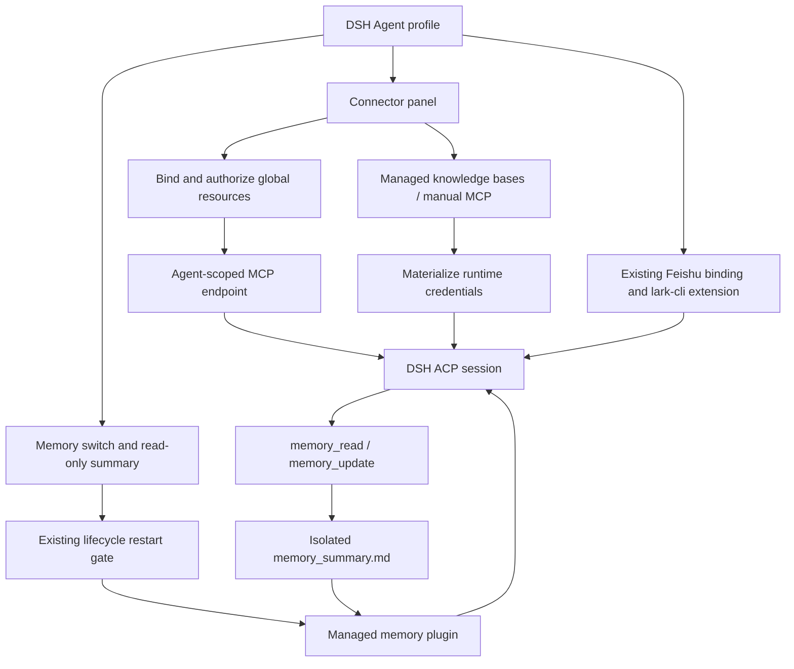

# DSH Agent resources

Chinese companion: [dsh-resources.zh.md](dsh-resources.zh.md).

DSH Agents use the same connector panel as Codex: bind a global resource, authorize it, inspect its tools, enable or disable it, or remove the binding. Manual MCP servers and managed knowledge bases stay available in that panel. The existing Agent MCP endpoint supplies connector tools using an Agent-scoped credential. Knowledge-base credentials are materialized at launch and are not written back to the Agent configuration. A connector catalog refresh restarts an idle ACP process and resumes its existing sessions; active work finishes before refresh.

## Durable memory

DSH implements the runtime-neutral `MemoryController`. Its existing profile memory tab displays a read-only summary and controls `runtime_options.memory_mode` (`enabled` by default, or `disabled`). The lifecycle controller applies a change through the existing restart gate.

The managed ACP memory plugin contributes two tools, `memory_read` and `memory_update`, and the current summary to model context. Guidance asks the Agent to save lasting preferences, corrections and reusable facts, and to remove facts the user asks it to forget. This is tool-based maintenance during normal work; it does not use Codex's background history extraction. Model behavior determines which facts are retained.

The summary lives at `$DSH_HOME/memories/memory_summary.md`, outside the selected project. Updates replace it atomically, reject stale revisions, and enforce a 32 KiB UTF-8 size limit. Symlink memory directories and files are rejected by the plugin. Memory maintenance changes only the managed summary, including in read-only workspace mode.

Disabling memory removes its tools and new context contributions; the stored summary remains available for viewing and re-enabling. Existing conversation history is retained, so past memory context or tool results already present in a conversation are not erased by the switch. Recreating an Agent preserves its memory directory. A template may include the summary only when memory is enabled and the user explicitly selects **Include agent memory**. Creating from that template seeds the new Agent's isolated memory; it does not copy memory into the project or overwrite an existing learned summary.

## Resource flow



## Verification

`GOWORK=off go test ./...` runs the shared integration and lifecycle suite. Native ACP cases use an isolated DSH installation and deterministic local model/MCP servers; no production model or Feishu account is required:

```sh
GOWORK=off CSGCLAW_TEST_DSH_BINARY=/absolute/path/to/dsh go test ./internal/runtime/dsh -run 'TestResourcesNativeDSHE2E|TestMemoryNativeDSHE2E|TestSkillEnablementNativeDSHE2E' -count=1
```

The native cases verify connector and knowledge-base calls, scoped credentials, catalog refresh without session loss, memory learning and restart/disable/re-enable behavior, and enabled skill projection. Feishu binding, extension permissions and delivery are covered by the existing channel tests; a live external Feishu round trip remains a deployment acceptance check.
