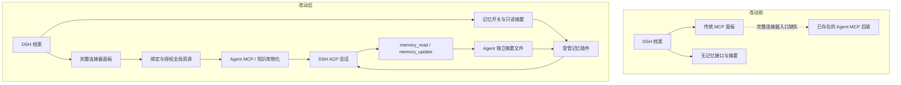

# DSH 资源接入与改动说明

英文说明见 [dsh-resources.md](dsh-resources.md)。

改动位于 CSGClaw 的 Web UI、DSH Runtime 和模板集成层。DSH 的连接器、知识库与飞书通道底层链路已经存在；本次补齐完整连接器入口和持久记忆，并验证原有链路。无需修改 DeepSeek Harness 或 OpenClaw 插件仓库。

## 改动前后

| 能力 | 改动前 | 改动后 |
| --- | --- | --- |
| 连接器 | 后端已接入，DSH 页面只展示传统 MCP 管理入口 | 与 Codex 共用完整连接器面板，支持全局资源绑定、授权、工具查看、启停与解绑 |
| 知识库 | 已支持运行时 MCP 物化 | 保留原链路；真实 DSH 测试确认工具发现、授权和结果回传 |
| 记忆 | 未实现 MemoryController，没有记忆面板与持久摘要 | 支持开关、只读摘要、跨会话读取、受控更新、重建保留 |
| 模板记忆 | DSH 模板不携带摘要 | 启用记忆且明确勾选时携带；创建新 Agent 时写入其独立目录 |
| 技能与飞书 | 已有启停投影、通道绑定和 lark-cli 扩展 | 保留原链路，验证相关回归测试 |

## 记忆如何工作

默认启用 `runtime_options.memory_mode=enabled`。插件将摘要作为上下文交给模型，模型发现长期偏好、纠正或明确的“记住/忘记”请求时，通过 `memory_read` 和 `memory_update` 维护摘要。这是正常回合内的工具维护方式，与 Codex 的后台历史抽取机制不同；记住哪些事实仍取决于模型行为。

摘要存放于 `$DSH_HOME/memories/memory_summary.md`，不改用户项目。更新采用原子替换，限制为 32 KiB，并用版本校验防止不同会话覆盖彼此的新内容。受管记忆写入仅作用于该文件，在工作目录只读模式下也可使用。

关闭后，插件不再提供记忆工具或新的记忆上下文；摘要仍保留，便于查看和再次开启。已有会话历史中已经出现的记忆内容不会被删除。重建保留摘要。发布模板时，只有启用记忆并主动勾选“包含智能体记忆”才会带出；从模板创建时写入新 Agent 的独立目录，重建不会用模板摘要覆盖已经学到的内容。

## 验证边界

真实 DSH ACP 配合本地确定性模型和 MCP 服务验证连接器、知识库、授权、目录刷新保留会话、记忆更新与启停、技能启停。飞书绑定、权限确认、lark-cli 扩展与消息投递通过现有测试验证；本次未使用真实飞书账号进行外部对话验收。
