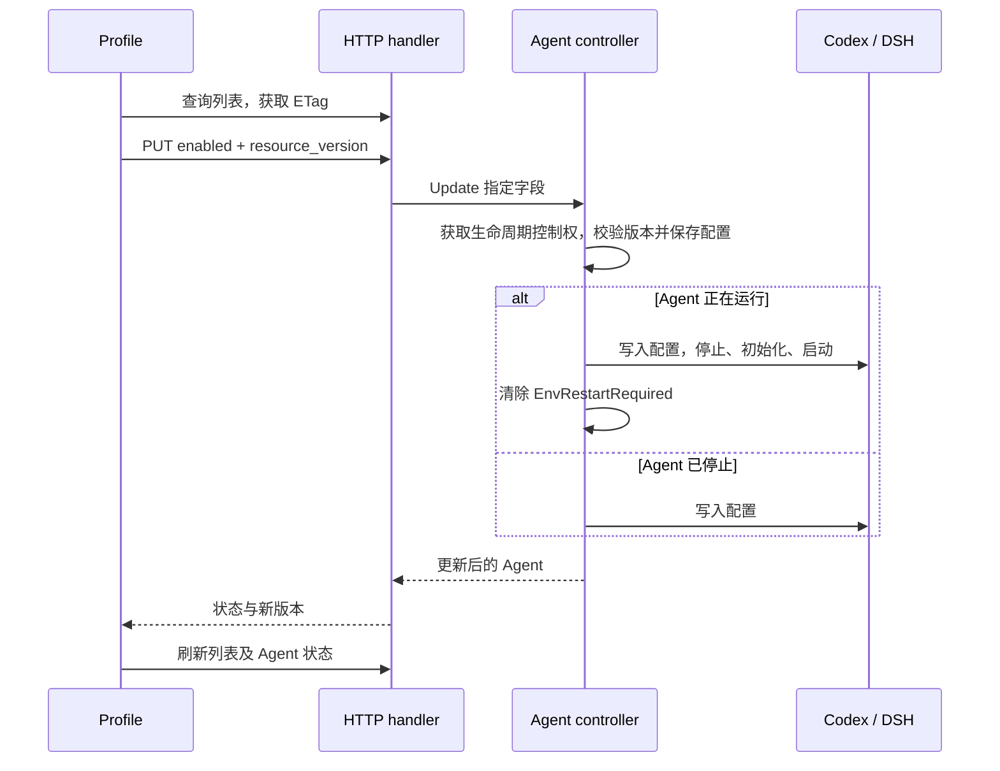

# Profile 的 Skill 与 MCP 启用管理

Profile 的 Skill 与 MCP 使用资源页面的 `ResourceListCard`：宽屏两列，每项横向排列图标、名称、说明与操作按钮；窄屏使用一列。点击内容打开详情弹框，点击启用或禁用按钮提交配置。Skill 详情按需读取完整目录和文件，MCP 详情隐藏凭据值。来源更新、删除确认和 App 设置沿用现有功能。

## 数据与模块

- `AgentSpec.SkillStates`、Agent 持久记录的 `skill_states` 保存每个已安装 Skill 的状态。未配置状态时默认启用。删除 Skill 同时移除状态，禁用保留文件。
- `mcp_servers.<name>.enabled` 保存 MCP 状态，缺省为启用。来源同步保留 Agent 的启用选择。
- HTTP handler 负责请求验证与响应；所有修改经过 `Engine.Agents().Update` 和现有 Agent 生命周期控制，使用 `ResourceVersion` 检查并发修改。
- Agent controller 负责保存目标配置、协调 runtime 配置写入与重启；runtime adapter 负责各自配置格式。`SkillsReconciler` 仅表示配置写入能力。
- `useAgentResourceEnablement` 统一请求状态、失败重试与查询失效。Profile 和聊天 `/` 候选使用同一个 `agentSkills` 查询；候选过滤禁用的 Skill。
- App 管理的 MCP 使用现有 App enabled API 与 App runtime 刷新机制；详情弹框显示工具列表并提供 App 设置入口。

## 接口

| 方法与 URI | 用途 |
| --- | --- |
| `GET /api/v1/agents/{id}/skill-summaries` | 返回 Skill 摘要数组，每项包含 `name`、`description`、`enabled`；响应头提供 `ETag` |
| `GET /api/v1/agents/{id}/mcp-servers` | 保持现有响应格式，配置包含 `enabled`；响应头提供 `ETag` |
| `PUT /api/v1/agents/{id}/skills/{name}/enabled` | 设置已安装 Skill 的状态 |
| `PUT /api/v1/agents/{id}/mcp-servers/{name}/enabled` | 设置已安装 MCP 的状态 |

两个 PUT 接口共用请求格式。`enabled` 必须是 boolean；`resource_version` 必须是查询响应 `ETag` 的字符串值，去除 HTTP 引号。

```json
{"enabled":false,"resource_version":"当前版本"}
```

成功响应：

```json
{
  "agent_id":"agent-example",
  "resource_version":"更新后的版本",
  "name":"reviewer",
  "enabled":false,
  "runtime_kind":"codex",
  "runtime_state":"running",
  "restart_required":false
}
```

`runtime_kind` 支持 `codex`、`dsh`。停止中的 Agent 写入配置并保持停止，返回 `runtime_state: "stopped"` 与 `restart_required: true`，下次启动读取配置。

| HTTP 状态 | 错误代码 | 含义 |
| --- | --- | --- |
| 400 | `invalid_request` | 参数缺失、类型错误或无效 Skill 名称 |
| 404 | `skill_not_found` / `mcp_server_not_found` | 目标资源未安装 |
| 409 | `resource_version_conflict` | Agent 已被其他请求修改 |
| 422 | `runtime_capability_unsupported` | runtime 不支持此操作 |
| 500 | `runtime_config_apply_failed` | 配置写入或重启失败 |

## 配置流程



配置修改沿用持久化的 `EnvRestartRequired`。配置写入或启动失败时保留目标状态与重试标记，页面展示错误和重试按钮；重试提交相同目标状态，继续应用配置。一次请求内的 Skill 与 MCP 修改统一由 controller 安排重启，保留 Agent 目录与会话记录。

## Codex

Skill 禁用配置写入 Agent 独立的 `.codex/home/config.toml`，使用带管理标记的 `[[skills.config]]` 段，`path` 指向对应 Skill 的 `SKILL.md` 文件，`enabled = false`。启用时移除该禁用项。配置重新生成时保留管理段。MCP 使用已有 `[mcp_servers.<name>]` 配置及原生 `enabled` 字段。

## DSH

`.dsh/home/skills` 保留完整 Skill 文件。每次应用配置与启动时，在 `.dsh/skill-view/skills` 生成启用项的完整副本，包含脚本、资源和文件权限。目录准备完成后替换当前目录，使用备份处理替换中断。

生成的 `csgclaw-context.patch.yml` 为 `skill-filesystem` 配置 `dshHome: <agent>/.dsh/skill-view`。DSH 自身的 home 与会话目录保持原位置。MCP 通过 ACP `session/new`、`session/resume` 参数加载，仅发送启用项；禁用项继续保存在 Agent 配置中。

这些开关管理 Profile 中已安装的资源。runtime 自行发现的项目目录资源遵循该 runtime 的发现规则。
